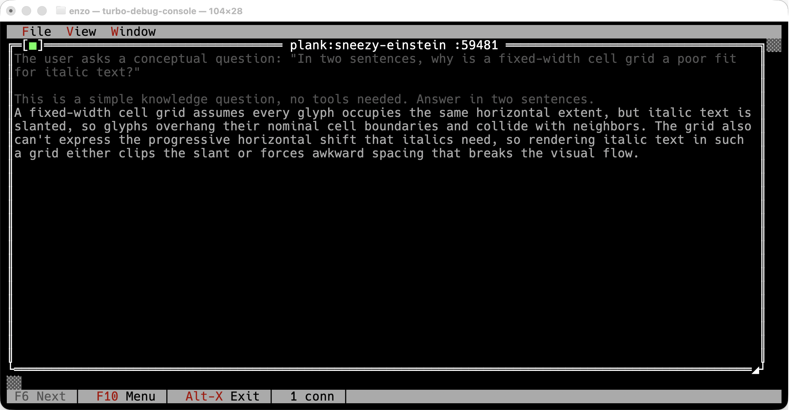
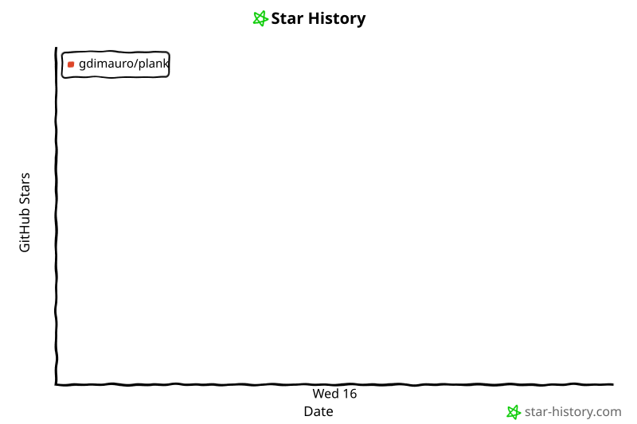

# plank

<p align="center">
  
</p>

<p align="center">
  <a href="https://github.com/aovestdipaperino/plank/stargazers"></a>
  <a href="https://opensource.org/licenses/MIT"></a>
  <a href="https://www.rust-lang.org/"></a>
  <a href="https://ai.enzolombardi.net/"></a>
</p>

Plank is a fast-moving agent harness built on the [ds4](https://github.com/aovestdipaperino/ds4) C reference (`ds4_agent`). It was ported functionality-by-functionality (not line-by-line), with each C section becoming an idiomatic Rust module, so changes landing in `ds4_agent` stay easy to port over — the upstream remains the source of truth for wire formats and prompt text, while plank iterates quickly on everything around it.

Plank is an interactive coding agent with a Ratatui TUI, a plain terminal REPL, a one-shot headless mode, and a set of built-in tools (shell, file read/edit, web).

> **macOS only.** Plank targets macOS exclusively: inference uses the original ds4 C engine with the Metal backend, linked via the `refs/ds4` submodule. Other platforms are not supported.

## Installing

Homebrew is the only distribution channel (plank is not on crates.io):

```sh
brew tap aovestdipaperino/tap
brew install plank-agent         # stable channel
brew install plank-agent-beta    # beta channel
```

Or in one step without a prior tap: `brew install aovestdipaperino/tap/plank-agent`. Prebuilt bottles exist for Apple Silicon and Intel Macs; on other setups Homebrew builds from source (requires Rust). Upgrade with `brew upgrade plank-agent`.

> **Note — formula naming.** The Homebrew formulas are `plank-agent` / `plank-agent-beta`, not `plank`, because a `plank` formula already exists in Homebrew and the bare name collides. The installed binary is still just `plank` — you run `plank`, only the `brew install` name carries the `-agent` suffix.

Releases follow a two-channel scheme where the patch number *is* the channel: every `vX.Y.0` is a stable release, and any patch above 0 is a beta (the app's version banner shows ` BETA` accordingly). A series opens with its stable `.0` and accumulates beta work as patch bumps (`v2.5.1`, `v2.5.2`, …); promoting a beta to stable opens the next minor as an identical `v2.6.0` (stable) / `v2.6.1` (beta) pair. The two formulas conflict since both install a `plank` binary, so switch channels with `brew uninstall plank-agent && brew install plank-agent-beta` (or the reverse). See [VERSIONING.md](VERSIONING.md) for the channel model and the promote-to-stable process.

## Building

Requires macOS (Apple Silicon or Intel) with the Xcode command line tools. Clone with the submodule to get the ds4 engine:

```sh
git clone --recurse-submodules https://github.com/aovestdipaperino/plank
cd plank
cargo build --release
```

- **With `refs/ds4` present:** `build.rs` builds `libds4core.a` from the Metal-backend objects and links the required frameworks, enabling the `ds4_engine` cfg.
- **Missing submodule:** plank still builds, but without the native engine it uses the echo engine only (useful for development/CI).

You will also need a GGUF model file (e.g. `ds4flash.gguf`) for real inference; see the `download_model.sh` script in `refs/ds4`.

## Usage

```sh
plank            # interactive REPL
plank --help     # full option list
```

Run with a prompt argument for one-shot headless mode.

### Model download

Real inference needs the DeepSeek V4 Flash GGUF — the official (non-preview) `-0731` build of 2026-07-31. You can point plank at any copy with `-m <path>`, but with no flag it looks in the default location (`~/.plank/ds4flash.gguf`) and, when nothing is there, offers to fetch the quantized model (~87 GB) from Hugging Face — one keypress and it downloads in place with live progress:

<p align="center">
  
</p>

Details worth knowing:

- **Resumable.** The download streams to a `.part` file next to the destination; if it's interrupted (Ctrl-C, network drop), the next launch detects the partial file and resumes from where it stopped instead of starting over.
- **Guarded.** The default quant needs ~82 GB resident, so plank refuses to download or load on machines with less than 96 GB of RAM — you find out before spending hours on the transfer, not after.
- **Honest about the wait.** An 87 GB download takes a while; the progress bar keeps you company with size/rate counters and a rotation of two hundred status messages ("Almost sentient. Please hold." among them).
- **Playable.** A round of [breakout](#the-arcade) sits above the gauge, because hours is a long time to watch a bar fill. It is decoration and never delays the transfer: Esc puts it away, and `q` or Ctrl-C abort the download from anywhere, so a rally can't trap you.
- **Kept current.** The build a model was downloaded from is recorded beside it, so a newer default is noticed instead of being masked forever by an existing file. Inferred from the filename when there's no stamp, which covers symlinking `ds4flash.gguf` at a GGUF you keep elsewhere; unknown never means re-download.
- **Headless-safe.** With stdin not attached to a terminal there is no prompt to answer, so plank exits with instructions instead of hanging a script.

Without a model (or on non-macOS platforms) plank still runs against a built-in echo stub — useful for developing the UI and tools, not for real inference.

### Speculative decoding (DSpark)

DSpark speculative decoding is **on by default**: DeepSeek's auxiliary draft checkpoint for V4 Flash reads hidden states from the main model, proposes up to five tokens ahead, and the main model verifies them and commits only the prefix it agrees with — so one verification pass can advance the stream by several tokens. `--dspark-off` turns it off for target-only decode.

The support model (~5.6 GB) does not need a flag of its own. It resolves to `~/.plank/ds4flash.dspark.gguf` and, when missing, is offered for download through the same resumable, playable path as the main model. Passing `--mtp <path>` overrides it, which is also how a legacy one-stage MTP drafter is supplied.

```sh
plank --temp 0
```

- `--dspark-off` — disable DSpark speculative decoding (target-only decode).
- `--dspark-confidence F` — pruning threshold, `0..1`. `0` forces fixed five-token blocks (diagnostics). The default is the engine's own and depends on the backend.
- `--dspark-strict` — load the drafter but keep target-only decode, for comparisons and correctness checks.

Verification is argmax, so proposals are only used at `--temp 0`; sampled decoding ignores them. Whether it actually pays depends on the engine build, the quant, and the machine — on an M5 Max it was a 0.71× *slowdown* until upstream pipelined the Metal verifier, after which the same measurement read 1.19×. Plank's exit message reports, per model, how long the session spent prefilling and generating with the average rate for each (and how long it spent in tools), which is the quickest way to check on your own hardware.

### Plank-only features

plank tracks `ds4_agent` for the core agent loop but moves faster on the user-facing side. A few of the things that exist only in plank:

- **Full-screen Ratatui TUI** — markdown rendering with syntax-highlighted code, mouse-wheel scrollback, and a two-row animated status bar: the working directory, git branch and a working-tree change counter (`📄 3 · +128 -41` — files touched, then lines added in green and deleted in red) on the first row, so the location holds still, and everything volatile on the second — engine origin, reasoning level (colored by how hard the model is thinking, with a braille stand-in for the expert routing that re-rolls every token), context gauge, and the name of the tool currently running. The C reference is a plain line REPL. Resumed sessions replay through the same renderer, so history comes back as markdown with thinking dimmed, not flat text.
- **Type while it thinks** — each turn runs on a worker thread, so the prompt stays live during generation and you can queue the next message.
- **`/btw` side questions** — ask something mid-task; the answer runs on a fork of the session, interleaved with the main generation, so it streams into a split panel while the main task keeps going. Nothing is written to the conversation, and neither side re-prefills.
- **Checkpoints, resume, and instant KV restore** — `/checkpoint`/`/rollback` and `/resume` snapshot the live engine KV alongside the transcript, so returning to a conversation skips re-prefilling it.
- **Git-style diff cards** — an `edit` (or an overwriting `write`) renders as a change card with an `Update(path)` header, an added/removed summary, and red/green `@@` hunks; a brand-new file streams its content dimmed as it is written.
- **`agent` sub-agent tool** — the model delegates a bounded task to a fresh scoped sub-agent and gets back only its conclusion, keeping the main transcript clean; bounded so a sub-agent can't itself delegate.
- **Cross-engine sub-agents** — a definition in `~/.plank/agents/*.md` (or `./.plank/agents`) can name the engine its sidechain runs on: `provider:` plus `model:` for a hosted model, or `provider: local` for the local one. A local sub-agent under a remote main agent works — plank loads the local model alongside the provider when a definition asks for it. Only the *name* of the API-key variable lives in the file, never the key, so definitions stay committable. The roster the model sees rides in the session context rather than the system prompt, so editing a definition rebuilds a small project-tier KV cache instead of invalidating the fingerprinted 1M-token prefix.
- **Git worktrees** — `EnterWorktree`/`ExitWorktree` move the session into an isolated second checkout (`.plank/worktrees/<name>`, on branch `worktree-<name>`), so a large or speculative change never touches the tree you're working in; `--worktree NAME` / `--worktree-pr N` start a whole session in one, and `isolation: worktree` gives each sub-agent its own so a fan-out can't overwrite itself. Removal is fail-closed: a worktree holding uncommitted files or unpushed commits is not deleted without an explicit discard, and neither is one whose state git couldn't be asked about. `WorktreeCreate`/`WorktreeRemove` hooks replace git entirely for a non-git VCS.
- **Plan mode** — `EnterPlanMode` holds the model read-only (research only) until it proposes a plan you approve with `ExitPlanMode`, before any edits land.
- **`@` file completion, `glob`, and a model-visible task list** that survives compaction.
- **`/` command menu** — typing `/` raises a drop-up above the prompt listing every command with its argument hint and a one-line explanation beside it, filtered as you keep typing. Skills and prompt templates appear alongside the built-ins, tagged as such, so what a project adds is as discoverable as what ships.
- **Editable, selectable prompt** — Shift with the arrows, Home/End, or a word-wise Alt/Ctrl arrow selects text in the prompt; so does click-and-drag. `Ctrl-C` copies the selection (and still clears the line when nothing is selected), `Ctrl-X` cuts, `Ctrl-V` pastes, `Ctrl-Shift-A` selects everything. It all works mid-turn too, on the prompt that stays live while the model generates.
- **Extensible** — skills (user- *and* model-invoked), named subagents, an expanded hook system, MCP tools and resources, and a `settings.json` for durable preferences.
- **`ask` tool** — when a turn is genuinely ambiguous the model can pose a multiple-choice question instead of guessing; you pick in a panel (or numbered list in the REPL), and it degrades cleanly when there's no user to ask.
- **`/install-claude-plugin`** — fetches and installs a Claude Code plugin from a GitHub repo, an `owner/repo` shorthand, a browser-copied `/tree/`/`/blob/` URL, a marketplace, a `.tar.gz`, or a local directory. It rewrites `${CLAUDE_PLUGIN_ROOT}` to the real install path and unwraps Claude Code's nested hook config, since plank's hook runner and hook reader expect neither as-is; `.mcp.json` and `settings.json` need no such translation and merge in the same way any other plugin's do.
- **Desktop notifications & live window title** — long turns end with a persistent macOS banner (`'<prompt>' finished` and the tail of the answer; `interrupted` for aborted turns), configurable to fire `always`, only while `unfocused`, or `never`; the terminal title tracks the task (`🪵 plank - fix the bug…`).

See **[docs/FEATURES.md](docs/FEATURES.md)** for the complete list.

### Highlights

Assistant replies render as markdown in the TUI, with tree-sitter syntax highlighting for fenced code blocks:

<p align="center">
  
</p>

The `/context` command visualizes context-window usage by category:

<p align="center">
  
</p>

`/btw` answers a side question *beside* the running task rather than pausing it. The aside runs on a fork of the session, interleaved with the main generation, so both advance at once — here the model keeps counting on the left while `/btw what is the capital of Italy` is answered on the right, with nothing written to the conversation:

<p align="center">
  
</p>

One Metal command queue means this is time-slicing, not parallelism — nothing finishes sooner overall. What changes is that the main task no longer stops. The aside takes the larger share of the thread while it runs, since it is the one you are waiting on.

Long turns end with a native macOS notification — your prompt as the headline and the tail of the answer as the body, wearing your terminal's icon and plank's logo. `ui.notifications` picks when they fire: `always`, `unfocused` (only while the terminal isn't focused), or `never`:

<p align="center">
  
</p>

### Watching the thinking in a debug console

`ui.showThinking` controls whether the model's reasoning is rendered in the scrollback. It is **off by default**: the thinking is usually noise once you trust the answer, and hiding it keeps the transcript readable.

Hiding it does not have to mean losing it. While `showThinking` is off, plank mirrors its whole raw model stream to [turbo-debug-console](https://github.com/aovestdipaperino/turbo-debug-console), a text-mode viewer that renders it in its own window, so the reasoning is one glance away instead of gone:

<p align="center">
  
</p>

Install it and leave it running; plank finds it on its own:

```sh
brew install aovestdipaperino/tap/turbo-debug-console
turbo-debug-console
```

`cargo install turbo-debug-console` works too. It listens on port 7878, and each plank session gets its own window titled `plank:<session-name>`, matching the session name plank shows above the prompt. Sessions are reconnectable: the window and its scrollback survive plank exiting, so restarting plank appends the new run below a `-- reconnected --` rule instead of losing the old one.

The console is entirely optional and plank never depends on it. If nothing is listening, plank connects to nothing, says nothing, and behaves exactly as it always has. If you close the console mid-turn, the mirror is dropped and the turn carries on. Turning `showThinking` back on disconnects it, since the reasoning is back in the scrollback where you can already see it.

What arrives there is the *whole* stream, not just the hidden part: thinking, answer, and tool calls, rendered by the same renderer plank uses for its own output. That is deliberate. The console shares plank's streaming renderer as the [`trace-stream`](https://crates.io/crates/trace-stream) crate rather than reimplementing it, so the two cannot drift, and reasoning arrives in the context of the answer it produced rather than as disembodied fragments.

### Settings file

Preferences you'd otherwise retype every launch live in `settings.json`, hierarchical like the MCP configs: `~/.plank/settings.json` applies globally, `./.plank/settings.json` in the working directory overrides it key by key. Everything is optional — the file need not exist, and any subset of keys works. Edit it in-session with `/config` (an interactive TUI form, or `/config <section>.<key> <value>` from the prompt, e.g. `/config ui.showThinking false`); changes write `./.plank/settings.json` and apply immediately. In the interactive form, **Ctrl-S** saves and closes; **Esc** cancels and discards.

A few keys cannot take effect until you restart, because what they configure is built once at startup: everything under `engine` (the model is already loaded), `safety.sandbox` and `safety.btwSuspend`, and the keys that shape the system prompt — `tools.recall`, `tools.fanout`, `tools.runCode` and `git.signCommits` — since the prompt is built once per session and KV-cached, and rewriting it mid-session would throw that cache away. Everything else is live.

```json
{
  "engine": { "model": "~/models/ds4.gguf", "threads": 8,
              "backend": "metal", "power": 80, "ctx": 262144,
              "thinkingToolCalls": true },
  "ui":     { "respectGitignore": true, "popupRows": 15, "indexRefreshSecs": 5,
              "historySize": 512, "showToolCalls": false, "showToolResults": false,
              "showThinking": false, "notifications": "always", "notifyAfterSecs": 10,
              "screensaver": "1m", "screensaverFace": "matrix" },
  "safety": { "sandbox": true, "btwSuspend": true },
  "mcp":    { "timeoutSecs": 30 },
  "ask":    { "maxOptions": 7 },
  "agents": { "autoRoute": true, "maxParallel": 4 },
  "git":    { "signCommits": true },
  "worktree": { "sparsePaths": ["src", "docs"],
                "symlinkDirectories": ["target"], "isolateAgents": false }
}
```

| Group | Key | Default | What it does |
|---|---|---|---|
| `engine` | `model` | `~/.plank/ds4flash.gguf` | Model file to load (`~` expanded). Same as `-m`. |
| | `threads` | engine default | Worker threads. Same as `-t`. |
| | `backend` | platform default | `metal`, `cuda`, or `cpu`. Same as `--backend`. |
| | `power` | unset | GPU power cap percent. Same as `--power`. |
| | `ctx` | 1048576 | Context window in tokens. Same as `-c`. |
| | `thinkingToolCalls` | `true` | Dispatch tool calls the model emits inside its thinking block. Set `false` for strict `refs/ds4` parity. |
| `ui` | `respectGitignore` | `true` | Whether `@` completion honours `.gitignore` for untracked files. |
| | `popupRows` | 15 | Rows the `@` completion popup offers. |
| | `indexRefreshSecs` | 5 | How long the file index is trusted before a rebuild. |
| | `historySize` | 512 | Prompt history entries retained. |
| | `showToolCalls` | `false` | Show the model's `🛠️` tool-call banners. Off keeps the UI uncluttered; the tools still run. |
| | `showToolResults` | `false` | Echo tool result text into the scrollback. Off keeps the UI clean; the model still receives the results. |
| | `showThinking` | `false` | Render the model's thinking (dimmed) in the scrollback. Off hides it from the display; the model still produces it, and plank mirrors the stream to a [debug console](#watching-the-thinking-in-a-debug-console) if one is running. |
| | `notifications` | `always` | When desktop notifications fire: `always`, `unfocused` (only while the terminal window isn't focused), or `never`. |
| | `notifyAfterSecs` | 10 | Minimum turn duration before a turn-end notification; awaiting-input notifications ignore it. |
| | `crtOff` | `true` | CRT power-off animation on clean TUI exit. |
| | `builtinEditor` | `true` | `Ctrl-G` opens the built-in editor (a fork of Microsoft Edit, in-process). `false` shells out to `$EDITOR` as before. |
| | `screensaver` | `1m` | Idle time before the screensaver takes the screen: `1m`, `2m`, `5m`, or `never`. Any key or mouse event dismisses it; it never comes up mid-turn or over a dialog. |
| | `screensaverFace` | `matrix` | Which screen it puts up: `matrix` (the rain), `starfield`, `minions`, or `random` for a fresh draw each time. |
| `safety` | `sandbox` | on (macOS) | Default for the bash write sandbox. Same as `--sandbox`/`--no-sandbox`. |
| | `btwSuspend` | `true` | Default for `/btw` mid-generation suspend. Same as `--btw-suspend`/`--disable-btw-suspend`. |
| `mcp` | `timeoutSecs` | 30 | How long an MCP server has to answer before it's considered dead. Raise it for a slow-starting server, since a server that misses the deadline is dropped along with all of its tools. |
| `ask` | `maxOptions` | 7 | Most options the `ask` tool may offer in one question (minimum is fixed at 2). |
| `agents` | `autoRoute` | `true` | Whether the model may select a sub-agent definition on its own initiative. |
| | `maxParallel` | 4 | How many sub-agents may run concurrently (clamped to 16). |
| `git` | `signCommits` | `true` | Ask the model to end each commit message it writes with a blank line and `--Co-Authored by Plank (https://plank-agent.dev)`. `false` drops the instruction and leaves commit messages to your repository's own conventions. |
| `worktree` | `sparsePaths` | `[]` | Cone-mode sparse-checkout paths for a new worktree. Empty checks out everything; set it when a second full checkout of the repo is painful. |
| | `symlinkDirectories` | `[]` | Directories symlinked from the main checkout rather than duplicated, e.g. `target` or `node_modules`. A name that could climb out of the worktree is ignored. |
| | `isolateAgents` | `false` | Give every sub-agent its own throwaway worktree. Off because a checkout per agent costs disk and time and the work must then be merged back; use `isolation: worktree` on the definitions that need it instead. |

Precedence runs left to right, each layer overriding the one before:

```text
built-in defaults → ~/.plank/settings.json → ./.plank/settings.json → environment → command-line flags
```

Because a settings file can move you off Metal or shrink the context — and both are invisible once the UI is up, showing only as "plank got slow" — plank prints one line at startup naming what is in force:

```text
plank: settings in effect (/path/to/.plank/settings.json): threads=3, backend=cpu, ctx=65536
```

It lists only settings actually in effect: a value a command-line flag overrode is not mentioned, and with no settings file (or one that changes nothing) there is no line at all.

Two things the file deliberately does **not** do:

- **It holds no secrets.** `./.plank/settings.json` sits inside your working tree and is easy to commit by accident, so there is no API-key setting — keep it on `--api-key` or the provider's environment variable.
- **It holds no per-run choices.** `--prompt`, `--non-interactive`, `--ui-remote`, `--trace`, `--chdir`, `--seed`, `--worktree`, and `serve` describe one invocation rather than a preference, so they have no settings key.

A broken settings file never stops plank from starting: malformed JSON, a wrongly-typed value, an unknown key, or an unrecognised backend name each fall back to that key's default. (The same unrecognised name passed to `--backend` is still an error — a flag is an explicit instruction, a config file is a preference.) One limitation: settings are read from the directory plank launches in, so project-scoped settings do not follow `--chdir`.

### MCP servers

Plank can load external tools from stdio and Streamable HTTP MCP servers. Configs are hierarchical like Claude Code's user and project scopes: `~/.plank/.mcp.json` applies globally, and `./.mcp.json` in the working directory (or the file given with `--mcp-config`) overrides same-named servers and adds new ones. Both use the standard `mcpServers` format — a `command` entry is spawned as a stdio subprocess, a `url` entry is reached over Streamable HTTP (optional `headers` carry e.g. an `Authorization` token):

```json
{
  "mcpServers": {
    "demo": {
      "command": "some-mcp-server",
      "args": ["--flag"],
      "env": {"KEY": "value"},
      "primaryTools": ["tool_a"]
    },
    "remote": {
      "type": "http",
      "url": "http://127.0.0.1:6510/mcp",
      "headers": {"Authorization": "Bearer <token>"}
    }
  }
}
```

Tools are exposed to the model as `mcp__<server>__<tool>`. The optional `primaryTools` list controls prompt size: listed tools get their full schema in the system prompt, the rest appear in a compact directory and are described on demand via the built-in `mcp_describe` tool. Omit the key to make every tool primary.

### Remote, hosted, and shared engines (beta)

The v2 beta channel extends plank past a single local process. All of it is off by default; a plain `plank` still runs the local Metal engine exactly as before.

- **Serve and connect** — `plank serve` hosts the local ds4 engine over HTTP+SSE so another machine can use it; `plank --remote <url>` points a thin client at that host (drive from a laptop, infer on the Metal box). The transport is synchronous, adds no async runtime, and streams tokens as they generate. Token auth via `--remote-token` / `$PLANK_REMOTE_TOKEN`; keep it behind an SSH tunnel or a TLS reverse proxy.
- **Hosted providers** — behind the same `Engine` trait, `--provider openai --model <name>` targets any OpenAI-compatible endpoint (`--base-url`, `--api-key` / `$OPENAI_API_KEY`; covers vLLM, Ollama, OpenRouter, Together) and `--provider anthropic` targets the Anthropic Messages API (`$ANTHROPIC_API_KEY`). Native provider tool calls are synthesized back into plank's DSML tool syntax, so tools dispatch identically regardless of backend, and multi-turn tool-call ids are threaded through. Anthropic prompt caching (`cache_control`) is on by default (`--provider-cache`).
- **Shared engine** — `plank serve --shared-engine` loads the weights once and serves many concurrent sessions from a single cooperative GPU thread (round-robin at token granularity; the one Metal queue means time-sliced, not parallel). A freshly attached session restores the warm system-prompt prefix instead of cold-prefilling it. `--max-sessions` and `--kv-budget-bytes` cap admission, `--session-ctx-size` sizes each session's context, and `--idle-reclaim-secs` snapshots idle sessions to disk and restores them on demand; `/info` reports live-session and KV accounting.
- **Remote control** — `/remote-control` (alias `/rc`) inside a running TUI session opens a loopback WebSocket and prints a one-click link: `http://127.0.0.1:PORT/?t=TOKEN`, plus an `ssh -L` hint for reaching it from another machine. Opening that link auto-connects a self-contained web client and claims control, with nothing to paste and no button to press. Bare `/rc` toggles; `/rc on` and `/rc off` are explicit and case-insensitive. Off tells connected clients, shuts the listener down, and kills the token, so a stale link is refused; the next `/rc` mints a new port and token. The `plank remote <ws-url>` terminal client attaches to the same server. One controller at a time, many mirrors, with a reconnect grace window.

  The page mirrors the session: assistant replies render as markdown, the header carries the same directory, branch, engine origin and reasoning level the TUI footer shows, and the end of a turn raises a browser notification, a banner, and a tab-title flash — the local desktop notification only reaches whoever is at the machine plank is running on. `send` lights up when there is something to send, `stop` only while a turn is running; ↑/↓ walk prompt history. A `/clear` clears the page too.

  Remote control needs the full-screen TUI — `/rc` in a piped or headless session declines rather than starting a server nothing can drive. The token rides in the URL, so it lands in browser history and any `Referer`: treat the link as a convenience for a loopback-only listener, not a secret, and reach it from elsewhere through the SSH tunnel rather than by widening the bind.

<p align="center">
  
</p>
- **`--ui-remote[=PORT]`** — for driving the TUI from a test harness: opens a `127.0.0.1`-only listener (bare form picks an ephemeral port, `=PORT` a fixed one) accepting line-delimited JSON `keypress`/`snapshot`/`uitree` commands. `snapshot`/`uitree` replies are held until the screen reflects any keys sent first, so a harness can assert without sleeping. One client at a time; a second simply queues.

### Using OpenAI or Anthropic providers

plank can drive a hosted model instead of the local one. The provider sits behind the same `Engine` trait as the Metal backend, so tools, sessions, `/btw`, compaction, and the rest of the agent loop behave identically — native provider tool calls are translated back into plank's own tool protocol on the way through.

Pick a provider with `--provider` and name the model with `--model`. The API key is read from the provider's environment variable, so you normally do not pass it on the command line:

```sh
# OpenAI
export OPENAI_API_KEY=sk-...
plank --provider openai --model gpt-4o

# Anthropic
export ANTHROPIC_API_KEY=sk-ant-...
plank --provider anthropic --model claude-sonnet-4-5
```

Both providers work with a one-shot prompt too: `plank --provider anthropic --model <name> -p "..."`.

**Flags**

| Flag | Meaning |
|---|---|
| `--provider openai\|anthropic` | Selects the provider family. `openai` speaks the OpenAI-compatible Chat Completions API; `anthropic` speaks the Anthropic Messages API. |
| `--model NAME` | The provider's model name (not a local GGUF path). Required with `--provider`. |
| `--api-key KEY` | The key, if you would rather not use the environment variable. Prefer the env var — a key on the command line lands in your shell history. |
| `--base-url URL` | Overrides the endpoint. Defaults to `https://api.openai.com/v1` and `https://api.anthropic.com/v1`. |
| `--provider-cache on\|off` | Anthropic prompt caching over the stable prefix (tools + system). On by default; ignored for `--provider openai`. |

**Key resolution** — `--api-key` wins if given, otherwise `$OPENAI_API_KEY` (openai) or `$ANTHROPIC_API_KEY` (anthropic). With neither set, startup fails with a clear message rather than a confusing API error.

**OpenAI-compatible gateways** — `--provider openai` plus `--base-url` reaches anything that speaks the OpenAI Chat Completions shape: vLLM, Ollama, OpenRouter, Together, LM Studio, and similar. For example, a local Ollama:

```sh
plank --provider openai --model llama3.3 \
      --base-url http://localhost:11434/v1 --api-key ollama
```

**What stays the same** — every plank tool (`read`/`edit`/`bash`/`glob`/`search`/…), the MCP tools, `@` completion, sessions and `/resume`, `/btw`, and compaction all work unchanged against a provider. The one difference is the system prompt: a provider gets plank's own prompt with native tool definitions, never the byte-parity DeepSeek prompt (which is meant only for the local model it was trained on).

**Two hosted models on one key** — a sub-agent definition can name a *different* model at the same endpoint, authenticated with the same variable:

```yaml
provider: openai                        # any OpenAI-compatible endpoint
model: qwen3-coder-next                 # the only difference from the parent
base-url: https://api.regolo.ai/v1
api-key-env: REGOLO_API_KEY             # the same variable the parent uses
```

Only the variable's *name* lives in the file, never the key, so definitions stay committable. `/usage` then reports one row per model rather than one total, which is how you confirm the sidechain really reached the second model — self-reported identity is weak evidence, billing is not. `multi-provider-tests/remote-remote/` is a runnable session that exercises exactly this, and needs no local model, so it starts instantly on any machine.

**Notes** — `--provider` cannot be combined with `--remote` or the local backend selectors (`--metal`/`--cuda`/`--cpu`); it *is* the engine for that run. `/usage` reports billed token counts for the session, including Anthropic cache read/write and hit rate. The key is never written to `settings.json` — it stays on the environment or `--api-key` by design.

## The arcade

Waiting on a long generation is the one moment a coding agent has nothing for you to do. So there are five games — and one thing to just watch — behind undocumented-in-`/help` slash commands, and they are meant to be used **during** a turn: type one while the model is streaming and it opens as a translucent layer over the live output, which keeps scrolling underneath.

<p align="center">
  
</p>

That is a real turn underneath — the model is 1m 49s into writing a poem at 20.8 t/s, still streaming, and the wall, ball and paddle are on top of it. The dim line near the top is the resume notice: this game had been left open in an earlier turn and came back where it was.

| Command | |
|---|---|
| `/pelota` | pong against a five-level CPU |
| `/breakout` | knock the wall down, five walls deep |
| `/invaders` | hold the line against the marching fleet |
| `/centipede` | shoot it apart before it walks into you |
| `/frogger` | cross the road, then ride the river home |
| `/minions` | nothing to play: two of them, giggling by a lake |

And one that is not a game at all:

| Command | |
|---|---|
| `/matrix` | glyphs falling down a black screen, for when you would rather just watch something |

`/matrix` keeps no state — there is nothing in rain to come back to, so closing it and reopening it deals a fresh downpour and `new` has nothing to undo. `↑`/`↓` and the wheel change how fast it falls; `c` cycles the alphabet through half-width katakana, binary, and punctuation-heavy ASCII. The katakana are the whole point, but they are also the one thing a terminal font can fail to draw: if you get a screen of boxes, press `c`.

Two arguments, combinable — `/breakout new sound`:

- **`new`** (or `reset`) — deal a fresh game. Without it a command **resumes the game you left**: each one keeps its own slot, so you can close pelota, run three turns, open breakout, and come back to pelota exactly where it was. A finished game is not kept, so the next command deals a new one.
- **`sound`** — blips on. Off by default; `b` toggles it in-game.

**Controls** — arrows (or `hjkl`/`wasd`), space to serve or fire, `p` to pause, `t` to switch between the translucent and opaque layer, `b` for sound, `Esc`/`q` to leave. The mouse works everywhere: the wheel and trackpad steer, click and drag place the paddle or the ship, and clicking fires in the two shooters. While a game is up, the first `Ctrl-C` closes it and a second one interrupts the model, so you are never locked out of stopping a turn.

Pelota has one extra move worth knowing: hold **Shift** while steering and the paddle shrinks to a third of its length, but a hit that lands leaves at triple speed — usually past the CPU. The boost lasts exactly one crossing.

### The screensaver, and the minions

After a minute of an idle prompt (`ui.screensaver`) the screen is taken by an ambient screen — the matrix rain, the perspective starfield, or two minions on the shore of a night lake — whichever `ui.screensaverFace` names, or a fresh draw each time under `random`. None is an easter egg: `ui.easterEggs` does not gate them, they never come up mid-turn or over a dialog, and the next key, click or paste puts the UI back (consumed, not typed).

The minions are also a command, `/minions`, which *is* gated like the games. They walk the shore, blink, elbow each other and fall about laughing, reflected in the water underneath. `↑`/`↓` and the wheel set the pace, `r` strips the night back to just the two of them, and `t` lays them over live model output like any other easter egg.

**The whole animation is 218 bytes of the binary.** The art is six poses of ASCII paint-by-numbers in `src/resources/minions.txt` — 1 440 cells, one byte each, readable and diffable — and that file never ships. `build.rs` packs it at build time with a three-op coder (same cell as the pose before / same ink again / something already drawn up to 256 cells back, everything else a literal) and writes the result into `OUT_DIR`, so **1 440 bytes of art become 218: about a seventh, or 85% saved**. A `const` assertion fails the build if a change to the art or the coder ever gives most of that back. Nothing else about the scene is stored at all: the walk, the bob, the nudge, the laughter, the stars, the ripples and the reflection are generated from one seeded generator and a clock.

Three honest notes about what the terminal can and cannot do:

- **Translucency is not alpha.** A cell holds one character and one pair of colors; there is nothing to composite. What happens instead is that these games are sparse, so the layer underneath is dimmed rather than erased and the glyphs land in the gaps. It reads as a veil, and the model's output stays legible behind it — but it is a trick, not blending.
- **What passes for transparency, where it can.** The minions get as close as a terminal allows, with three mechanisms and no alpha channel anywhere: cells too faint to matter are **not drawn at all** — the only true transparency there is, and what keeps the layer from punching holes in the model's text; `█ ▓ ▒ ░` cover a known fraction of a cell, so the *coverage ramp is the alpha channel* and fading is walking down it, which is what rounds their shoulders, fades the scene up when it opens and sinks their reflection into the water; and glyphs that are shapes rather than fills — a goggle rim, an eye — fade toward the night by colour instead, because a rim at quarter coverage is not a fainter rim, it is a different character.
- **Sound is the terminal bell**, and nothing else. That is deliberate: it adds **zero bytes** to the binary, where real audio would mean a synthesis crate and a system audio dependency. The cost is that `BEL` has no pitch and no length, so the only thing distinguishing one cue from another is how many — one blip for a hit, two for a life lost, three for a level. Terminals set to a visual bell will flash instead, which is why it is off unless you ask.

None of these appear in `/help` or the completion popup. That is the point.

They live behind `ui.easterEggs`, on by default. Setting it to `false` does more than hide them — it stops them being commands at all, so `/pelota` goes to the model as an ordinary prompt exactly like any other unrecognized slash command. That is the honest behaviour for a shared or managed install that wants no games in it, and the startup line names the setting when it is off, so a `settings.json` cannot quietly remove them without saying so.

## Screensaver

Leave the TUI idle and it puts something on the screen. By default that is the matrix rain:

<p align="center">
  
</p>

There are three faces, and `ui.screensaverFace` picks which one you get:

| Value | |
|---|---|
| `matrix` | the falling glyphs above — the default |
| `starfield` | a perspective starfield rushing outward past the edges |
| `minions` | two minions on the shore of a night lake |
| `random` | a fresh draw each time it opens |

`ui.screensaver` says *when*: `1m` (the default), `2m`, `5m`, or `never` to switch it off. Both are editable live with `/config`, which cycles the values rather than making you type them.

Any key or mouse event dismisses it, and the keystroke that wakes the screen is swallowed rather than typed into your prompt. It never comes up mid-turn or over a dialog — an idle timer that interrupted a running generation, or covered a question waiting on an answer, would be a bug rather than a feature.

Unlike the games, the screensaver is **not** behind `ui.easterEggs`. Turning the arcade off in a shared or managed install stops `/pelota` and `/matrix` being commands at all, but it does not take the idle screen with it: one is a game you invoke, the other is what an unattended terminal shows, and they are not the same decision. Set `ui.screensaver` to `never` if you want no idle screen either.

## Project layout

Each module in `src/` maps to one functional section of the original `ds4_agent.c`:

- `engine.rs` / `ds4engine.rs` / `ffi.rs` — inference engine abstraction and native ds4 bindings
- `session.rs`, `compact.rs`, `sysprompt.rs` — conversation state, compaction, system prompt
- `tools/` — built-in agent tools (bash, edit, files, web) and the MCP client
- `worktree.rs`, `tools/worktree.rs` — git-worktree isolation and the `EnterWorktree`/`ExitWorktree` tools
- `ui.rs`, `render.rs`, `statusbar.rs`, `editor.rs`, `viz.rs` — terminal UI
- `arcade.rs`, `arcade/` — the easter-egg games, the matrix rain, the starfield and the minions (see above)
- `config.rs`, `settings.rs`, `trace.rs`, `interrupt.rs`, `status.rs` — configuration, persistent settings, tracing, signal handling

## Star History

<!-- Chart is rendered in CI by .github/workflows/star-history.yml (the hosted
     star-history.com embed broke with GitHub's 2026-06-30 stargazers API
     restriction). The action rewrites everything between these markers. -->
<!-- star-history:start -->
<picture>
  <source media="(prefers-color-scheme: dark)" srcset="assets/star-history/star-history-dark.svg">
  
</picture>
<!-- star-history:end -->

## License

[MIT](LICENSE)
