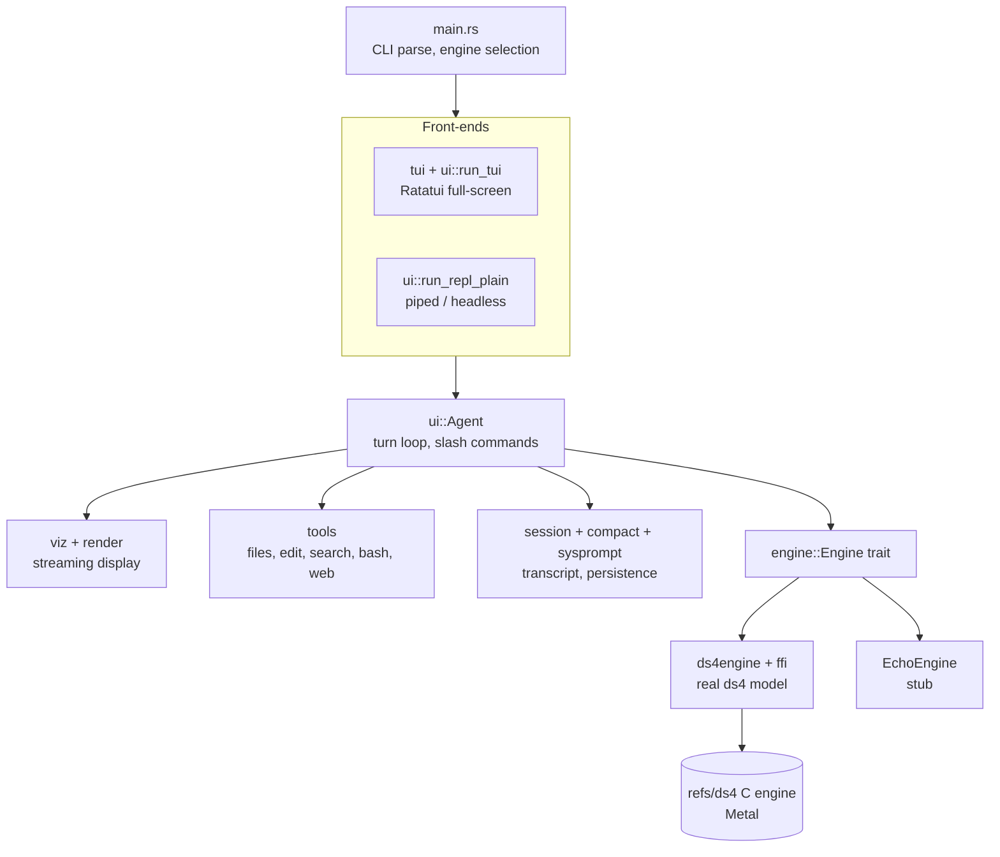
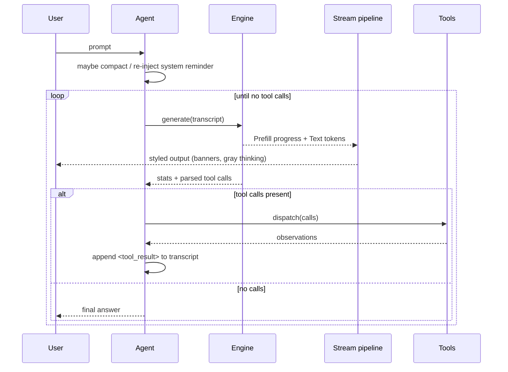

# plank Architecture

plank is a Rust port of the `ds4_agent` reference (a single-file C agent for the
DeepSeek V4 Flash model). It is a **functionality-by-functionality** port, not a
line-by-line translation: each C section became an idiomatic Rust module with
its own tests, while preserving the model-facing behavior (prompt shape, tool
protocol, output formats) that the model was trained on.

The C reference lives in the `refs/ds4` git submodule and is the source of truth
for wire formats and prompt text.

## Design principles

- **Narrow engine surface.** All inference sits behind the `Engine` trait, so
  the agent, UI, and tools never touch model internals. A stub `EchoEngine`
  keeps the whole app runnable without a model.
- **Sink-agnostic rendering.** Model output flows through a streaming pipeline
  whose final destination (stdout, or a Ratatui buffer) is a swappable sink.
- **Preserve model-facing formats.** Tool output framing, the DSML tool-call
  syntax, and the system prompt are reproduced verbatim from the C reference.
- **Correctness before cleverness.** The KV cache reuses only a genuinely
  matching token prefix; a stale disk checkpoint is rebuilt, never trusted.

## Layers



## The turn lifecycle

A "turn" is one user prompt driven to a settled answer. The agent generates,
runs any tool calls the model emitted, feeds the results back, and repeats until
a generation produces no tool calls.



## Module reference

### Agent core (`ui.rs`, `worker.rs`)
Owns the `Agent` struct (engine, session, tools, system prompt, trace) and the
turn loop (`run_turn` / `worker_turn`). Hosts the two interactive front-ends and
the slash-command handlers. Also holds `render_transcript`, which flattens the
message list into the `[system]`/`[user]`/`[assistant]` text the engine tokenizes.

In the TUI, each turn runs on a scoped worker thread (the C's "Model Worker
Thread" split): the worker owns the agent — generation, tool dispatch,
compaction — and reports over an mpsc channel of `worker::UiEvent`s (the
`RenderSink` calls made by its stream renderer, plus log lines and status
snapshots). The UI thread stays in a real event loop: the next prompt remains
editable while the model runs, Enter queues it (the worker drains queued lines
into the transcript between tool rounds, like the C's `queued_user_drain`;
lines left over when the turn settles start a fresh turn), and Esc/Ctrl-C set
a shared interrupt flag. The plain line REPL keeps the synchronous inline
loop — with piped stdin there is no live input to multiplex.

- `goal.rs` — `/goal` autonomous loop: iteration state, adjudication prompt, and verdict parsing. Pure logic; `ui.rs` drives it from both front ends.

### Engine abstraction (`engine.rs`, `ds4engine.rs`, `ffi.rs`, `snapshot.rs`)
- `engine.rs` — the `Engine` trait (`generate` over `Prompt::{Flat, Structured}`,
  `warm_reset`/`warm_append`/`warm_sync`, `get_kv`/`set_kv`, `count_tokens`,
  `ctx_size`, plus `generate_aside` /
  `supports_aside` for mid-generation asides and `snapshot_kv` / `restore_kv`
  for checkpoints), the event types (`EngineEvent::{Prefill, Text}`), options,
  stats, and the `EchoEngine` stub. Trait methods default to unsupported so
  non-ds4 engines opt in only to what they support.
- `ffi.rs` — raw declarations for the subset of the ds4 C API plank uses
  (engine open/close, chat-template tokenization, session sync/sample/eval,
  speculative decode, KV snapshots). Present only under the `ds4_engine` cfg.
  `Ds4EngineOptions` mirrors the C `ds4_engine_options` **positionally**, so a
  field inserted mid-struct upstream shifts everything after it with no compile
  error; `ffi::tests` pins every offset and the struct size against `offsetof`
  on the checked-out header.
- `speeds.rs` — per-model peak prefill and generation rates for the current
  session, printed in the exit message. Session-scoped and never persisted;
  both rates exclude the first `STEADY_WARMUP_SECS` of their phase.
- `ds4engine.rs` — the safe wrapper, split (issue #28) into `Ds4Model` (immutable
  `Arc`-shareable weights / tokenizer / Metal queue) and `Ds4Session` (one live
  FFI session, its KV suffix + cursor, implements `Engine`). The single-owner
  path is a `Ds4Session` over a solely-owned `Ds4Model`; it keeps one live session
  across turns so `ds4_session_sync` reuses the cached KV prefix and only prefills
  the new suffix. With DSpark enabled and greedy sampling, the decode loop drives
  `ds4_session_eval_speculative_argmax` instead of one `ds4_session_eval` per
  token — the only entry point that consumes drafts, and the reason configuring
  the engine for DSpark is not on its own enough to get any benefit from it.
- `snapshot.rs` — the safe KV snapshot primitive: `SessionSnapshot`
  (`capture`/`restore`/`as_bytes`/`restore_bytes`) over the FFI, plus an
  unconditional-restore `RestoreOnDrop` guard. Shared by `generate_aside`,
  `/checkpoint`, and per-session KV payloads.

### Remote, hosted, and shared engines (`serve.rs`, `host.rs`, `remote/`)
- `remote/provider.rs` — additional `Engine` impls for hosted providers
  (OpenAI-compatible and Anthropic Messages) over synchronous `ureq`+SSE.
  Native provider tool calls are synthesized back into the canonical DSML
  stanza and fed through the real `dsml.rs` parser, so dispatch is
  backend-agnostic.
- `remote/ds4_client.rs` — `RemoteDs4Engine`, a client `Engine` that speaks to a
  `plank serve` host; `serve.rs` is that HTTP+SSE host, generic over any
  `Engine`.
- `host.rs` — `EngineHost`: a refcounted `Ds4Model` shared across many
  `Ds4Session`s driven by one cooperative GPU thread (round-robin, admission
  caps, warm-prefix bootstrap, idle KV reclamation). The concurrency layer under
  `plank serve --shared-engine`.
- `remote/control.rs`, `remote/client.rs` — the remote-control WebSocket server
  (mirrors the live turn loop via a `BroadcastBus`, token auth, Origin
  allow-list, bounded queues, a served web client) and the `plank remote <url>`
  terminal client.

### Streaming display (`viz.rs`, `render.rs`, `dsml.rs`)
Model text is fed byte-by-byte through a pipeline:
1. `viz::StreamRenderer` detects the DSML tool-call marker (in plain text and
   inside `<think>` blocks), suppresses raw markup, and emits human-friendly
   tool banners. It routes output to a `RenderSink` (visible, thinking, and
   red-styled error banners; raw DSML never reaches the screen, even on parse
   failure). A DSML stanza opened inside `<think>` is discarded with a
   `[tool call ignored: ...]` notice exactly as the C does, and the model is
   told *why* on the next message: the pass reports
   `sysprompt::IN_THINK_PROHIBITION` — the same placement rule the tools prompt
   gave it — rather than the parser's verdict on the stanza it threw away.
   Turning on `engine.thinkingToolCalls` (off by default, editable in
   `/config`) instead dispatches it as an ordinary tool call.
2. `render.rs` (stdout path) turns that into ANSI: markdown, syntax
   highlighting, and gray thinking text.
3. `dsml.rs` is the strict parser that turns a completed stanza into executable
   `ToolCall`s.

A headless sub-agent's `StreamRenderer` output does not write to the caller's
screen directly: it is routed by `ui::SubSinkTarget` through a channel to
`worker::SubAgentSink`, which re-emits it as `UiEvent::Sub`. From there the
TUI event loop applies it to the run's own buffer in `tui::SubPane` (the
roster), the plain
REPL prints it inline, or — for `SubSinkTarget::Null` under
`--non-interactive` — it is discarded so the headless stdout protocol stays
uncorrupted.

### Tools (`tools/`)
`dispatch` maps a `ToolCall` to an implementation, mirroring the C tool table:
`files.rs` (read/more/write/list), `edit.rs` (edit with `[upto]` anchoring,
search), `bash.rs` (sync + async jobs), `web.rs` (`google_search`, `visit_page`).
Output framing matches the C byte-for-byte.

### Worktree isolation (`worktree.rs`, `tools/worktree.rs`)

An isolated second checkout of the repository, under
`<mainRepoRoot>/.plank/worktrees/<slug>` on branch `worktree-<slug>`, so a
session's edits cannot collide with the main working copy or with another
session. `worktree.rs` owns the mechanics (slug validation, git plumbing,
create/resume/remove, change accounting, the stale sweep);
`tools/worktree.rs` is the model-facing `EnterWorktree` / `ExitWorktree` pair.

Three entry points, all sharing that core:

- **`EnterWorktree` / `ExitWorktree`** — the model moves the session in and
  out mid-turn. The session lives on `ToolContext::worktree`, and switching
  `ToolContext::cwd` is what actually isolates every other tool. Exit takes
  `keep` (leave it on disk) or `remove`; a `remove` that would destroy
  uncommitted files or commits is refused unless `discard_changes` is passed.
- **`--worktree NAME` / `--worktree-pr N`** — `main.rs` creates the worktree
  and `chdir`s into it *before* the agent is built, so the worktree becomes the
  session's project: its hooks, agent definitions, and settings are the ones
  found there. The session is parked in `worktree::set_startup_session` and
  adopted by `new_agent`, so `ExitWorktree` can still leave it.
- **`isolation: worktree` sub-agents** — an agent definition (or the
  `worktree.isolateAgents` setting) gives each sub-agent run a throwaway
  worktree named `agent-a<7 hex>`, so a fan-out cannot overwrite itself. A
  clean one is removed when the run ends; one holding work is kept and its path
  reported back to the parent.

`WorktreeCreate` / `WorktreeRemove` hooks replace the git backend entirely when
configured, for non-git VCS. Everything destructive is fail-closed:
`count_changes` returns `None` for unverifiable state and callers must read that
as "there is work here", and the stale sweep only ever considers directory names
of the exact ephemeral shape plank itself generates. Worktree state is
in-memory only — a resumed session always starts where it was launched.

### Sessions & context (`session.rs`, `compact.rs`, `sysprompt.rs`)

See `docs/SYSTEM-PROMPT.md` for the full story of how the system prompt is
built, snapshotted to `sysprompt.kv`, and invalidated across versions.
- `session.rs` — save/load/list/switch/delete with SHA-1 identities and history
  rendering under `~/.plank/kvcache`.
- `branch.rs` — the session *tree* behind `/tree`, `/fork` and `/clone`: one
  node per message, one active path (the live transcript), and the pure
  fork/clone/common-prefix operations. Off-path branches serialize as extra
  `node` records, so a linear session's file is unchanged and older files load
  as a single-branch tree.
- `compact.rs` — the durable-summary + verbatim-tail rebuild and its pressure
  thresholds.
- `sysprompt.rs` — the verbatim tools/system prompt, datetime context, and the
  token-distance policy for re-injecting the system-prompt reminder.

### Terminal front-ends (`tui.rs`, `status.rs`, `statusbar.rs`, `editor.rs`, `configform.rs`, `miniedit/`)
- `tui.rs` — the Ratatui presentation layer: a styled scrollback `OutputLog`
  (a `RenderSink`), the frame layout, and the magenta-colored progress bar.
  `OutputView` tracks the scroll viewport: it follows the newest output by
  default, pins in place when the user wheels back (also mid-generation),
  and shows a jump-to-bottom hint until End resumes following. `draw_config`
  renders the `/config` modal overlay.
- `status.rs` — the compact footer text and the prefill progress bar. Also owns
  the rotating status-bar tips (`TIPS`/`rotating_tip`), shown in yellow at the
  tail of the bar and advanced off the animation clock.
- `configform.rs` — the front-end-agnostic `/config` editor: the `FIELDS`
  registry, the `ConfigForm` key/edit state machine, and the textual setter used
  by the plain REPL.
- `statusbar.rs` — the single-line `\r`-updated bar for the stdout path.
- `editor.rs` — `LineBuffer`/`History` primitives reused by the TUI input.
  `LineBuffer` also carries an optional *selection anchor*: the fixed end of a
  selection whose moving end is the cursor, so every existing motion doubles as
  a selecting motion once the anchor is pinned. Nothing pins it on its own, so
  callers that never select are unaffected. `insert`/`backspace`/`delete`
  consume an active selection; the other mutators clear it.
- `slashmenu.rs` — the `/` command menu, sibling to `complete.rs`'s `@` popup
  and mutually exclusive with it (`@` needs whitespace before it, `/` only opens
  at byte 0). Synchronous: the candidates are `config::SLASH_COMMANDS` plus the
  skills and templates already loaded, so there is no index and no worker. A
  test in `config.rs` asserts every advertised command is one dispatch knows.
- **Prompt selection** — `TuiInput::selection_key` is the one keymap both TUI
  key loops call for Shift+motion, `Ctrl-C`/`Ctrl-X`/`Ctrl-V` and
  `Ctrl-Shift-A`, the twin of `popup_key` and for the same reason: the idle and
  mid-turn loops must not drift. Shift pins the anchor and falls through to the
  caller's own motion binding; only Shift+Up/Down are consumed outright, since
  unshifted they walk the history. Mouse selection in the prompt hit-tests
  against the input rect `render_input` records each frame (`tui::input_hit`),
  which is why it is recorded rather than recomputed — the prompt's position
  depends on the task strip's height.
- **Screensaver** (`arcade.rs` + the TUI input loop): after `ui.screensaver`
  of idleness (`1m` by default; `2m`, `5m`, `never`) one of the two ambient
  screens takes the whole screen — the matrix rain (`arcade/matrix.rs`) by
  default, the perspective starfield, the minions (`arcade/minions.rs`), or a
  fresh draw off the opening seed, per `ui.screensaverFace`.
  `open_screensaver` reads the setting; `open_screensaver_as` takes the face
  directly, so tests drive each one without touching process-wide state. The
  next key, click or paste puts the UI back — consumed, not typed. Idleness is
  measured in the outer input loop, which is the only place that can be idle: a
  running turn is inside `tui_turn`, so a long generation is never mistaken for
  an absent user. Focus and resize events deliberately do not count as
  activity, or a window manager moving focus around would pin the timer at
  zero. It reuses the arcade's draw and step path but is not an easter egg: no
  command, no parking slot, no footer, and `ui.easterEggs` does not gate it.
  The rain and the minions are also reachable on demand as `/matrix` and
  `/minions`, which *are* gated — same screens, two ways in. Being ambient
  (`Game::ambient`), none is ever parked: rain resumed is indistinguishable
  from rain dealt fresh, and so is a skit. The minions' six poses are the only
  art in the tree that ships packed: `build.rs` runs `minions/codec.rs` over
  `src/resources/minions.txt` and writes the blob into `OUT_DIR`, so the
  readable sheet stays in the repository and 218 bytes reach the binary.
- **Built-in editor** (`miniedit/`, feature `builtin_editor`): Ctrl-G opens an
  in-process, single-buffer fork of Microsoft Edit (`refs/edit`, MIT) on the
  half-typed prompt. plank suspends its own TUI through `with_tui_suspended`
  and miniedit takes the raw terminal, exactly as `$EDITOR` did. Ctrl-S accepts
  and returns the text; Esc cancels, asking first when the text was edited.
  F10 opens a menubar (Prompt / Edit / View) carrying undo, clipboard,
  find/replace and the display toggles. No file I/O — the buffer starts from a
  string and ends as one. `ui.builtinEditor` (or building without the feature)
  falls back to `$EDITOR`.
  Three things about `edit`'s immediate-mode TUI are load-bearing here and are
  easy to get wrong: the first focusable widget takes the focus, so the text
  area has to claim it explicitly or every keystroke lands on the closed
  menubar; an `editline` collapses to nothing without an explicit
  `attr_intrinsic_size`; and `TextBuffer::save_as_string` marks the buffer
  clean, so "was it edited?" compares against the original string rather than
  asking the buffer whether it is dirty.

### Remote control of the TUI (`uiremote.rs`)
`--ui-remote[=PORT]` (bare form binds an ephemeral port; `=PORT` picks one)
starts the normal Ratatui TUI and, in addition, opens a `127.0.0.1`-only
`TcpListener` a test harness can attach to and drive line-by-line JSON: `{
"cmd": "keypress", "keys": ["down", "enter"] }` → `{"ok":true}`; `{"cmd":
"snapshot"}` → `{"ok":true,"ansi":"...","cols":100,"rows":30,"cursor":[12,28]}`
(the screen as ANSI text, one line per row, with `cursor` reporting where the
frame left the caret — JSON `null` when it is hidden, never invented
coordinates); `{"cmd":"uitree"}` → `{"ok":true,"tree":{"name":"root",...}}` (the
current frame's instrumented regions as nested JSON). The address is not
configurable — only the port is — so this is deliberately unreachable from
anything but the local machine, matching the `/rc` remote-control server's own
loopback-only posture. Connections are served one at a time on the
listener's own thread; a second client that connects while the first is
attached does not get an error, it queues in the kernel's accept backlog and
is served once the first disconnects — there is no busy-rejection.

`keypress` is acknowledged immediately, but `snapshot`/`uitree` are
deliberately held: `UiRemote::drain` queues injected keys and defers replies
until the *next* qualifying draw, so a client that sends `keypress`
then `snapshot` back-to-back always sees the screen *after* those keys took
effect, never a stale pre-injection frame. This inject → redraw → answer
ordering is what lets harness tests assert on the result without sleeping or
polling: the reply itself is the synchronization point.

That ordering covers the keys and the frame, but not work those keys set in
motion on another thread. `@` completion results, for instance, come back from
`complete::IndexWorker` and are pumped into the popup a tick or two later, so a
`uitree` issued immediately after typing `@src/` shows the input text but no
popup region yet — query again and it is there. State produced asynchronously
needs a second look, not a longer wait.

Two windows do not service remote commands, and a command issued inside
either is answered with `{"ok":false,"error":"ui thread timed out"}` after ten
seconds rather than hanging. The first is model warm-up, which a cold start
can spend well over ten seconds in — a harness should retry until its first
`snapshot` succeeds instead of assuming the port is broken. The second is a
running `!` shell command: `tui_bang` draws and polls the terminal on its own,
so injected keys cannot interrupt one and a snapshot taken during one will
time out. Nothing observed through `--ui-remote` can therefore say anything
about what the screen looked like *while* a `!` command ran — a poll loop just
gets every frame at once when the command ends, which reads exactly like output
that never streamed. Verifying mid-command behaviour needs an observer outside
plank's event loop, such as a terminal screenshot.

`uitree` reflects only draw sites that call `uiremote::region(name, rect,
state)` — an uninstrumented widget is simply invisible to it, not an empty
node. `frame_tree`'s JSON shape depends on how many regions have no
enclosing parent: the common case (one full-screen root) renders that root
directly as a bare `{"name":"root",...}` object with its children nested
inside; when more than one region is top-level (e.g. a popup drawn outside
the root's bounds, or two same-sized siblings), all of them are wrapped in a
synthetic `{"children":[...]}` object that carries no `"name"` key of its
own.

### Support (`config.rs`, `trace.rs`, `interrupt.rs`, `logo.rs`, `repro.rs`)
CLI parsing, trace logging (`--trace`), the SIGINT flag for interrupting
generation, the startup banner, and `/repro` — a read-only diagnostic dump of
the exact rendered engine input plus generation knobs, written to
`~/.plank/repro/` for bug reports.

### Settings (`settings.rs`)
Persistent user preferences, read from `~/.plank/settings.json` then
`./.plank/settings.json` with the later file winning key by key. The precedence
chain is:

```text
built-in defaults < ~/.plank/settings.json < ./.plank/settings.json < env < CLI flags
```

The file holds only *stable preferences*, never per-run choices — `--prompt`,
`--non-interactive`, `--ui-remote`, `--trace`, `--chdir`, `--seed`,
`--worktree`, and the serve/control options deliberately have no key. Seven
groups:

| Group | Keys | Replaces |
|---|---|---|
| `engine` | `model`, `threads`, `backend`, `power`, `ctx` | `-m`/`-t`/`--backend`/`--power`/`-c`, and the hardcoded `~/.plank/ds4flash.gguf` fallback |
| `ui` | `respectGitignore`, `popupRows`, `indexRefreshSecs`, `historySize`, `showToolCalls`, `showToolResults`, `showThinking`, `screensaver`, `screensaverFace` | magic numbers in `complete.rs` and `ui.rs` |
| `safety` | `sandbox`, `btwSuspend` | the defaults behind `--sandbox`/`--no-sandbox` and `--btw-suspend`/`--disable-btw-suspend` |
| `mcp` | `timeoutSecs` | `MCP_TIMEOUT_SEC` in `tools/mcp.rs` |
| `ask` | `maxOptions` | the `ask` tool's option cap |
| `agents` | `autoRoute`, `maxParallel` | the `agent` tool's routing and fan-out bounds |
| `worktree` | `sparsePaths`, `symlinkDirectories`, `isolateAgents` | full-checkout worktrees, and per-sub-agent isolation being off |

Editing: `/config` opens an interactive modal (`configform.rs`) in the TUI, or
`/config <section>.<key> <value>` sets one from the prompt (e.g. `/config
ui.showThinking false`). Both write `./.plank/settings.json` via
`Settings::save_to` — which round-trips the existing file so unknown keys
survive — and then call `settings::reinstall` so the change takes effect in the
running session without a restart. The `configform` module is front-end-agnostic
(the plain REPL renders the same `FIELDS` table as text); only `tui::draw_config`
knows about the terminal.

Two rules govern the implementation. **A broken settings file never stops plank
from starting**: malformed JSON, a wrongly-typed value, an unknown key, or an
unrecognised `engine.backend` all fall back to the default for that key (the
same text passed to `--backend` is still a hard error, because a flag is an
explicit instruction). **No secrets**: `./.plank/settings.json` sits inside the
working tree and is easy to commit by accident, so the provider API key stays
on `--api-key` and the environment.

`main` calls `Settings::load()` once and hands it to
`config::parse_options_with`, which seeds `AgentConfig` before flag parsing, so
flags override the file simply by assigning over it. `parse_options` (no
settings argument) stays hermetic on the built-in defaults — that is what tests
and library consumers get. Non-CLI settings reach their consumers through
`settings::active()`, a process-global installed at startup that returns the
built-in defaults until `install` runs. It is a swappable `&'static` (the
payload is `Box::leak`ed), so `/config` can `reinstall` a fresh copy live
without touching `active()`'s many call sites.

`settings::startup_note` prints one stderr line naming the settings actually in
force, because a file that quietly selects the CPU backend or shrinks the
context is otherwise invisible — it shows up only as "plank got slow". The note
consults the parsed `AgentConfig`, so a setting a flag overrode is *not*
reported: it describes what is in force, never what a file asked for.

One limitation: settings are read from the launch directory, because `--chdir`
is parsed from the very arguments the settings seed.

## Data flows worth understanding

### System-prompt KV cache
See **`docs/KV-CACHING.md`** for why this subsystem is shaped the way it is, and **`docs/KV-CACHE.md`** for the full mechanics — tiers, fingerprints, the
warm walk, the on-disk format, forks, and GC. In outline, on startup the agent
warms the cache before the first turn:

1. `kvtier::plan` builds the tier list, keyed from
   `system_fingerprint(model, think, trusted_len, system)` downward, each tier's
   fingerprint chaining its parent's.
2. `kvtier::warm` restores the deepest tier whose checkpoint loads — a disk read,
   no prefill — and prefills only the tiers below it, persisting each at its own
   boundary.
3. The note above the bar names the tier actually rebuilding
   (`TierKind::warm_label`, e.g. **"Updating system prompt cache…"** for Tier 1,
   **"Updating session context…"** when only the volatile tier prefills), and the
   window title stays `🚀 launching...` until the UI accepts input.

Within a run, the live session then makes each turn reuse the common prefix, so
only the new user/assistant suffix is evaluated.

### Per-session KV payloads

`/save` also snapshots the live engine KV to a sidecar next to the transcript
(`~/.plank/kvcache/<sha>.payload`). The raw KV bytes come from the shared
`Engine::snapshot_kv` / `restore_kv` primitive (the same one `/checkpoint`
uses, wrapping `SessionSnapshot::as_bytes` / `restore_bytes` in `snapshot.rs`);
`snapshot_kv` returns `None` on the echo stub, so no payload is written there.
The payload sidecar and fingerprint staleness check live one layer up, in the
`Agent` (`save_session_payload` / `load_session_payload` in `ui.rs`, backed by
`session::write_payload` / `read_payload`) — there is no second hand-rolled
KV-serialize path at the FFI level. The payload file layout matches
`sysprompt.kv`: a fingerprint line, then the raw `ds4_session_save_snapshot`
bytes. The fingerprint is `SHA-1(model_name + "\0" + system_prompt + "\0" +
rendered_transcript)`, so *any* drift — different model, changed system prompt,
or a transcript that gained turns or was compacted since the save — makes the
payload stale.

`/switch` and `/resume` try to restore the payload; on a fingerprint match the
resumed session skips re-prefilling the transcript entirely. A stale, missing,
or unloadable payload silently falls back to a full prefill: stale payloads
are rebuilt, never trusted (the C reference's policy). `/strip <sha>` deletes
the payload while keeping the transcript, reporting the token count a later
`/switch` pays to rebuild it; `/list` shows payload size or `stripped`.
Transcript files stay in the v1 text format — payloads are pure sidecar
caches, so old session files and old readers are unaffected. Upgrade
maintenance (`upgrade.rs`) deletes `*.payload` on minor/major bumps purely to
reclaim disk; correctness never depends on that because of the fingerprint.

### Interruption
Between tokens the engine polls an `interrupt` closure. In the TUI the worker
thread's closure reads `TurnShared::interrupt`, set by the UI thread on
Esc/Ctrl-C (plus the SIGINT atomic); in the plain path it reads the SIGINT
atomic (`interrupt.rs`) directly.

## Front-end selection

`main::run` picks the path from the terminal:

| stdin & stdout are a TTY | `--non-interactive` | Front-end |
| --- | --- | --- |
| yes | no | Ratatui TUI (`run_tui`) |
| no | no | Plain line REPL (`run_repl_plain`) |
| — | yes | Headless stdin protocol (`run_non_interactive`) |

The TUI uses the alternate screen, so block-based terminals (Warp) render it as
a proper full-screen app rather than reflowing it.

## Build

`build.rs` compiles the ds4 C engine from the `refs/ds4` submodule on macOS
(Metal objects → `libds4core.a`), links Foundation + Metal, and emits the
`ds4_engine` cfg. Off macOS, or without the submodule, the cfg is absent and
plank builds with the `EchoEngine` only. The Metal kernel directory is baked in
so the engine can locate its `.metal` sources at runtime.

## Testing

Each module carries unit tests (the DSML parser, renderers, tools, session
persistence, compaction thresholds, config parsing). The pure logic is testable
without a model; the `EchoEngine` exercises the turn loop end-to-end. The
pre-commit hook runs `cargo fmt` and `cargo clippy --workspace --all-targets`.
