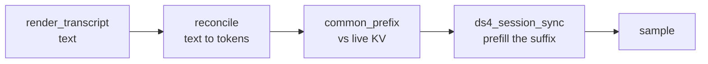
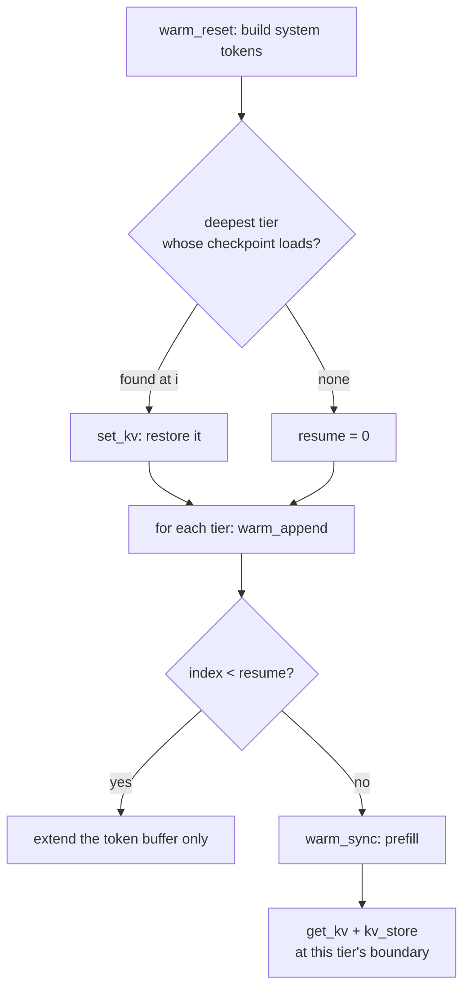

# KV cache mechanics

Prefill is the expensive half of local inference. A cold system prompt runs to
thousands of tokens, and at a few hundred tokens/second of prefill that is a
visible stall before the model has said anything. Everything in this document
exists to avoid paying it twice.

The rule the whole design serves is one sentence: **reuse only a genuinely
matching token prefix, and rebuild anything else rather than trust it.** A
wrongly reused KV does not error — it produces a model that has silently read a
different prompt than the one on screen. Every fingerprint, version byte, and
signature below is there to make that failure impossible rather than rare.

Related reading: **`docs/KV-CACHING.md`** is the companion to this file and the
better starting point if you are new to the subsystem. It follows the arc from
requirement to design to implementation and explains *why* each decision was
made; this document is the mechanics reference, organised by layer, and answers
*what* each piece does. Also `docs/ARCHITECTURE.md` for where these pieces sit,
and `FINDINGS.md` for the traps that cost a debugging session each.

## The two things being cached

Do not confuse them; almost every bug in this area came from doing so.

| | **Live KV** | **Checkpoint** |
|---|---|---|
| Where | in the engine (C session, GPU/unified memory) | a `.kv_raw` file under `~/.plank/kvcache/`, with a `.json` sidecar beside it |
| Lifetime | one process | across launches and across sessions |
| Written by | every `generate` | `warm`, and session save |
| Trusted because | it was built by this process | its signature matches what the caller expects |

A checkpoint is a *snapshot of a live KV plus the tokens it was built from*.
Restoring one is `set_kv`; capturing one is `get_kv`.

## Layer 1: the live KV within a turn

`Ds4Session` keeps **one** C session alive for the whole run, so consecutive
turns extend the same KV instead of rebuilding it. Each `generate` does:



Two properties of that path are load-bearing:

**Tokens, not text, are the unit of matching.** `reconcile` parses the rendered
transcript into role-tagged sections, diffs them against the `TokenTranscript`
the engine already holds, and retokenizes only from the first divergence.
A section that differs by one trailing space is a different section, and
everything after it re-prefills. This is why `kvtier::plan` canonicalizes each
tier's text to exactly what the turn will tokenize — an untrimmed tier and a
trimmed turn diverge at the first tier and rebuild everything below it.

**The sync is extend-only.** `ds4_session_sync` cannot rewrite behind its live
end: the backend still holds SWA rows, compressed KV rows, indexer rows and
compressor frontiers for the old suffix, and a token count cannot roll those
back. So a prompt that is a strict *prefix* of the live KV — exactly what
`/new` and `/clear` produce — matches completely and is still rebuilt from
zero.

`engine::reusable_prefix(pos, common)` encodes that: it returns `pos` only when
`common == pos`, and `0` otherwise. Reporting the raw `common` there would prime
the progress bar as already complete and then run a multi-thousand-token prefill
with no feedback — a hang, as far as anyone watching is concerned.

## Layer 2: volatility tiers

The prompt prefix is a hierarchy ordered **most stable first**, each tier an
extension checkpoint of the one above it. `kvtier::plan` builds the list;
`kvtier::warm` walks it.

| Tier | Content | Key | Storage |
|---|---|---|---|
| 1 | system prompt, global MCP tool defs, sub-agent roster | `fp1 = sha1(model ‖ think ‖ trusted_len ‖ system)` | `sysprompt-<fp1>.kv_raw`, model-global |
| 2 | project-stable context: `AGENTS.md`/`CLAUDE.md`, memory, local MCP tool defs | `fp2 = tier(fp1, stable ‖ local defs)` | `<project-key>/project-<fp2>.kv_raw` |
| 3 | session-volatile: git status, date, hook output | — | never cached |
| 4 | conversation turns | `tier(fp2, transcript)` | `<session>.kv_raw` |

Each fingerprint **chains its parent's**, which is what makes the walk sound:
a deep tier matching proves every ancestor matches, so the walk can restore the
deepest hit without independently revalidating what sits above it.

The split is by *rate of change*, not by size. Tier 3 is never checkpointed
because git status moves between turns; Tier 1 is model-global because the same
system prompt on the same model is the same tokens in every project.

### What is allowed in Tier 1

Only inputs stable across sessions: the verbatim tools prompt, MCP schemas and
instructions, `-sys` text, the agent roster. Per-session data — date, git state,
`AGENTS.md` contents — belongs in `ContextContent` and lands in Tier 2 or 3.
The `fingerprinted_prompt_contains_no_volatile_bytes` test enforces this. A
volatile byte in Tier 1 does not corrupt anything; it just means the most
expensive tier misses on every launch.

### Why `think` and `trusted_len` are key material

Neither changes the prompt's *bytes*, and both change its *tokens*:

- `ThinkMode::Max` prepends a reasoning-effort preamble ahead of the system
  prompt, so two levels give identical text a different token prefix.
- `trusted_len` is where the tokenizer stops treating the prompt as trusted
  control text. Inside that span, `｜DSML｜` becomes the model's dedicated
  vocabulary token; outside it, spelled-out BPE pieces. Same bytes, different
  stream.

A checkpoint keyed on the text alone would be restored under the wrong one and
prefilled against a KV that does not match it.

## Layer 3: the warm walk



Three rules in that diagram are easy to get wrong:

**Append for every tier, including restored ones.** The engine's cumulative
token buffer must describe the *whole* restored prefix. Skipping the append for
a restored tier leaves a hole, and the next sync — seeing a common prefix
shorter than the buffer — rewrites the session's checkpoint from that truncated
buffer, throwing the restored KV away. A deep hit then costs more than a cold
start.

**Capture at the tier's own boundary.** `get_kv` snapshots the *whole* session,
not a range. Persisting after the next tier has synced would store the next
tier's KV under this tier's key — undetectable by fingerprint, because the key
would be genuinely correct for what it claims to be and wrong for what it holds.

**A skipped tier is never written.** This follows from the two above and is the
subtlest consequence in the system: `warm` restores the deepest tier and skips
everything above it, a skipped tier is never prefilled, and a tier never
prefilled is never persisted. Once Tier 2 is valid, **Tier 1 stops being
written** — and if it was never written before that, it never will be.

That is invisible for the main engine, which restores Tier 2, a superset. It
matters for any consumer that needs Tier 1 *alone* — see the sub-agent section.

## Layer 4: on-disk format

Every blob body is a `.kv_raw` file, and every body has a sibling `.json`
sidecar holding its metadata. The `.kv` extension means **session transcript**
and nothing else:

```
~/.plank/kvcache/
  sysprompt-a19f….kv_raw
  sysprompt-a19f….json
  <projkey>/
    project-7c02….kv_raw
    project-7c02….json
  cheeky-bell.kv          # transcript
  cheeky-bell.kv_raw      # KV payload
  cheeky-bell.json        # metadata
```

Paths keep their tier-derived names, so this is a sidecar addition rather than a
content-addressed re-layout. Both files of a pair are created together and swept
together; a body without its sidecar is legal and simply displays with
synthesized defaults.

### The body

One writer, one reader: `KVCache::persist` and `KVCache::from_file`.

```
<signature>\n<version:u8><encoded transcript><raw kv bytes>
```

- **signature** — what the caller expects this file to be. `KvKey::signature()`
  supplies it: `fp1` for Tier 1, `fp2` for Tier 2, the payload fingerprint for a
  session. A mismatch is a miss.
- **version** — `FORMAT_VERSION`, currently 2. Bumping it invalidates every
  cached file, which is safe: all of them are rebuildable.
- **transcript** — the tokens this KV was built from. Empty for tier
  checkpoints, which have no conversation in them. Carrying it in the same type
  is what lets a resumed session avoid re-prefilling from its first reply.

A read is fallible **by value**: missing file, signature mismatch, truncated
body and unknown version are all `None`, and `None` always means "prefill
instead". No other code in plank makes a trust decision about cached bytes.

Writes go through a temp file and rename, so an interrupted write cannot leave a
half-checkpoint that reads as valid.

### The metadata sidecar

`kvmeta.rs` owns the sidecar: one `KvMeta` per body, serialized as JSON.

```json
{
  "version": 1,
  "role": "system" | "project" | "session",
  "fingerprint": "a19f…",
  "parent": "7c02…",
  "model": "…",
  "created": 1770000000,
  "last_used": 1770000000,
  "hits": 41,
  "bytes": 92274688,
  "pinned": false,
  "label": { }
}
```

`parent` is `null` for a system blob and a fingerprint string otherwise, which is
what lets `kvtree.rs` reassemble the tier chain that the warm walk builds in
memory and then forgets. `created` and `last_used` are Unix seconds, `hits`
counts successful loads, and `bytes` caches the body's size so rendering the tree
does not stat every blob. `version` is this schema's own counter, deliberately
independent of `kvcache::FORMAT_VERSION`: a schema change must not invalidate
blobs, so a sidecar whose version does not match `META_VERSION` is ignored rather
than migrated.

`label` is role-specific and exists purely to make the tree readable:

- `system`: `think_mode`, `trusted_len`, `global_mcp` (server names)
- `project`: `project_path`, `agents_files`, `local_mcp` (server names)
- `session`: `name`, `title`
- `unknown`: nothing recorded, the shape a synthesized sidecar takes

That split is also the audit surface for MCP segregation. Global tool defs are
Tier 1 material and local ones Tier 2, so a global server name may appear only on
a `system` label and a local one only on a `project` label. Before the split the
property was a claim in a document; now a test can read it off the labels
(`a_local_mcp_name_never_reaches_a_system_label`).

**The trust invariant: metadata is advisory.** The signature inside the body is
the only trust input for restoring cached bytes, and `KVCache::decode` is the
only place that decides. A missing, corrupt, or disagreeing sidecar degrades the
display and resets some counters; it can never invalidate a good blob and never
validate a bad one. Sidecar parse failure is swallowed into a synthesized
default, and sidecar writes are best-effort because a lost counter update is not
worth failing a persist over. This is the property a future change is most likely
to break: the moment anything reads a sidecar field to decide whether a body may
be loaded, a hand-edited or stale JSON file becomes able to feed the model a KV
built from a different prompt. `a_corrupt_sidecar_never_blocks_a_good_blob` pins
it.

## Layer 5: session payloads

A saved session carries its KV as a `<id>.kv_raw` blob, keyed differently
from the tiers: the file is named after the session id, which is stable across
resaves, but it is only trusted when its stored signature equals
`payload_fingerprint(model, think, trusted_len, system, transcript_render)`.
Keying on the id alone would make a payload captured under a different model or
system prompt a hit.

Restoring a payload **skips the warm walk entirely** (`skip_warm_after_restore`).
The payload is a superset of every tier prefix — it came from a session that had
already been warmed — so there is nothing left to warm, and running the walk
afterwards is strictly destructive: its last act per tier is `set_kv` on a
checkpoint whose transcript is empty by construction, which rewinds the live KV
from the end of the conversation back to the tier boundary and clears the token
transcript. Measured at 165 tokens re-prefilled on a two-turn session, scaling
with the whole conversation.

## Layer 6: forks and sidechains

A sub-agent runs as a fork of the live transcript. Two mechanisms keep the
parent's KV intact:

**`fork_kv` snapshot/restore.** `begin_subagent_fork` captures the live KV
before the sidechain diverges it; every fork-end path calls `restore_fork_kv`.
Without it the post-fork prompt (parent prefix + the small report) diverges
behind the sidechain's live end, and the extend-only sync re-prefills the whole
parent context from token zero rather than just the report. The stack is LIFO
and pushes `None` rather than skipping, so a nested fork cannot pop the parent's
snapshot.

**Clean-room sidechains on an alternate engine.** When a definition names its
own engine, the parent engine is never called, so there is nothing to snapshot
(`snapshot_kv: false`). The parent transcript is stashed and only the framed
task is visible, which keeps parent context out of a provider's billing and out
of the sidechain's prompt.

### The alt local engine

A `provider: local` sub-agent under a provider main agent means two engines
alive at once, and this is where Tier 1's write-once problem bites: the
sidechain is clean-room, so its prompt is the system prompt plus the framed task
with **no** project or session context between them. It needs Tier 1 alone.
Restoring Tier 2 would seed its KV with tokens its prompt does not contain.

So the alt engine is warmed at startup with a tier list of **one**. With nothing
deeper to short-circuit it, Tier 1 is prefilled and written — which is also what
makes `sysprompt-*.kv_raw` exist at all on a machine whose Tier 2 has been valid for
months.

Two configuration requirements, both silent when missed:

- The alt engine needs `set_trusted_system_prefix` and `set_think_mode` applied
  exactly as the main engine does, because `warm_reset` builds its tokens from
  those fields. An unconfigured engine tokenizes the same system text
  differently from whatever wrote the checkpoint, restores a KV its token buffer
  does not describe, and prefills anyway — reporting success.
- `/think` must reach every cached alt engine. The level is Tier 1 key material,
  so an engine left behind builds tokens at one level while being keyed at
  another: a disagreement between the key and the tokens, which no fingerprint
  can catch.

## Layer 7: the snapshot ladder

Micro-compaction rewrites old tool-result bodies to a stub *in place*
(`compact::microcompact`). That is exactly the case Layer 1 rules out reuse
for: the engine can only extend its live end, never roll back behind it, so a
rewrite anywhere in the transcript forces a full re-prefill from token zero —
even though everything before the rewrite is still correct. A snapshot taken
*before* the rewrite point is a legitimate restore target: restoring it makes
the engine's live end equal to the snapshot's, and the next sync genuinely
extends forward from there.

`kvladder.rs` keeps a small, depth-indexed ladder of such snapshots ("rungs")
per live session, in memory (`Agent::ladder`) plus one blob per rung on disk.

**Not yet proven in production.** The accepting path — a pass that actually
fires and a rung that is actually restored — has only ever been exercised by
unit tests with a synthetic small `ctx_size`. It needs the window around 42%
full before the pressure-dependent floor relaxes far enough, and no benchmark
run to date has come close to filling a 1M-token window (measured sessions
reach 2-3%). What *has* been measured live is the refusing path; see
`FINDINGS.md`.

- **Naming and location.** A rung's blob is `<id>.rung-<n>.kv_raw`, next to the
  session's own `<id>.kv_raw` payload and `<id>.kv` transcript, where `<n>` is
  a *monotonically increasing* slot index minted by `KvLadder::push` — not a
  vector position. A session's fourth rung is `rung-3`, its fifth `rung-4`,
  and so on for the life of the process; nothing ever reuses a lower index.
- **Trust rule.** Identical to every other KV blob in this system: a rung is
  read back through `SessionStore::kv_load`, which trusts only the signature
  embedded in the body, never the filename or its sidecar. The signature is
  `payload_fingerprint` computed over the transcript *as it stood at capture
  time* — i.e. truncated to the rung's own `spans` — because that is what
  `render_transcript` produced when the blob was written, and
  `render_transcript` has no length-dependent formatting, so replaying that
  same truncation later reproduces the byte-identical render to fingerprint
  against.
- **Placement.** A rung is captured as an *anchor*, immediately before a tool
  result larger than `MICROCOMPACT_MIN_BYTES` is appended to the transcript
  (`Agent::anchor_rung_before_tool_result`). At that instant
  `transcript.len()` is exactly the index that result will occupy, which is
  exactly the index `microcompact_first_index` later reports as the edit point,
  so `select`'s `spans <= edit` holds with equality. Capturing at *turn ends*
  instead — the original design — can never work: micro-compaction clears
  oldest-first, so the edit sits near the start of the transcript, while within
  a single turn the transcript jumps from 1 span to 6 and no turn boundary
  exists at a usable depth. A measured 18-turn session captured 11 turn-end
  rungs and used none of them.
- **Spacing.** `KvLadder::wants_anchor` suppresses a capture when the ladder
  already holds a rung shallow enough to cover this index (the same test
  `select` applies), unless the new anchor is at least
  `LADDER_ANCHOR_MIN_SPACING_TOKENS` (8192) tokens deeper. Since
  `microcompact_first_index` is monotone non-decreasing, only a handful of
  anchors per session are ever useful.
- **Eviction.** At most `LADDER_MAX_RUNGS` (3) rungs are held per session.
  Pushing a fourth evicts whichever interior rung's removal least widens the
  largest remaining gap — never the shallowest rung (the only one that can
  cover an edit near the start of the transcript) and never the newest.
- **Selection.** `KvLadder::select(edit, already_reused)` returns the deepest
  rung with `spans <= edit` that covers more tokens than the engine would
  reuse unaided — so a restore is only performed when it is a genuine
  improvement, never a regression.
- **Lifecycle.** Rungs are a live-session accelerator, not history: they are
  deleted outright when the session they belong to is replaced or rewritten
  (`/new`, `/clear`, `/switch`, `/resume`, a full compaction, or a clean exit —
  `Agent::discard_ladder`, `SessionStore::remove_rungs`), and swept as a
  backstop by GC (below) for the case where none of those exit paths ran — a
  crash, a `SIGKILL`, or a machine losing power mid-session.
- **GC treatment.** A rung gets its own role, `KvRole::Rung`, with a dedicated
  one-day TTL (`RUNG_BACKSTOP_SECS`) independent of `kvcache.ttlSessionDays` —
  a rung is worthless the instant its process is gone, unlike a saved session
  payload, so there is no reason to let a crash-orphaned one survive as long
  as one. Phase 2's budget pass also always evicts rungs first
  (`evict_rank(KvRole::Rung) == 0`, everything else `1`), since a rung is the
  cheapest thing in the cache to recreate and the one role that is *never*
  history a later run would miss. And a rung is never parented to its
  session in the metadata graph: `plan_sweep`'s "has a surviving child" rule
  (Phase 1, item 3) would otherwise make the single most disposable blob in
  the cache the thing keeping the session payload — and the tier checkpoint
  above it — alive.

- **The gate, and why it depends on context pressure.** An opportunistic pass
  is only taken when `compact::microcompact_is_worth_it(reclaimable,
  reprefill_tokens, ctx_size, ctx_used)` agrees, where `reprefill_tokens` is
  the rendered transcript's token count minus whatever the selected rung
  covers. The comparison is bytes reclaimed per token re-prefilled against a
  floor, and that floor is **not fixed**: it is
  `MICROCOMPACT_BYTES_PER_TOKEN_FLOOR` (2.0) while used context sits at or
  below half of `compact::compaction_trigger_used(ctx_size)`, then relaxes
  linearly to a small epsilon (`MICROCOMPACT_FLOOR_EPSILON`, 0.05) at that
  trigger — the exact point `should_compact` starts firing, so the cheap
  decision and the expensive one are anchored to the same threshold and cannot
  contradict each other (`compact::microcompact_floor`). The floor bottoms out
  at an epsilon rather than at zero because zero means "accept any pass at
  all", and the opportunistic pass runs at the end of a turn while
  `should_compact` is consulted at the start of the next: a pass barely
  clearing the minimum could spend a `set_kv` and a rewrite immediately before
  a full compaction discarded the ladder and rebuilt anyway.
  The reason is that the value of reclaiming context is not constant. A
  measured run offered 12,344 bytes for 10,674 re-prefilled tokens — a ratio of
  1.16 — in a window 2% full, where the right answer is no: ~3,300 tokens of
  context are not worth ~98 s of prefill when nothing is short. The same trade
  at 60-80% of the window is clearly worth taking, because there the
  alternative is a full compaction: a model round-trip *plus* a total KV
  rebuild. At or past the trigger the floor is zero and the opportunistic pass
  can never be the blocker — full compaction is imminent and will rebuild the
  KV regardless, so refusing a cheap pass there is strictly worse. The
  decision is monotone in each input: more bytes reclaimed or more pressure
  makes it more willing, more tokens re-prefilled less. The
  `microcompact gate refused:` debug line reports `ctx_used`, `ctx_size` and
  the effective `floor` alongside the bytes and tokens.

A rung restore is a performance mechanism only: on a miss (stale fingerprint,
missing blob, or no rung shallow enough) the code path is identical to having
no ladder at all — the transcript rewrite proceeds and the next turn simply
re-prefills, exactly as it always did.

## Garbage collection

Checkpoints run to hundreds of megabytes, and a plank upgrade, an MCP server
added or removed, or a model switch forks a new one while the old one keeps its
file. Retention used to be "keep the current fingerprint, delete every sibling",
which meant switching model or reasoning level back and forth paid a full Tier 1
re-prefill each way. It is now **value-based**: a blob lives while it is pinned,
in use, holding something up, or simply young enough. `kvgc.rs` owns the policy,
`SessionStore::sweep` executes it, and a best-effort sweep runs at startup.

The sweep is two phases, both pure functions of (nodes, active fingerprints,
policy, now).

**Phase 1, per node, first match wins:**

1. `pinned`: keep.
2. In the tier chain this launch is using: keep. Recency for these nodes is
   refreshed by the load itself (`SessionStore::kv_load`), not by the sweep.
3. Has a surviving child: keep. An expired system prompt with a live session
   below it stays.
4. `now - last_used >= ttl(role)`: delete the `.kv_raw` and its `.json`.

Otherwise keep. The comparison is `>=` rather than `>` so that a TTL of zero
means "collect on sight" instead of being a silent no-op.

Rule 3 reads the node set as it stood **before** the sweep began, not one
mutating as files are unlinked, which is what makes the outcome independent of
directory scan order. The cost is that a parent whose last child died this run
needs one more run to go, so a dead chain collects one level per launch. That
bottom-up cascade is the intended behaviour, not a defect.

**Phase 2, the budget pass**, runs only once phase 1's verdicts are fully
determined. If the survivors still total more than `kvcache.maxBytes`, they are
evicted in a globally sorted order (ascending `last_used`, ties broken by
fingerprint), skipping pinned nodes, nodes in the active chain, and nodes with a
child that survived phase 1, stopping as soon as the total is under budget.
Sorting before evicting is what keeps this order-independent. Note that phase 2
re-derives "has a surviving child" against the *post*-phase-1 survivors, the
opposite of phase 1: a parent whose only child just expired must become evictable
rather than immortal under any budget.

Settings, read from `settings.json`:

| key | default | meaning |
|---|---|---|
| `kvcache.ttlSessionDays` | 14 | idle days a session payload survives |
| `kvcache.ttlTierDays` | 30 | idle days a system or project checkpoint survives |
| `kvcache.maxBytes` | 21474836480 (20 GB) | ceiling for the budget pass; `0` disables it |

There is no separate user-facing setting for the rung TTL: it is derived as
`min(ttlSessionDays, 1 day)` (`RUNG_BACKSTOP_SECS`), so a stricter session TTL
can only tighten it, never loosen it.

`maxBytes = 0` means **unbounded**, never "evict everything". The inverse
reading would wipe the cache on every launch for anyone who never set the key.
The ceiling is also a target rather than a licence: a cache of nothing but pinned
and active blobs stays over budget, and the footer says so.

A verdict maps to a **path**, not to a fingerprint. Two bodies can legitimately
carry the same fingerprint (a root `sysprompt-X.kv_raw` beside a
`<projkey>/project-X.kv_raw`, or the same `project-X` under two project
directories), so a fingerprint-keyed delete could unlink a file the sweep had
decided to keep.

Each verdict is re-checked against the disk immediately before the unlink. A
sibling process persisting a multi-hundred-megabyte body spans the whole window
between the scan and the delete, so a body whose sidecar has moved since the scan
is skipped rather than deleted under metadata that no longer describes it.

Version transitions (`upgrade.rs`) deliberately do **not** drop KV caches: they
self-validate by signature and format version. Only the image cache, which has no
such guard, is dropped on a major bump.

### One-shot migration to the sidecar layout

The pre-sidecar layout is wiped rather than adopted, once, by
`SessionStore::migrate_legacy_blobs`, which `main.rs` calls before any terminal
setup and which is guarded by a `.kvformat-2` marker in the cache directory.
Synthesized metadata would carry no lineage and unreliable counters, and every
tier rebuilds on demand, so adopting the old files would buy nothing. Deleted:
`sysprompt-*.kv`, `<projkey>/project-*.kv`, `*.payload`, the legacy bare
`sysprompt.kv`, and `sysprompt-last.prompt`. **Every `<id>.kv` transcript is
preserved**, so resuming a session across the migration works exactly as before
and pays one re-prefill. The reclaimed byte count is reported once, on that first
launch.

### Browsing the cache: `/kvcache`

`kvtree.rs` groups the sidecars into a forest by `parent`, and `kvpane.rs` turns
that forest into rows, selection and key handling. A node naming a parent with no
file on disk renders under an `(orphaned)` heading rather than disappearing: a
blob you cannot see is a blob you cannot delete, and those are exactly the ones
worth deleting.

In the TUI, `/kvcache` opens a centered modal: `↑↓` move, `←→` fold, `p` pin, `d`
delete (with a `y` confirmation), `g` sweep now, `Esc` close. The plain-stdout
REPL has no pane, so it prints the same tree statically and takes
`/kvcache pin|unpin|rm|gc` subcommands. Both front ends read the same rows, per
the two-parallel-paths rule in `CLAUDE.md`.

Rows, collapse keys and pin/delete actions are keyed on a **scan index** — the
position of the blob in `SessionStore::kv_blob_nodes`, the one walk every caller
shares — not on a fingerprint. A fingerprint cannot identify a file: two bodies
may share one, and a session sidecar records the *payload* fingerprint, which
never equals the `<id>` its body is named after. So the two same-fingerprint
bodies described above fold, pin and delete independently. The REPL subcommands
keep their `<fp-prefix>` argument, resolving it to an index first and still
refusing a prefix that matches nothing or more than one blob. Because a session
row is labelled by its *name*, its detail line also carries the first 8 characters
of its fingerprint, so the handle `/kvcache rm` wants is one you were shown.

An index is a position in a scan, not a durable handle, so `kv_blob_paths` sorts
by path (making both the row order and the phase-2 budget tie-break reproducible)
and every row carries its fingerprint alongside its index. A mutation retakes the
scan and refuses unless the blob at that index still carries the expected
fingerprint, with a second check that the body is present under a matching sidecar
immediately before an unlink. Without that, a blob unlinked by a second plank or a
sub-agent between the pane being drawn and a `d` press would shift every later
index down one and the delete would hit the neighbouring body. A refusal is the
right answer there: the cache moved, so the pane has to be reopened.

## Diagnosing a miss

A silent hit and a silent miss look identical, which is why `kvtier::Restored`
names the outcome and callers print it with the fingerprint and the exact path:

| Outcome | Meaning | Usual cause |
|---|---|---|
| `Yes` | restored | — |
| `NoKey` | tier is not cacheable, or no store | Tier 3, or a store-less caller |
| `NoCheckpoint` | nothing on disk under this key | never warmed at this fingerprint, or the prompt changed |
| `Unreadable` | present, keyed right, would not load | stale format, interrupted write |
| `EngineRefused` | bytes loaded, engine rejected them | built by a different build |

`NoCheckpoint` is the common one, and the fingerprint is usually the answer: it
covers the system prompt, and the sub-agent roster is part of the system prompt,
so a project with its own `.plank/agents` keys Tier 1 differently from the same
model in any other directory.

`kv_debug` logging reports, per generate, the prompt length, the cached prefix,
the percentage reused, and — on a full rebuild — that the prompt was a strict
prefix of a longer live KV. `reconcile` logs the first divergent span with both
sides, which is how a mismatch in invisible characters gets found.

## Test coverage

None of this needs a model. `SpyEngine` in `kvtier.rs` records what the walk
asked the engine to do, and `ScriptedEngine` in `ui.rs` covers the agent-level
pairings.

What the tests deliberately pin, beyond the walk's logic:

- the checkpoint **file** appears after a one-tier warm — not merely that a
  prefill ran, since nothing else would notice `warm` ceasing to write Tier 1
- a **second launch** restores instead of prefilling, using two separate engines
  because a launch is a fresh process
- a valid deep tier leaves Tier 1 unwritten — the known gap, pinned so closing
  it is a decision rather than a surprise
- warm and GC in the order a launch runs them: neither is wrong alone, and the
  pair deleted what the launch had just written
- all four `Restored` outcomes, because conflating absent with unreadable sends
  an investigation the wrong way

## Known gap

If the main engine's Tier 2 checkpoint is invalidated, it rebuilds from token
zero rather than restoring Tier 1, because Tier 1 will not exist unless
something else created it. Closing that needs a second snapshot taken at the
Tier 1 boundary — the boundary rule above means an existing snapshot cannot be
reused for it — so it costs one extra capture on a cold walk. Not done.
