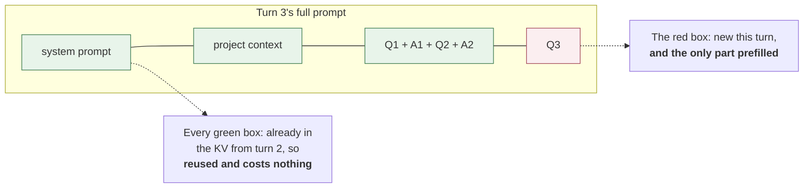
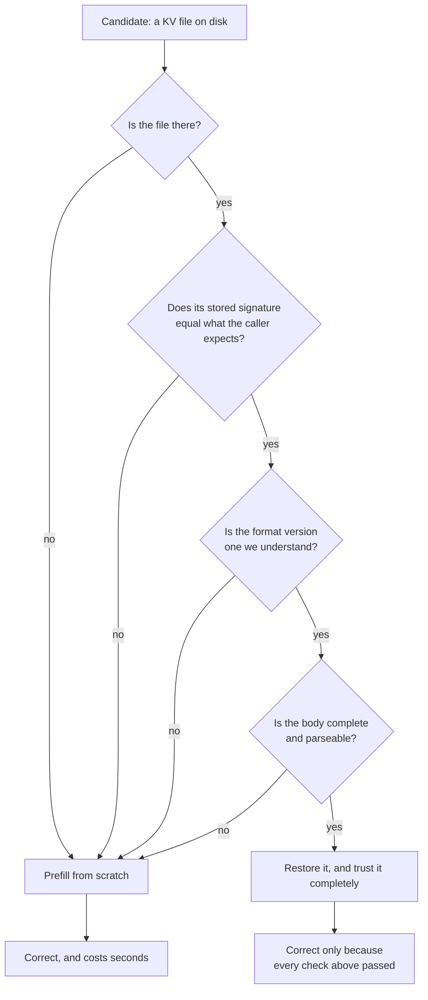
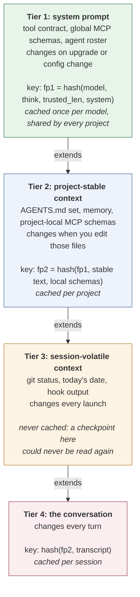
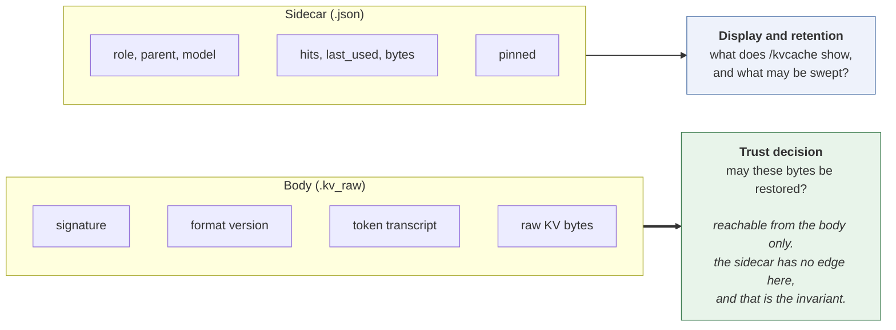
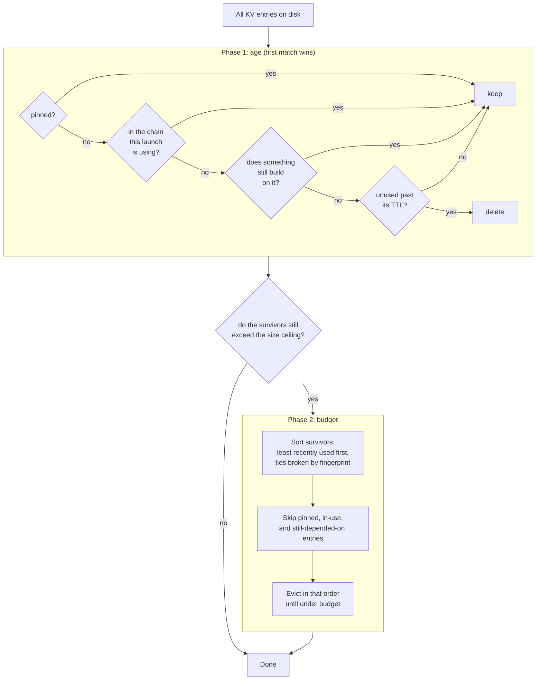
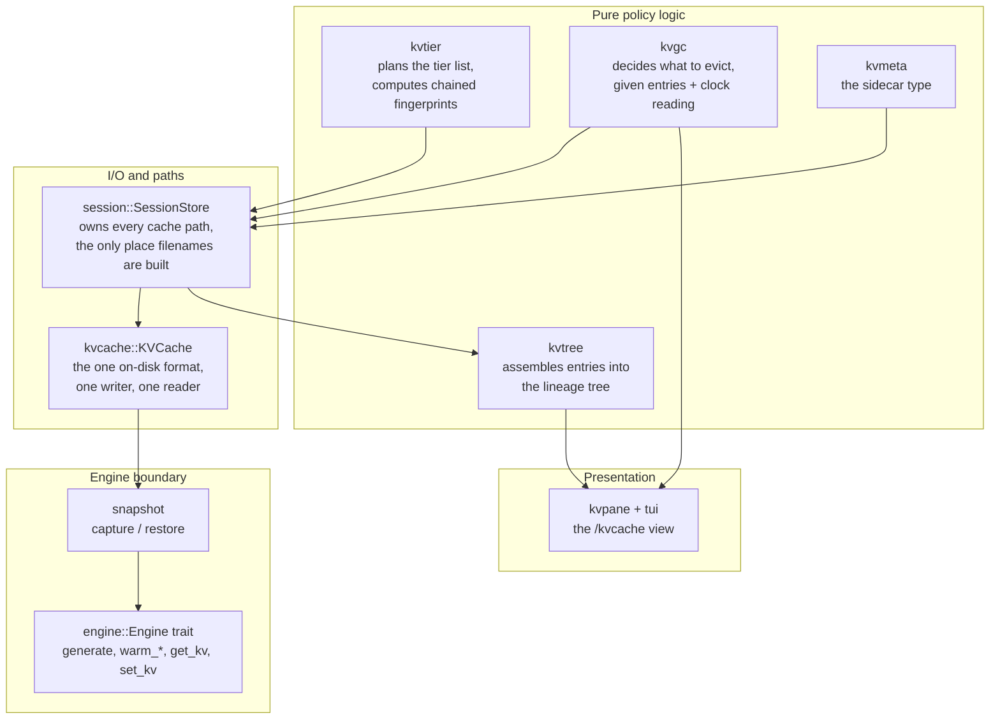
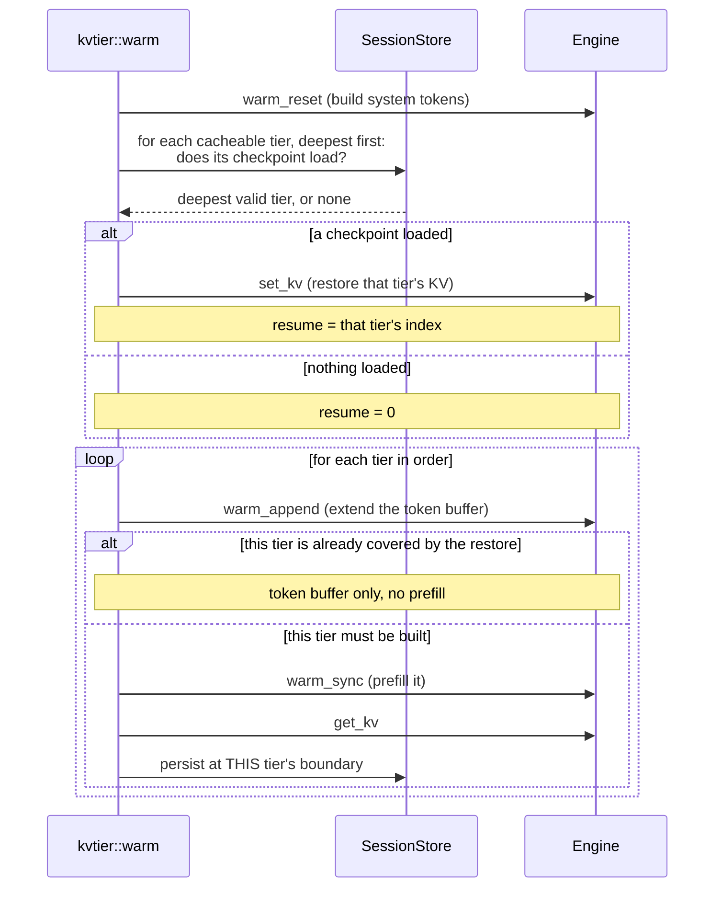

# KV caching in plank: requirements, design, implementation

This document explains *why* plank's KV cache is shaped the way it is. It is
self-standing: you should not need to read the source to follow it, and it does
not assume you have read the other documents in this directory.

It is deliberately a companion to two other files rather than a replacement for
either. `docs/KV-CACHE.md` is the mechanics reference, organised by layer, and is
where you go to answer "what exactly does this function do". `FINDINGS.md`
records the individual traps, each with the debugging session that found it. This
document is the connective tissue: the problem, the forces acting on it, and the
reasoning that produced the design those two describe.

A note on scope. Everything here concerns the local Metal-backed engine running
DeepSeek V4 Flash. Hosted providers have their own prompt-caching mechanisms with
entirely different economics, and plank uses them, but they are not this.

---

## Part 1: The requirement

### Where the time actually goes

A language model turn has two phases with wildly different costs. **Prefill**
reads the prompt and builds the attention key/value tensors for every token in
it. **Decode** then emits one token at a time, each step attending over
everything already in that KV state.

Decode is what you watch happen. Prefill is what you wait through before
anything appears. On a local Metal backend, prefill runs at a few hundred tokens
per second. That number is the entire reason this subsystem exists, because of
what gets fed to it.

plank's system prompt is thousands of tokens before you have typed anything: the
tool contract, every MCP server's schemas and instructions, the sub-agent roster.
Add project context, which means every `AGENTS.md` and `CLAUDE.md` plank
discovered, plus your memory file. Then add the conversation, which for a real
working session reaches tens of thousands of tokens. The model's context window
is one million tokens, and long sessions genuinely use a serious fraction of it.

Now consider the naive implementation, where each turn hands the model the whole
prompt and lets it read from the beginning. Turn *n* re-reads everything turns 1
through *n-1* already read, so the total prefill work over a conversation grows
with the square of its length:

| | Turn 1 prefills | Turn 2 prefills | Turn 3 prefills |
|---|---|---|---|
| **No reuse** | system + context + Q1 | system + context + Q1 + A1 + Q2 | system + context + Q1 + A1 + Q2 + A2 + Q3 |
| **With reuse** | system + context + Q1 | A1 + Q2 | A2 + Q3 |

The first row is quadratic in the length of the conversation. The second is
linear. At a thousand-token system prompt that difference is an annoyance; at
plank's actual prompt sizes it is the difference between a usable agent and one
that stalls for most of a minute before every reply.

What makes the second row possible is that the attention state for a prefix does
not depend on anything that comes after it. So if the model has already read
`system + context + Q1 + A1`, and the next prompt starts with exactly those same
tokens, the KV state for them is still valid and only the remainder needs
reading.



### Four requirements

From that, four requirements fall out, and they are listed in priority order
because they conflict and the order is how the conflicts get settled.

**R1. Reuse across turns.** Within one run of the process, turn *n+1* must not
re-read what turn *n* already read.

**R2. Reuse across launches.** Quitting plank and starting it again must not cost
a full rebuild of the system prompt. This is a separate requirement from R1
because it forces the KV state onto disk, which introduces every hard problem in
this document. R1 alone could be satisfied by keeping one session alive in
memory.

**R3. Never reuse wrongly.** This dominates R1 and R2, and understanding why is
the key to the whole design. A wrongly reused KV does not raise an error. It
produces a model whose attention state was built from a *different prompt than
the one on screen*. It will answer confidently, using tool definitions it no
longer has, a system prompt you edited an hour ago, or a conversation that
belongs to a different session. There is no exception, no log line, and no
plausible way for a user to diagnose it. Compared to that, a cache miss costs
some seconds.

**R4. Bounded disk.** Snapshots of a million-token-capable attention state are
large: hundreds of megabytes for a system prompt, and around a gigabyte for a
long conversation. Left unmanaged this reaches tens of gigabytes, which it did on
the author's machine before the retention policy described in Part 3 existed.

---

## Part 2: The constraints

R3 would be easy if identity were simple. It is not, and four properties of the
underlying machinery are the reason.

### The unit of identity is tokens, not text

The obvious way to check whether a cached KV matches the current prompt is to
compare the prompt text. This does not work, and the reason is worth internalising
because it recurs throughout the design.

Byte-pair encoding is many-to-one. Many token sequences decode to the same
string, and the tokenizer picks exactly one canonical segmentation of them, the
one its merge order produces. The *sampler* is under no such constraint. It can
emit `"in"` followed by `"to"` where the encoder would have produced the single
token `"into"`, split a number or an identifier at a different boundary, or emit
a rare standalone token that the merge rules would have absorbed into its
neighbour.

So detokenising a reply and retokenising it is not the identity function on token
ids, even though it is on text. One differing id shifts every position after it,
and the KV state is indexed by position. A cache validated on text but keyed to
positions is a cache that can be confidently wrong, which is precisely the R3
failure.

This has a direct consequence that shapes the on-disk format: a persisted KV must
carry the token sequence it was built from. Text is not enough to reconstruct it.

### The engine can only extend, never rewrite

The backend keeps more state than a token count can describe: sliding-window
attention rows, compressed KV rows, indexer rows, compressor frontiers. Its sync
operation can extend the live state forward but cannot roll it back behind its
live end, because a position count does not describe how to undo those
structures.

The counter-intuitive consequence is that a prompt which is a strict *prefix* of
the live KV cannot be reused at all. It matches perfectly, on every token, and
the reuse is still impossible. This is exactly what `/new` and `/clear` produce,
which is why resetting a session used to silently rebuild the entire system
prompt, and why plank now restores a checkpoint at the tier boundary instead of
trying to shrink the live state.

There is a user-visible corollary. If the code reports the raw matching prefix
length in this situation, the progress bar arrives already full and then sits
there through a multi-thousand-token prefill with no feedback. To anyone
watching, that is a hang. So the reusable length is reported as zero unless the
whole live state is being kept.

This constraint bites in a second, less obvious place: micro-compaction
clears old tool-result bodies by rewriting their text *in place*, mid-session.
That is not appending or removing a message — it is exactly the "roll back
behind the live end" case the engine cannot do, at whatever point the
rewritten message sits. Absent a mitigation, every micro-compaction pass costs
a full re-prefill of everything from that point on, including the large
stretch of the transcript that did not change. A measured 18-turn session paid
72,769 tokens re-prefilled this way across five full rebuilds — see
`docs/superpowers/specs/2026-08-31-kv-snapshot-ladder-design.md` for the numbers
and Part 3 below for the fix.

### A cache boundary has to fall on a message boundary

You might reasonably want to snapshot the KV in the middle of a long block of
context text, at whatever offset is convenient. You cannot.

Byte-level BPE merges across a seam, so `tokenize(stable)` is not necessarily a
prefix of `tokenize(stable + volatile)`. Two pieces of text that concatenate
cleanly can tokenise to sequences that diverge at the join. On top of that, the
chat template wraps each message and closes that wrapper at the message's end, so
a mid-message split lands inside a structure that is not closed.

This is why plank injects its session-start context as *two* separate user
messages, a stable one and a volatile one, rather than one concatenated block.
The text the model sees is identical. The tokenisation is now guaranteed to have
a reusable boundary between them.

### A snapshot is the whole session, not a range

The capture primitive serialises the entire live session. There is no API for
"snapshot the first N positions".

That sounds like a limitation and is really a scheduling constraint: it means the
order of operations when building a layered prefix is not a matter of taste. You
must sync to the end of tier *i*, capture and persist tier *i*, and only then
sync tier *i+1*. Building the full prefix and then trying to attribute parts of
it to individual tiers retroactively is not possible.

Worse, that mistake is undetectable by fingerprint. Persisting tier *i* after
prefilling tier *i+1* writes tier *i+1*'s KV under a key that is genuinely,
correctly computed for tier *i*. The key is right. The bytes are wrong. Nothing
downstream can tell.

### The shape of the trust decision

Putting R3 together with the above gives the rule the entire implementation
serves, and it is worth stating as a single sentence: **reuse only a genuinely
matching token prefix, and rebuild anything else rather than trust it.**



Two design commitments come out of that diagram.

The first is that every rejection path leads to the same place. Absent, stale,
truncated, and written-by-an-older-version are not distinguished by the caller,
because there is no useful difference between them: all four mean "prefill
instead". Collapsing them removes a whole category of bug where one rejection
reason is handled and another is overlooked.

The second is that a rejection must be cheap and routine, never exceptional. If
a cache miss were expensive or awkward to handle, there would be pressure to
avoid one, and that pressure is exactly what produces a wrongly trusted cache.

---

## Part 3: The design

### Separate by rate of change

The single most important design decision is that the prompt prefix is not one
cache entry but a hierarchy of them, split by *how often each part changes*.

This is not a size optimisation. It is a consequence of R2 and R3 together. The
system prompt changes when plank is upgraded or an MCP server is added, perhaps
weekly. Project context changes when you edit `AGENTS.md`, perhaps daily. Git
status changes between turns. If those live in one cache entry, that entry's
lifetime is the lifetime of its *most volatile* member, and the expensive stable
part gets thrown away every time the cheap volatile part moves.



Read the key lines from the top down and the chaining is visible: `fp2` is
computed from `fp1`, and tier 4's key from `fp2`. Note that tier 3 sits in the
chain as prefix text but contributes no key of its own, because it is never
stored.

Three decisions inside that structure are worth their own explanation.

**Each fingerprint chains its parent's.** Tier 2's key is computed *from* tier
1's key, not merely alongside it. This is what makes the lookup sound. Because a
child's key embeds its parent's, a valid deep tier is proof that every tier above
it is also valid. The walk can therefore restore the deepest hit without
independently revalidating the chain above it, and "the deepest valid tier" and
"the last tier of the leading valid run" are guaranteed to be the same thing. A
stale checkpoint cannot be mistaken for a fresh one, because staleness anywhere
in the chain changes every key below it.

**Tier 3 is deliberately never cached.** Caching it would be strictly wasteful.
Its content changes every launch, so a checkpoint written for it could never be
read by anything. Recognising which parts of a system are *not worth caching* is
as much a part of cache design as deciding what is.

**Project-local MCP schemas key tier 2, not tier 1.** They reach the model
through the system prompt text, so the naive placement is tier 1. Putting them
there would make tier 1 project-specific, destroying the one property that makes
it worth its size: that the same system prompt on the same model is the same
tokens in every project you work in. So the local schemas are folded into tier
2's *key* while their text stays where the model needs it. There is a matching
subtlety for global MCP servers: their schemas are rendered from a cached
advertisement rather than from a live handshake, so a server that fails to start
this morning cannot invalidate the most expensive tier in the system.

### A depth-indexed ladder resolves the in-place-rewrite case

The tier hierarchy above solves reuse for the *stable* parts of the prompt.
It does nothing for micro-compaction's in-place rewrite, because a tier
boundary sits at a fixed depth and a rewrite can land anywhere past it in the
conversation. What that case needs instead is a snapshot that can be taken
*anywhere* a rewrite might later occur, so the restore can pick whichever one
predates the actual edit.

The shape of the fix follows directly from two facts about micro-compaction's
own behaviour. First, it walks the transcript oldest-to-newest, and a cleared
body becomes a stub too small to be a candidate again — so the point past
which it rewrites next only ever moves forward, never back. Second, a
snapshot only helps when it predates the edit; one at the live end is useless,
since the live end is exactly where the next edit already isn't. Together
these mean a single rolling snapshot cannot work (it always postdates the
next edit), but a small **ladder of snapshots at increasing depths** does:
whichever rewrite comes next, some rung on the ladder already sits behind it.

`kvladder.rs` implements this as pure logic — spans and token counts only, no
engine dependency — with the ladder capped at three rungs (measured snapshot
economics make more possible, but each rung is 200-400 MB on disk, and the
cache already runs to tens of gigabytes) and a minimum spacing between
consecutive rungs, so captures spread out rather than clustering uselessly
near the live end. `Agent` (`ui.rs`) owns the two moments that make this
correct: it captures a rung once per turn when the ladder wants one, timed
*after* any compaction that turn already ran (so the rung's prefix is stable
when it is signed), and it restores a rung strictly *before* micro-compaction
mutates the transcript, using the already-known edit point to pick the
deepest usable one. Restoring after the mutation would fingerprint the wrong
prefix; deciding whether to restore only *after* calling `set_kv` — an actual
review finding on this branch — throws away the live KV for nothing on the
turn the pass declines to fire, and then does so again every turn after,
since the reclaimable total only grows. The decision and the restore must use
the exact same selection call, made before either one touches the engine.

The decision itself is the last piece, and it is not a property of the ladder
at all. Whether an opportunistic pass is worth its prefill cost is a question
about *the value of context*, and that value is not constant: reclaiming a few
thousand tokens is worthless when the window is 2% full and valuable when it is
nearly full, because in the second case the alternative is not "do nothing" but
a full compaction — a model round-trip plus a total KV rebuild. A fixed
bytes-per-token ratio cannot express that, and a measured run showed exactly
the failure mode: a ratio of 1.16 refused at every turn, correctly at 2%, and
with no mechanism to ever accept it. So the floor is a function of context
pressure — strict while the window is roomy, relaxing linearly at the point
full compaction fires to a small epsilon (`MICROCOMPACT_FLOOR_EPSILON`, 0.05)
rather than to nothing, since "accept anything" would let a marginal pass spend
a rewrite moments before a full compaction threw the result away. It is
anchored to *the same* threshold `should_compact` uses rather than a second one
of its own, so the cheap decision can never sit blocking in front of the
expensive one.

One caveat a reader should carry away: this accepting branch has never fired in
a live session. It has only ever run in unit tests with a synthetic small
`ctx_size`, because no benchmark yet built fills enough of a 1M-token window to
relax the floor. The refusals are measured; the acceptance is designed.

### Some key material does not change the text

Tier 1's key includes two inputs that do not alter a single byte of the prompt,
and both are there because they change its *tokens*.

The reasoning level matters because the maximum setting prepends a
reasoning-effort preamble ahead of the system prompt. Identical system text,
different token prefix.

The trusted length is subtler and is the better illustration of why textual
identity is insufficient. It marks where the tokenizer stops treating the prompt
as trusted control text. Inside that span, the markup delimiter is the model's
own dedicated vocabulary token; outside it, the same characters become
spelled-out BPE pieces. Identical bytes, different token stream, same position
indices pointing at different things.

A checkpoint keyed on the text alone would be restored under the wrong setting
and prefilled against a KV that does not describe it. This is R3 failing quietly,
and it is the kind of bug that would be found weeks later by someone noticing the
model behaved oddly at one reasoning level.

### One value type, one writer, one reader

Every persisted KV in plank, whether it is a system-prompt checkpoint, a project
tier, or a session's conversation, is the same type in the same format, written
by one function and read by one function.

This was not the original state. There were three near-identical
`fingerprint + bytes` implementations and two different payload shapes. The
consolidation matters for a reason specific to this problem: a cache whose
correctness depends on a signature check is only as trustworthy as its *least
careful* reader. Three readers means three places for someone to add a
well-intentioned fallback, and one such fallback is enough to reintroduce R3.
With one reader, the trust decision exists in exactly one place and can be
audited by reading a dozen lines.

The read is fallible by value rather than by exception. It returns an optional,
and nothing above it makes a trust judgment about cached bytes.

### Metadata has to be advisory

plank keeps a small JSON file beside each KV body recording what it is, which
snapshot it extends, its size, how often it has been reused, when it was last
used, and whether it is pinned. That metadata is what makes the cache
inspectable, and it is what retention decisions read.

It is also, deliberately, incapable of affecting whether a KV is trusted. The
signature embedded in the body remains the only trust input. A missing sidecar, a
corrupt one, or one that disagrees with the body all degrade the display and
reset some counters. None of them can make a good body unusable, and none of them
can make a bad body usable.

The reason is a direct application of R3. The sidecar is a second, unsigned
description of the same bytes. The moment it can gate a load, the cache has two
sources of truth about identity, and they can disagree. Keeping it advisory means
the metadata can be as rich and as lossy as convenience dictates, because
nothing correctness-critical depends on it.



The absence of an edge from the sidecar to the trust decision is the invariant. If
a change ever draws one, the property is gone.

### Retention: age first, then a ceiling

R4 asks for bounded disk, and the first attempt at it was to keep only the
*current* fingerprint for each tier and delete every sibling. That is beautifully
simple and turned out to be a poor trade.

The problem is that it makes cache identity and cache retention the same
decision. Switch reasoning level, and the checkpoint for the level you just left
is deleted, because it is no longer current. Switch back, and you pay a full
system-prompt prefill. Alternate between two models, and neither ever has a warm
checkpoint. The policy optimised disk perfectly and defeated R2 in the process.

The replacement separates the two questions. Retention is now about *value*, and
value is estimated from age and use, which is what the metadata sidecar exists to
record. It runs in two phases.



Four decisions in there each answer a specific failure.

**Phase 1 evaluates "does something still build on it" against the entry set as
it stood before the sweep began**, not against a set shrinking as files are
deleted. This makes the outcome independent of the order the directory happens to
be read in, which is the difference between a policy you can reason about and one
that behaves differently on two machines. The cost is that a chain whose bottom
entry expires today has its parent collected on the *next* run rather than this
one. That one-level-per-run cascade is the intended behaviour, not a bug to be
optimised away.

**Phase 2 evaluates the same question against the survivors of phase 1.** The
asymmetry is deliberate and it is easy to get wrong in either direction. If phase
2 used the pre-sweep set, an entry whose only dependent just expired would be
protected forever and no budget could ever reclaim it.

**Phase 2 sorts before it evicts.** Size-based eviction was originally rejected
outright, on the grounds that it would make one entry's fate depend on other
entries' sizes and on traversal order. Sorting first removes that objection
entirely: the eviction order is a total order derived from the data, so the
outcome is a pure function of the inputs. Size-awareness was never the real
problem; unordered size-awareness was.

**A budget is a target, not a licence.** If every remaining entry is pinned, in
use, or still depended upon, the sweep stops over budget rather than deleting
something protected. R4 is the lowest-priority requirement, and this is where
that ordering shows up in the code.

One small thing worth stating because the inverse reading would be catastrophic:
a size ceiling of zero means *unbounded*, not "evict everything". Read the other
way, it would wipe the entire cache on every launch for anyone who never
configured a limit.

---

## Part 4: The implementation

### How the pieces divide the problem



The division is not arbitrary. Everything that constitutes a *policy decision*
lives in a pure function taking its inputs explicitly, including the current
time. That is what makes the retention rules testable at all: the sweep's
decision logic is a function from a list of entries and a clock reading to a list
of deletions, so the awkward cases (an expired parent with a live child, a
zero-length TTL, a pinned entry decades past its expiry) are ordinary unit tests
rather than filesystem choreography.

Correspondingly, everything that touches the filesystem is deliberately dumb. The
store owns every path so that no other code constructs a cache filename, which
is what allows the naming scheme to be reasoned about as a whole.

### The warm walk

At startup, plank has a planned tier list and a directory of checkpoints, and has
to get the engine into the best state it can.



Three properties of that loop are load-bearing, and each was learned by getting
it wrong.

**The token buffer is extended for every tier, including restored ones.** The
engine's cumulative token buffer has to describe the whole restored prefix. Skip
the append for a restored tier and you leave a hole; the next sync sees a common
prefix shorter than the buffer, rewrites the session's checkpoint from that
truncated buffer, and discards the restored KV. A deep cache hit then costs more
than a cold start, which is a memorably confusing thing to debug.

**Each tier is captured at its own boundary**, for the whole-session-snapshot
reason from Part 2. This is the constraint that fingerprints cannot protect you
from.

**A tier that is skipped is never written.** This follows from the two above and
is the subtlest consequence in the system. The walk restores the deepest valid
tier and skips everything above it; a skipped tier is never prefilled; a tier
never prefilled is never captured. So once tier 2 is valid, *tier 1 stops being
written*, and if it was never written before that, it never will be.

For the main engine this is invisible, because tier 2 is a superset of tier 1 and
restoring it is strictly better. It matters for any consumer that needs tier 1
*alone*, which is exactly the situation of a sub-agent running on a different
engine than its parent. That consumer has to warm tier 1 explicitly rather than
assuming the main walk left it on disk.

### On disk

A body and its metadata sit side by side, distinguished only by extension:

```
~/.plank/kvcache/
  sysprompt-<fp1>.kv_raw     the tier 1 body
  sysprompt-<fp1>.json       its advisory metadata
  <project-key>/
    project-<fp2>.kv_raw     tier 2 for one project
    project-<fp2>.json
  cheeky-bell.kv             a session TRANSCRIPT (user data)
  cheeky-bell.kv_raw         that session's KV payload
  cheeky-bell.json
```

The body layout is `signature`, newline, format version byte, encoded token
transcript, raw KV bytes. The transcript is in there for the BPE reason from Part
2: text cannot reconstruct the token ids, so a restored payload has to carry the
exact token sequence its KV was built from.

The extension split is worth a note, because it was not always there. `.kv`
originally meant both "session transcript" and "tier 1 checkpoint", which forced
the garbage collector to filter candidate filenames by prefix so it would not
delete a user's saved conversation while trying to clean up checkpoints. A
deletion routine whose safety rests on a filename prefix match is one careless
glob away from destroying user data. Bodies now have their own extension and
`.kv` means transcript, exclusively. The safety property became structural rather
than vigilant.

That distinction also draws the sharpest line in the subsystem. Everything with a
`.kv_raw` extension is a *rebuildable cache*: deleting it costs time and nothing
else. A `.kv` transcript is *user data*: it is the conversation. The one-shot
migration that introduced this layout deleted every old-format body and did not
touch a single transcript, and every scan that feeds the sweep filters on
`.kv_raw` precisely so that a transcript is not merely unlikely to be deleted but
unreachable by the code that deletes things.

### Writes are atomic, because two plank processes can share a directory

Bodies and sidecars are both written to a process-suffixed temporary file and
renamed into place. Two plank instances can have the same cache directory open,
and a half-written body that still parses would be a wrongly trusted cache, which
is R3 again. The rename makes the transition atomic, and the process suffix keeps
two writers from sharing a temporary file, since interleaved writes to one
temporary path could splice two snapshots into a body that decodes cleanly and
describes nothing.

### Seeing it: `/kvcache`

Because lineage is recorded rather than implied, the cache can be displayed as
what it structurally is, which is a forest: system prompts at the roots, project
contexts hanging off them, session payloads below those. `/kvcache` renders that
with per-entry size, hit count, age, and expiry state, and allows pinning,
deleting, and sweeping.

This is not only a convenience. Before the metadata existed, the tier chain was
implied by a chain of hashes and was therefore unobservable, so the only way to
answer "why did my system prompt rebuild this morning" was to reason about it from
first principles. Making the structure visible converted a class of
reason-it-out problems into look-at-it problems.

---

## Part 5: What went wrong along the way

Every item here cost real debugging time and is recorded in `FINDINGS.md` with
more detail. They are collected because the *pattern* is instructive: almost
every one is a case of two things that looked interchangeable not being
interchangeable.

Text and tokens looked interchangeable. They are not, because BPE is many-to-one
and the sampler does not respect canonical segmentation.

A tier's fingerprint and a tier's bytes looked like they could be written at any
convenient moment. They cannot, because a snapshot covers the whole session, and
capturing late stores the next tier's bytes under a key that is genuinely correct
for this one.

Two extensions looked like a naming detail. They were the difference between a
deletion routine that structurally cannot touch user data and one that merely
tries not to.

A cache index and a cache identity looked equivalent when the pane was rewritten
to address entries by position in a scan. They are not, because a scan is a
snapshot of a directory that another process can change underneath you, so a
position resolved against a fresh scan can name a different file than the one the
user selected. The fix was to carry an identity alongside the position and refuse
to act when the two disagree, which turns a silent wrong-file deletion into a
visible "reopen the pane".

Two "fingerprints" looked like the same concept when the display was wired up.
One was derived from a filename stem and the other from the sidecar's contents,
and for session payloads they legitimately differ. Every test fixture happened to
construct entries where they coincided, so a broken code path passed twelve
reviews before a whole-branch pass caught it. The lesson there is about test
fixtures rather than about caches: a fixture that makes two distinct things equal
cannot detect code that confuses them.

Finally, a test whose fixtures were freshly written stopped testing anything the
moment retention became age-based, because freshness alone kept its entries
alive. It passed with the entire feature it guarded deleted. Any test that
asserts something survives a policy has to make sure the policy's *other*
protections are not silently doing the work.

---

## Part 6: The invariants

If you change anything in this subsystem, these are the properties to check. Each
one, if broken, produces a failure that is silent rather than loud.

**Only a signature in a body decides whether its bytes may be restored.** Not a
sidecar, not a filename, not a timestamp.

**No fingerprint function changes without a deliberate decision.** Changing one
silently invalidates every cached checkpoint on every user's disk. That is not a
correctness failure, but it is an expensive one, and it is invisible except as
"plank got slow".

**Session transcripts are never deleted by cache code.** Every scan that feeds a
deletion filters on the body extension, so the code that deletes cannot see a
transcript.

**A deletion verdict resolves to a path and is identity-checked before acting.**
Not to a fingerprint, which two entries can share, and not to a bare position,
which another process can invalidate.

**A tier's checkpoint is captured while the cursor sits exactly at its own
boundary.** No fingerprint can catch a violation.

**Global and project-local MCP schemas stay in their own tiers.** A local schema
reaching tier 1 makes the most expensive checkpoint project-specific, which
quietly costs a rebuild per project.

**Retention decisions are pure functions of their inputs**, including the clock
reading. A policy that reads the filesystem while deciding is a policy nobody can
test.

**A ladder rung is looked up under the fingerprint of the transcript
truncated to its own recorded depth, never the current transcript.** Get this
backwards and every rung misses forever, silently, while the feature looks
fully wired up — nothing short-circuits, nothing errors, the code path simply
never hits.

**Nothing that mutates the engine's live KV runs before the decision that
justifies it.** A `set_kv` restore is only valid to perform once the caller
already knows it will use the result; performing it speculatively and then
declining leaves the engine worse off than doing nothing.
