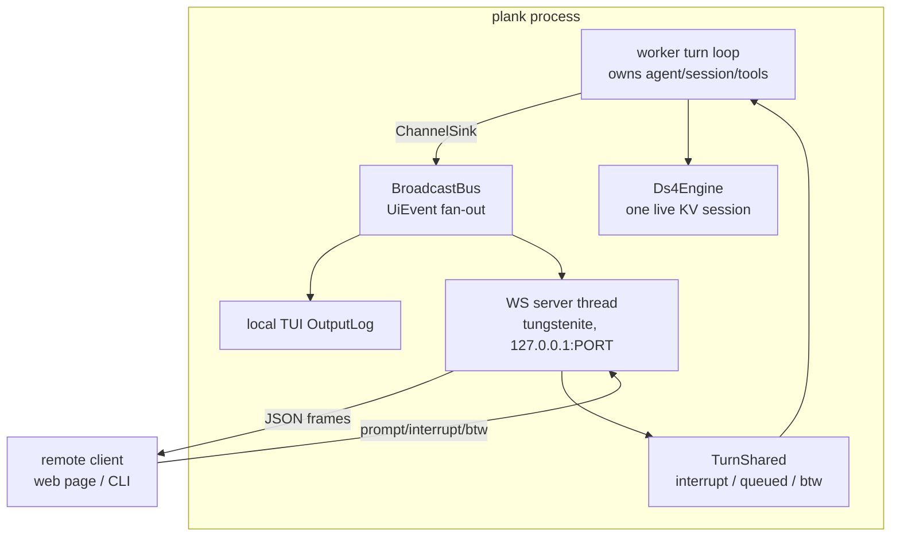

# Remote Control — Driving a Running plank from Elsewhere

Design document for plank's remote-control interface (issue #25, split from #2): a
local server that lets another process or machine submit prompts to, and read the
streaming output of, a running plank instance. This is the **v2.0.0 headline**
(roadmap Phase 6) and is deliberately the *minimal, CLI-only, no-backend* variant
— a local WebSocket server reached over an SSH reverse tunnel, not a claude.ai
bridge.

Status: **shipped.** This document is kept as the design record; where it and
the code disagree, the code wins. The sections below have been reconciled with
what was actually built, and the places where the built thing diverged from the
plan are called out inline rather than quietly edited away — the divergences are
the interesting part of a design record.

The three that matter, up front:

- **No launch flags.** The design proposed `--remote[=ADDR]`; what shipped first
  was `--control[=ADDR]` and four siblings, and those were then **deleted**. The
  server is started only by `/remote-control` (alias `/rc`) from inside a running
  session, on an ephemeral loopback port, with a token minted per activation.
- **TUI only.** The design's primary target was headless server mode
  (`--remote --non-interactive`). That does not exist: `/rc` can only be typed in
  the full-screen TUI, and the headless and piped-REPL remote-drive paths were
  written, found unreachable once the flags went, and removed. `/rc` in those
  front-ends declines rather than starting a server nothing can drive.
- **`/grant` is wired, and reachable through `/rc ask`.** Typing `/rc` (or
  `/rc on`) is still the consent, so the server pre-authorizes an attaching client
  and §4.4's `NeedsLocalGrant` path never fires. `/rc ask` starts the same bridge
  *without* that pre-authorization: a client mirrors output, its
  `request_control` comes back denied, and the request waits in
  `ControlPolicy::pending` until the operator runs `/grant` (oldest waiting
  request) or `/grant <session>`. Granting broadcasts a dim line locally and the
  granted client's own connection thread notices the role change and sends a
  `control` frame.

The reference agent's `/remote-control` (documented in `vault/REMOTE-CONTROL.md`)
is a bidirectional bridge to a hosted backend with OAuth, environment
registration, and work polling. plank has no backend and did not grow one; the
note's closing "Minimal Emulation for CLI-Only" section — a plain local WebSocket
server plus an SSH tunnel — is what this document specified and what shipped.

## 1. Goal

Let a prompt submitted from another process or machine drive a running plank
instance, and stream that instance's output back, **without changing what a turn
is** for the local user. The defining properties:

- **Attach, don't fork.** A remote client becomes *another front-end* over the
  existing `worker::UiEvent` channel — the same serialization boundary the TUI
  already uses (`src/worker.rs`) — not a second engine, session, or KV context.
  One live `Ds4Engine` session remains the whole truth (mirroring the BTW design's
  §8 rejection of a second concurrent stream).
- **No backend.** No auth server, no cloud, no environment registration. The
  server binds `127.0.0.1` only; reachability off-box is the user's SSH tunnel.
- **Local-first coexistence.** When a local TUI is running, the remote client
  **mirrors** it (sees the same output) and, by policy, may be granted control;
  it never silently races the local user for the input line.
- **Small surface.** One WebSocket endpoint, one JSON message schema, one
  optional static web client. No new async runtime if avoidable (§4.7).
- **Same guarantees.** Interrupt, queued prompts, `/btw`, tool banners, status
  snapshots, and the KV-cache discipline all behave exactly as locally; the
  remote path reuses them rather than reimplementing them.

Non-goal for v2: web/mobile sync, multi-user collaboration, a hosted relay.
Those are what the reference backend buys and are explicitly out of scope (§9).

## 2. Prior art and context

### 2.1 The reference `/remote-control` (what we are *not* building)

`vault/REMOTE-CONTROL.md` documents the reference implementation: a
`replBridgeEnabled` flag that spins up a `HybridTransport`/`SSETransport` bridge,
registers an *environment* with a backend (`POST /v1/environments/bridge`),
long-polls `/work` for assignments, decodes a JWT `work_secret`, and streams
inbound `user_message` / `control_request` / `cancel_work` frames while POSTing
outbound message/tool/result batches. Three auth layers (OAuth bearer, work-secret
JWT, trusted-device token) and backend-registered callback URLs make it fundamentally
a hosted feature. The note's own "Real Barrier" section concludes a pure local
emulation *"could work for CLI-only usage, but web/mobile sync would break."*
plank chooses exactly that CLI-only branch.

### 2.2 The one lesson that transfers: message channels, not RPC

The reference's inbound/outbound split (server→client streams events; client→server
POSTs prompts, permission responses, cancels) maps cleanly onto plank's existing
`UiEvent` enum. We keep that shape — a duplex stream of typed JSON frames — and
drop everything backend-specific (polling, work secrets, environments).

### 2.3 What already exists in plank

The worker-thread architecture (#12, `76a6428`) did the hard part:

- **`worker::UiEvent`** (`src/worker.rs`) — the enum the worker emits over an
  mpsc channel: `Visible`/`Think`/`Tool`/`Error` (the four `RenderSink` calls),
  `Dim`/`Plain`/`UserEcho` log lines, `EndLine`, and `Status(Status)` snapshots.
  This is *already* the wire-ready description of everything on screen.
- **`worker::ChannelSink`** — a `RenderSink` (`src/viz.rs:32`) that forwards
  render calls into the channel; a hung-up receiver just drops text and the
  worker keeps running. This is the exact resilience a flaky remote link needs.
- **`worker::TurnShared`** — `interrupt: AtomicBool`, `queued: Mutex<Vec<String>>`
  (the C's `queued_user_drain`), and `btw: Mutex<Vec<String>>` with a capped
  FIFO. Remote prompts, interrupts, and `/btw` all have a home already.
- **`Status`** (`src/status.rs`) — the footer snapshot (state, prefill/gen
  progress, tps, ctx used/size, elapsed) already serializable field-by-field.
- The TUI loop (`src/ui.rs:1197` `run_tui`, worker scope at `~2238`) drains
  `rx.try_recv()` into the `OutputLog` and polls crossterm for input on a 100 ms
  cadence — the precise place a second consumer/producer slots in.

plank has **no interactive per-tool permission prompt**: bash runs under a Seatbelt
write-sandbox (`src/sandbox.rs`, `src/tools/bash.rs`), tools are not gated on user
approval. So the protocol's "permission" surface today is only *interrupt* plus a
forward-compatible hook for a future approval gate (§4.5).

### 2.4 The transport decision

plank is entirely synchronous/blocking: `ureq` for HTTP (`web.rs`), threads +
mpsc + `libc::poll` for concurrency, no `tokio`. Introducing an async runtime for
one WebSocket endpoint would be the largest dependency and paradigm change in the
codebase. We therefore choose **blocking `tungstenite`** on dedicated threads over
`axum`/`tokio` (§4.7), matching the worker-thread idiom.

## 3. Architecture overview



The single structural change is turning the worker's *single* mpsc sender into a
**fan-out bus**: one `ChannelSink` per consumer (local TUI + each remote session).
Everything downstream of `UiEvent` is unchanged.

## 4. Detailed design

### 4.1 Front-end selection and startup

Remote control is opt-in, never automatic.

**As shipped** — one entry point, no configuration:

- `/remote-control`, alias `/rc`, in both dispatchers (`slash` and `tui_slash`,
  per the "two parallel paths" rule). Bare `/rc` toggles; `/rc on` and `/rc off`
  are explicit and case-insensitive. The TUI arm starts the server; the plain-REPL
  arm declines and says why, because only the TUI can mirror output or be driven
  (its idle loop is what drains the remote queue).
- Turning it on binds `127.0.0.1:0` — an **ephemeral** port, so the command never
  collides with another plank or a stale listener — mints a fresh token, and
  prints `http://127.0.0.1:PORT/?t=TOKEN` plus a ready-to-paste `ssh -L` line.
- Turning it off tells connected clients, shuts the listener down, and drops the
  token with it, so a stale link is refused. The next `/rc` mints a new port and
  a new token.
- The token is generated per activation. There is no way to pin one, and no
  unauthenticated mode.

**Divergence from the plan.** The flags above were the design; `--control[=ADDR]`,
`--control-token`, `--control-allow`, `--control-origin` and `--control-queue-max`
were what actually shipped first, and all five were later removed. They created a
second server the runtime toggle could not see: in a session started with the
flag, `/rc off` reported "already off" while a listener was serving, and a bare
`/rc` bound a *second* listener and orphaned the first server's bus, silently
cutting off already-attached clients. Deleting the flags deleted the bug class.
Headless server mode went with them, since nothing could start a server there.

### 4.2 The broadcast bus: remote client as another RenderSink

Today `run_worker_turn` (the scope at `src/ui.rs:~2238`) creates one
`Sender<UiEvent>` wrapped in a `ChannelSink`. Generalize:

- Introduce `worker::BroadcastBus`: holds `Vec<Sender<UiEvent>>` behind a
  `Mutex`, with `subscribe() -> Receiver<UiEvent>` and a `broadcast(&UiEvent)`
  that clones to each sender and prunes hung-up ones. `UiEvent` becomes `Clone`.
- The worker's stream renderer writes to a `ChannelSink` whose sender is a
  bus-fan-out sender (or the bus is the sink directly). The local TUI subscribes;
  each accepted remote session subscribes.
- **Late-join replay.** A remote client that connects mid-turn must not see a
  half-line. Keep a bounded ring buffer of recent `UiEvent`s (the *scrollback
  tail*, e.g. last N KB, reusing `OutputLog`'s existing content is tempting but
  the bus tail is simpler and thread-local to the server). On subscribe, the
  server replays the tail as a `Snapshot` frame, then live events. This is the
  reconnect/resume substrate (§4.8).

Because a dropped remote receiver already degrades gracefully (the `ChannelSink`
doc guarantees the worker keeps running and the transcript stays authoritative),
backpressure and disconnect handling inherit that property for free (§4.9).

### 4.3 Protocol: WebSocket JSON frames

One endpoint, text frames, one JSON object per frame, discriminated by `"type"`.
Versioned envelope so the web client and server can evolve:

```jsonc
// envelope (both directions)
{ "v": 1, "type": "...", "id": 42, /* type-specific fields */ }
```

**Server → client** (mirrors `UiEvent` plus session/control):

| type | fields | source |
|---|---|---|
| `hello` | `protocol_version`, `plank_version`, `session_id`, `controller` (bool) | on connect |
| `snapshot` | `scrollback` (array of prior output frames), `status` | on connect / resume |
| `visible` / `think` / `tool` / `error` | `text` | `UiEvent::{Visible,Think,Tool,Error}` |
| `dim` / `plain` / `user_echo` | `text` | corresponding `UiEvent`s |
| `end_line` | — | `UiEvent::EndLine` |
| `status` | flattened `Status` fields (§2.3), plus `cwd`, `branch`, `origin`, `think` | `UiEvent::Status` (throttled, §4.9) |
| `btw_begin` / `btw_end` | — | the `/btw` side-answer boundary |
| `main_checkpoint` / `main_rollback` | — | a preempted main pass |
| `tasks` | `completed`, `total` | the task-list counter |
| `reset` | — | the transcript was replaced (`/clear`, `/new`, `/switch`, `/resume`) |
| `notify` | `title`, `body` | end of turn: the payload of the local desktop notification |
| `control_denied` | `reason` | e.g. "another client holds control"; also a command that cannot run remotely (§4.4) |
| `control` | `controller` (bool) | this session's role changed after `hello` (a `/grant`, a release, a lapsed grace) |
| `bye` | `reason` | server shutting the session |

`turn_begin` / `turn_end` were never built: a client that needs the turn boundary
reads it off `status.state`, and end-of-turn arrives as `notify`. `snapshot`
carries `scrollback` and `highest_id` (the resume cursor), not a `status`.

`reset` and `notify` are the two frames the design did not anticipate, and both
exist because a *remote* front-end is not the local one:

- **`reset`** — `/clear` replaces the session and clears the local log, both
  local-only. Without a frame for it a browser kept showing a session that no
  longer existed, and the bus still held the pre-clear scrollback, so a client
  attaching afterwards was replayed the transcript that had just been cleared.
  Broadcasting the reset also drops that scrollback; ids keep climbing, so an
  attached client's `resume_from` survives the reset.
- **`notify`** — the local desktop notification reaches whoever is at the machine
  plank runs on, which is exactly the person a remote session is not.

There is no `permission_request` / `permission_response`: plank still has no
interactive per-tool approval gate (§4.5), so the reserved pair was never added.

A third late addition is in `status` rather than a frame of its own: the footer's
`cwd` / `branch` / `origin` / `think` segments ride on every status frame, so a
client attaching mid-session learns them from the first frame it sees rather than
waiting for one to change. Status frames come only from engine callbacks *during*
a turn, so a turn also publishes an idle snapshot when it ends — without it the
last thing a remote ever saw was `generating`.

**Client → server:**

| type | fields | effect |
|---|---|---|
| `auth` | `token` | first frame; see §4.6 |
| `prompt` | `text` | `TurnShared::push_queued` if busy, else start a turn |
| `btw` | `text` | `TurnShared::push_btw` (respects `BTW_QUEUE_CAP`, returns drop notice) |
| `interrupt` | — | set `TurnShared::interrupt` |
| `command` | `text` (a `/slash`) | routed through the same slash dispatcher, unless refused as remote-unsafe (§4.4) |
| `request_control` / `release_control` | — | §4.4 |
| `permission_response` | `request_id`, `allow` | reserved (§4.5) |
| `ping` | — | liveness; server replies `pong` (also native WS ping/pong) |

The frame set is a near-1:1 image of `UiEvent` + `TurnShared`, which is the whole
point: the remote path adds a transport, not new turn semantics. A CLI client and
the web client speak the same schema.

Note the web client sends everything as `prompt`, including slash lines: the
agent's own dispatcher already routes a leading `/` when it drains the queue, so
a second parser in the page would only be a worse copy of it. `command` remains
in the protocol and the terminal client still uses it.

### 4.4 Session multiplexing and the coexistence policy

**One controller, many mirrors.** Multiple clients may connect and all *see*
output (mirrors), but at most one entity holds *control* (may submit prompts /
interrupts) at a time. Control is a token held by exactly one of: the local TUI,
or one remote session.

- **Local TUI present** (always, as shipped): the local user holds control by
  default and remote clients connect as mirrors. `/rc` starts the server with
  `allow_control` set, so a client's `request_control` is granted immediately —
  typing the command is the operator's consent, which is the whole reason the
  design's `/grant` handshake was never needed. Control releases on disconnect
  (after a grace window, §4.8) or on explicit `release_control`, and returns to
  the local user.
- **`/rc ask` and `/grant`.** `/rc ask` starts the bridge without
  `allow_control`, which is what makes `NeedsLocalGrant` reachable: the request is
  refused, `[remote session N wants control — /grant or /grant N to allow]` is
  surfaced locally, and the session id is recorded in `ControlPolicy::pending`.
  Bare `/grant` answers the oldest waiting request, `/grant <session>` picks one
  out. Granting clears the *whole* pending list — there is one controller, so
  saying yes to one request says no to the others, and a client that still wants
  control re-asks. A waiter that disconnects is pruned, so a grant can never land
  on a dead socket.
- **Headless server mode** does not exist (see the header). There is no
  no-local-front-end configuration to have a policy for.
- **A granted request is silent, but a role *change* is not.** A successful
  `request_control` still gets no acknowledgement, so a client's own optimism
  covers the `/rc on` case. When the role changes later — a `/grant`, a release, a
  lapsed grace window — the session's connection thread notices on its next poll
  tick and sends an authoritative `control` frame. Polled rather than pushed
  because `/grant` runs on the local UI thread, which has no socket, and the bus
  carries transcript events for every client rather than per-session facts.
- **Commands that cannot work remotely are refused, not queued.** A `command` (or
  a `prompt` carrying a slash line) is checked against
  `config::slash_command_remote_refusal` before it reaches the queue, and a
  refusal comes back as `control_denied` with the reason. Two families qualify:
  commands that would take over the *local* terminal (`/open`, and the bare
  interactive forms of `/kvcache` and `/resume` — the same commands with an
  argument are non-interactive and stay allowed), and commands that would saw off
  the branch the client sits on (`/rc`, `/remote-control`, `/quit`, `/exit`, plus
  `/grant` itself, which from the requesting client would be self-granting).
- A non-controller's `prompt`/`interrupt`/`command` frames get `control_denied`.
  `btw` is allowed from mirrors (it is ephemeral and read-only by construction —
  see BTW-DESIGN §4.2), giving read-only observers a safe way to ask questions.

Rationale for single-controller over full multiplex: plank has **one** engine
session and one transcript; concurrent prompt submission would interleave turns
unpredictably and break KV-prefix discipline. Multiplexed *sessions* (separate
transcripts) would require multiple engine contexts — the same duplicate-KV /
Metal-contention cost the BTW design rejected in §8. Deferred to §9.

### 4.5 Permission and interrupt

- **Interrupt** is fully wired today: a client `interrupt` frame sets
  `TurnShared::interrupt`, exactly what Esc/Ctrl-C does. `turn_end.interrupted`
  reflects the outcome. No new mechanism.
- **Permission** is reserved, not built. plank currently gates tool writes with a
  sandbox, not an interactive prompt, so there is nothing to forward. The
  `permission_request`/`permission_response` frames are specified now so that if a
  future interactive-approval feature (e.g. a hook, #8-style) lands, the remote
  controller can answer it without a protocol bump. Until then the server never
  emits `permission_request`.

### 4.6 Authentication (token)

Single shared bearer token, checked on the first frame:

- Client's first frame **must** be `auth { token }`; anything else → close with
  WS code `1008` (policy violation). A missing/wrong token → `4401` (custom
  "unauthorized"), connection closed, attempt logged to `--trace`.
- The token is generated per `/rc` activation (32 bytes, base64url) and printed
  once, inside the one-click link. There is no way to supply one, no default
  token, and no unauthenticated mode — binding to loopback is defense-in-depth,
  not the auth. It dies with the server, so a link from a previous activation is
  refused.
- Constant-time comparison. Optional origin allow-list for the web client
  (reject cross-site WebSocket upgrades whose `Origin` is unexpected), mitigating
  a malicious local web page reaching `127.0.0.1` (the CSRF-for-WebSocket risk).
- Rate-limit failed auths per source; a handful of failures closes and briefly
  blocks the peer.

The token is the *only* auth layer — no OAuth, no JWT, no trusted-device token
(all of which the reference note ties to a backend we don't have).

### 4.7 Transport and crate choices

| Concern | Choice | Rationale |
|---|---|---|
| Runtime | **Blocking threads** (no `tokio`) | Whole codebase is synchronous (`ureq`, `libc::poll`, `std::thread::scope`, mpsc). One accept-thread + one thread per connection matches the worker idiom and adds no async paradigm. |
| WS library | **`tungstenite`** (blocking) | Sans-async WebSocket + TLS-agnostic; pairs with `std::net::TcpListener`. `tokio-tungstenite`/`axum` would drag in `tokio` for a single endpoint — rejected. |
| JSON | **`serde` + `serde_json`** | First serde use in plank; unavoidable for a typed schema and far safer than hand-rolled JSON. Small, ubiquitous. Alternatively hand-write encode/decode to avoid the dep — rejected as brittle for a versioned protocol. |
| TLS | **None in-process** — rely on the SSH tunnel (§4.10) | Loopback bind means on-box traffic never hits the network unencrypted; off-box confidentiality/auth is SSH's job. Adding rustls + cert management for a loopback server is unjustified complexity. A `--remote-tls` path with rustls is a documented future option for direct-LAN use without SSH. |
| Web client | **Static HTML/JS**, no build step | Served by the same server at `/` (a `GET` upgrade-less request returns the page); a single file, `xterm.js`-style log pane + input box speaking the §4.3 schema. Optional; the CLI client (§4.11) is the reference consumer. |

Threading: an **accept thread** owns the `TcpListener`; each accepted socket gets
a **connection thread** that (a) authenticates, (b) subscribes to the
`BroadcastBus` and pumps `UiEvent`→JSON to the socket, and (c) reads client frames
and pushes into `TurnShared` / slash dispatch. The bus and `TurnShared` are the
only shared state, both already `Send + Sync` (Mutex/Atomic).

### 4.8 Reconnect and resume

- Each connection is stateless beyond its control token; the *server* holds the
  scrollback ring and current `Status`, so a reconnecting client gets a fresh
  `snapshot` and continues. No client-side session state is required to resume
  viewing.
- **Sequence numbers.** Every server→client frame carries a monotonic `id`; the
  `snapshot` states the highest replayed `id`. A reconnecting client may send
  `auth { token, resume_from: <id> }`; the server replays only frames newer than
  that from its ring (best-effort — if the ring has rolled past, it sends a full
  `snapshot` instead). This mirrors the reference transport's
  `getLastSequenceNum()` without any backend.
- **Control on disconnect.** A controller that drops keeps control for a short
  grace window (e.g. 10 s) so a brief network blip resumes seamlessly; after the
  window control is released and a mirror may claim it. Local TUI control never
  expires.

### 4.9 Backpressure

- Each connection thread owns a bounded outbound queue (the mpsc receiver from the
  bus). If a slow client can't keep up and its channel/socket buffer fills, the
  server **drops that client** (close code `1013`/"try again later") rather than
  blocking the worker — the `ChannelSink` contract already tolerates a vanished
  receiver, so the turn is never stalled by a slow remote. The client reconnects
  and resyncs via `snapshot` (§4.8).
- **`status` throttling.** `Status` snapshots can arrive per-token; the server
  coalesces them to at most ~10/s per connection (send the latest, drop
  intermediates) since they're pure state, not a log. Text frames
  (`visible`/`think`/…) are never coalesced — they're the transcript.
- WS ping/pong (server-initiated, ~15 s) detects dead peers to reclaim control
  and free threads.

### 4.10 The SSH reverse-tunnel story and threat model

No backend, no public listener. To drive plank on a remote box `host`:

```sh
# on host, inside the running plank TUI:
/rc
# prints http://127.0.0.1:PORT/?t=TOKEN and the matching ssh -L line

# from the laptop: forward that port to host's loopback server
ssh -L PORT:localhost:PORT user@host
# then open the printed link, or: plank remote ws://127.0.0.1:PORT/ --token TOKEN
```

Or the *reverse* direction (plank behind NAT reaching out to a bastion):

```sh
# on the NATed plank box:
ssh -R PORT:localhost:PORT user@bastion
# clients on/through the bastion reach ws://localhost:PORT
```

`PORT` is ephemeral and changes on every activation, which is why the `on` output
reprints the tunnel line each time: an off/on cycle silently invalidates a
standing tunnel. That is the cost of never colliding with a stale listener.

**Threat model:**

- **Confidentiality & integrity in transit:** provided entirely by SSH. plank's
  socket carries plaintext JSON but only over `127.0.0.1`, which is not on any
  wire.
- **Bind scope:** `127.0.0.1` — never `0.0.0.0`, and as shipped there is no way to
  override it: `/rc` passes a loopback constant and the printed link hardcodes
  `127.0.0.1`, with a `debug_assert` pinning the invariant where a second caller
  would hit it. Off-box reach requires an explicit tunnel the operator sets up.
- **Token in the URL:** the one-click link carries the token as `?t=`, so it lands
  in browser history and any `Referer`. An accepted trade for one-click attach on
  a loopback listener whose lifetime is a single toggle — not a claim the link is
  a secret.
- **On-box multi-user risk:** any local user could connect to the loopback port.
  The token defends against that; combine with OS user isolation. Document that a
  shared host means a shared trust boundary.
- **Malicious local web page (CSRF-ish):** a browser page could attempt a
  WebSocket to the loopback port. Mitigated by the mandatory token (the page
  cannot know it — and the port is ephemeral, so it cannot even guess where to
  knock) and by the `Origin` check, which now refuses every non-loopback browser
  `Origin` unconditionally (§8.1).
- **What we explicitly *don't* defend:** a compromised SSH endpoint or a leaked
  token = full control of that plank instance (which can run bash under the
  sandbox). This is equivalent to shell access on the box and is stated plainly:
  the token is a capability, treat it like an SSH key.

### 4.11 Minimal client story

Two clients, one schema:

1. **CLI client** — the reference consumer, shippable as a `plank remote <url>`
   subcommand or a tiny standalone binary. Connects, auths, streams
   `visible/think/tool/error` to stdout with the same styling as the plain REPL
   (reuse `render.rs`'s ANSI path against a stdout `RenderSink` fed by decoded
   frames), reads lines from stdin as `prompt`/`command`/`btw`/interrupt (Ctrl-C
   → `interrupt` frame). This makes plank *scriptable* over the tunnel — the
   issue's core ask ("submitting prompts and reading output from another
   process").
2. **Web client** — optional static page served at `/`: a scrollback pane, a
   status footer bound to `status` frames, an input box, and `/btw` + interrupt
   buttons. No framework, no build. Good enough to drive plank from a phone
   browser through the tunnel, without any of the reference's backend sync.

## 5. Implementation plan

**Historical: all of this landed**, except where the header's three divergences
say otherwise — step 2's flags were built and then removed, and step 4's
`turn_begin`/`turn_end` were never built (see §4.3). Ordered; each step
independently landable and testable with `EchoEngine`.

1. **Bus refactor.** Make `UiEvent: Clone`; add `worker::BroadcastBus`
   (subscribe / broadcast / prune) plus a bounded scrollback ring with sequence
   ids. Route the existing local TUI through the bus (one subscriber). Pure
   refactor, no behavior change — covered by existing worker tests.
2. **Config & selection.** `--remote`, `--remote-token`, bind addr, `/remote`
   slash command in *both* dispatchers, front-end table update, token generation
   + one-time stderr print, `ssh` hint. (`src/config.rs`, `src/main.rs`, `src/ui.rs`.)
3. **Server skeleton.** `serde`/`serde_json`/`tungstenite` deps; `src/remote.rs`
   with accept thread + connection threads; `auth` handshake, `hello`, loopback
   bind, token check (constant-time), origin allow-list. No turn wiring yet —
   just mirror `UiEvent`→JSON and `snapshot` replay.
4. **Inbound control.** `prompt`/`btw`/`interrupt`/`command` frames into
   `TurnShared` and the slash dispatcher; single-controller policy
   (`request/release/grant`, `control_denied`); `turn_begin`/`turn_end`.
5. **Resilience.** Sequence numbers + `resume_from`, status throttling, bounded
   outbound queue with slow-client drop, ping/pong, control grace window.
6. **CLI client.** `plank remote <url>` subcommand reusing `render.rs` styling.
7. **Web client.** Static page served at `/`, schema-complete.
8. **Docs.** This file, `README`/`--help` for the SSH recipes and threat model,
   `docs/ARCHITECTURE.md` front-end-selection + module-reference updates.

`serde` is the one notable new dependency; steps 1–2 add none, so the refactor
can merge ahead of the transport work.

## 6. Testing

Unit / integration (`cargo test --lib`, `EchoEngine`, no model, no network where
possible):

- `bus_fans_out_to_multiple_subscribers` — one worker emit reaches TUI + N remote
  subscribers in order; a dropped subscriber is pruned and doesn't stall others.
- `bus_scrollback_replays_on_late_join` — subscribe mid-stream, assert `snapshot`
  contains the tail and live frames follow without a split line.
- `frame_roundtrip` — every `UiEvent` ↔ JSON frame encodes/decodes losslessly
  (property-ish table test); envelope version present.
- `auth_required_first_frame` / `auth_rejects_bad_token` / `auth_constant_time`
  (behavioral) — drive a `tungstenite` client against a loopback server on an
  ephemeral port.
- `single_controller_policy` — second client's `prompt` gets `control_denied`;
  `btw` from a mirror is accepted; grant/release transfers control; disconnect
  releases after the grace window.
- `remote_prompt_starts_turn` / `remote_prompt_queues_when_busy` — assert
  `TurnShared::{push_queued,take_queued}` semantics via the frame path.
- `remote_interrupt_sets_flag` — `interrupt` frame flips `TurnShared::interrupt`;
  `turn_end.interrupted == true`.
- `slow_client_dropped_not_worker` — a stuck reader is closed; the worker turn
  completes; a reconnect resyncs via `resume_from`.
- `status_frames_coalesced` — a burst of `Status` emits ≤ throttle rate downstream.
- `origin_allowlist_rejects_unexpected_origin`.

Manual (real model, macOS): type `/rc` in a plank TUI on one box, `ssh -L`, drive
from the CLI client and the web page; confirm a mirror sees local TUI output when
both are active; confirm `/btw` from a mirror works; pull the
network mid-turn and reconnect, verify `snapshot`/`resume_from` continuity and
that the local turn never stalled; verify the printed `ssh` line works verbatim.

## 7. Constraints and invariants

1. **One engine, one session, one transcript.** The remote path never creates a
   second engine context or transcript; it is a transport over the existing
   worker channel. (Multiplexed sessions are §9, not this.)
2. **The worker is never blocked by a remote client.** A slow/dead/absent remote
   consumer only drops frames — the `ChannelSink` contract in `src/worker.rs` is
   authoritative and must not be weakened.
3. **No unauthenticated access, ever.** No default token; loopback bind is
   defense-in-depth, not the auth boundary.
4. **Loopback by default; off-box reach is the user's tunnel.** plank does not
   open itself to the network without an explicit override.
5. **Two UI paths.** Every slash/config change lands in both `slash` and
   `tui_slash`; the remote control policy must not let a remote client silently
   contend the *local* user's input line.
6. **Schema is versioned.** The `v` envelope field is mandatory; adding frame
   types is backward-compatible, changing existing ones bumps `v`.
7. **`/btw` remains ephemeral over the wire** — a remote `btw` obeys BTW-DESIGN's
   invariants (nothing enters the transcript, `full transcript + suffix` prompt,
   tools denied).

## 8. Open questions

All three are settled:

- ~~Should headless server mode auto-grant control to the first client?~~ Moot:
  headless server mode does not exist. The equivalent question for the shipped
  design — whether typing `/rc` is consent enough to hand an attaching browser
  control — was answered yes, and remains the default. `/rc ask` is the other
  answer for operators who want it, and is what `/grant` serves.
- ~~Ring-buffer sizing for scrollback replay.~~ A fixed event-count cap
  (`SCROLLBACK_CAP`), not a KB cap and not a flag. A session reset drops the ring
  outright, since everything in it belongs to a transcript that no longer exists.
- ~~CLI client as a subcommand or a separate crate?~~ Subcommand:
  `plank remote <ws-url>`, sharing the binary and the protocol types.

Still open, small:

- The reconnect grace window makes a page reload look like contention: the new
  session gets a fresh id, no `resume_from`, so `ControlPolicy::request` reports
  `another client holds control` for up to `CONTROL_GRACE`. The denial is
  correct; the *reason string* is a lie, and distinguishing "held for a reconnect
  grace window" would be the honest fix.
- Nothing mirrors a `/switch` or `/resume` transcript to a remote: those replay
  into the local log directly, so the page clears and says the history is local
  only. Mirroring would mean re-rendering a transcript into events.

### 8.1 Resolved (hardening, issue #25)

> **Superseded by the `rc-toggle` branch.** The two bullets below described
> `--control-origin` and `--control-queue-max`, launch-time flags on a
> `--control` server. Both flags (and `--control` itself) were deleted:
> starting the server is now only `/rc` from inside a running session. The
> `Origin` allow-list this section describes is still enforced — `/rc` passes
> an empty allow-list, so the default-deny policy (loopback only) is now
> unconditional — only the `--control-origin` *override* that could add
> entries to it is gone. The outbound-queue cap is still enforced, but at its
> 1 MiB default only; there is no flag left to change it. The mechanism
> descriptions below are kept for history, not as current behavior.

- **`Origin` allow-list.** Enforced on the WebSocket upgrade in
  `control::handle_connection` via `origin_allowed`. Default policy: a missing
  `Origin` (native `plank remote` clients send none) and any loopback `Origin`
  (`localhost` / `127.0.0.1` / `::1`, any scheme or port) are allowed; every
  other browser `Origin` must be listed with `--control-origin <ORIGIN>`
  (repeatable or comma-separated) or the upgrade is refused with an HTTP 403
  before the handshake completes. `null` (opaque `file://` origins) is treated
  as a non-loopback browser origin and must be allow-listed explicitly.
- **Bounded per-client outbound queue.** Each connection caps its unsent output
  at `--control-queue-max` bytes (default 1 MiB) via tungstenite's
  `max_write_buffer_size`. Writes use a short socket write timeout so a stalled
  client's data accumulates in the buffer rather than blocking the connection
  thread; once the buffer exceeds the cap the client is evicted (its thread
  exits and the bus prunes the dropped subscriber on the next broadcast).
  Healthy clients keep the existing scrollback-replay + live-mirror semantics.
- **Static web client.** A single self-contained HTML+JS page (no external
  deps) is served at `GET /` (and `/index.html`) straight from the control
  server — see `control::WEB_CLIENT_HTML` (`src/remote/web_client.html`). It
  authenticates with a token, renders mirrored output, and sends typed lines as
  `prompt` / `command` / `btw` frames at the same `PROTOCOL_VERSION`.

## 9. Non-goals

- **A backend / claude.ai sync.** No environments, work polling, OAuth, JWT, or
  trusted-device tokens — the entire reference bridge machinery
  (`vault/REMOTE-CONTROL.md`) is out of scope. plank stays backend-free.
- **Multiplexed independent sessions.** Multiple concurrent transcripts would
  require multiple engine/KV contexts — the same duplicate-KV / Metal-contention
  cost rejected in BTW-DESIGN §8. Single controller + mirrors only.
- **A second concurrent generation stream.** One live session, boundary-scheduled
  `/btw`, same as today.
- **In-process TLS / cert management** for the common case. Confidentiality off-box
  is SSH's job; `--remote-tls` (rustls) is a documented future option for direct
  LAN use, not part of the minimal variant.
- **Web/mobile presence in claude.ai/code.** That is precisely what the backend
  buys and what this feature deliberately forgoes.
- **Steering / multi-user collaboration.** Interleaving multiple controllers into
  one turn is a separate design with its own turn-ordering questions.
