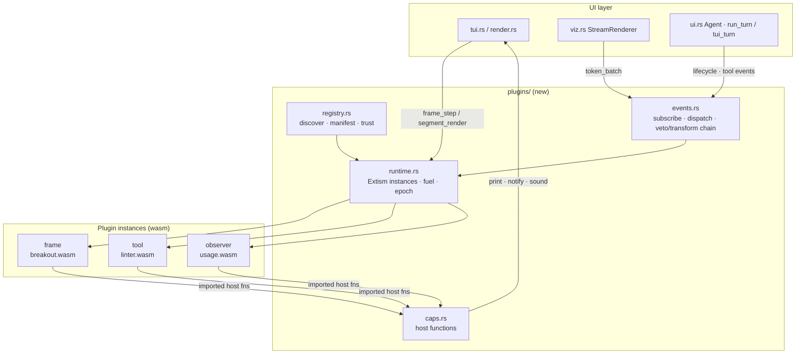

# WASM plugins

> Status: **implemented and shipping, on by default** as of 2026-08-21. Merged
> to `main` on 2026-08-19 behind the `plugins` Cargo feature, which was turned on
> once the system stopped being feasibility-stage: a plugin nobody can run
> without rebuilding plank is not a plugin system. It costs 18 MiB (134 → 152
> MiB measured); `--no-default-features` still gets the lean binary, and CI
> guards that configuration because it is now the one that can rot unnoticed. This document
> describes the plugin system, the surfaces a plugin may claim, the events it may
> observe, and how plugins are packaged, versioned and trusted — and it records
> the reasoning, including for the parts that were deliberately cut.
>
> Four surfaces of five are implemented (`panel` was cut), nine events of roughly
> twenty, and five capabilities of ten. Each gap says so where it appears, so
> "designed" and "built" stay distinguishable. The one that catches people is
> `$PLANK_PLUGIN_PATH`: designed, never built, use `--plugin-dir`.

> Writing a plugin rather than changing plank? See
> **[WASM-PLUGIN-AUTHORING.md](WASM-PLUGIN-AUTHORING.md)**, which documents what
> is implemented from an author's side. This file is the design and records the
> reasoning, including for parts that were cut.

## What is implemented

**Phase 0 — feasibility spike.** `src/wasmhost.rs` behind the `plugins`
feature: the `WasmHost` trait, its always-available no-op, and the Extism
implementation. Answers below.

**Phase 1 — discovery, trust, registry.** `src/wasmreg.rs`, compiled
unconditionally. WASM is a component kind inside the existing plugin format;
trust keys on the module's SHA-256 with per-repo approval for project-local
components.

**Phase 2 — the `command` surface.** Components claiming `command` contribute
slash commands to the menu and to both front ends' dispatch. Specs are read
once at load, never per keystroke. A component claiming a surface whose exports
it lacks is refused at load rather than failing when a user first picks it.
Held components are listed by `/plugins` with what they want and the exact
`/plugins trust <id>` that approves them — approval is a typed act, not a modal
question before the first turn.

**Capabilities — `log`, `print`, `state`.** `src/wasmcaps.rs`, also compiled
unconditionally: whether a grant is honored, where a key may write and what a
refusal says are pure functions over a directory, and the Extism glue in
`wasmhost` is a thin shell over them. Every host function is provided to every
component and checks its own grant when called, so a missing grant reads as
"this component was not granted `print`" rather than as a wasm import error.
`fs`, `net` and `exec` — the three that undo the sandbox — are deliberately not
wired.

**The `observer` surface and the event bus.** `src/wasmevents.rs`. Five events
are dispatched — `session_start`, `user_prompt_submit`, `pre_tool_use`,
`post_tool_use`, `turn_end` — from the same call sites the shell hooks fire
from, so a component sees what a hook would have seen. Subscriptions are
declared in the manifest and an unsubscribed event costs nothing.

One deviation from the sketch above: a component implements a single
`on_event` export rather than a handler per event. Extism cannot type-check an
export signature, so N exports buy no safety over one, and a new event would
otherwise oblige every interested component to grow an export — which the
payload-evolution rule says additions must not do.

An event's class is enforced host-side, not trusted from the guest: a reply
that vetoes a notify event is dropped rather than honored. Transform
replacements chain in load order, so a redactor and a summarizer compose
instead of competing.

**The `tool` surface.** A component's tools join the model's registry beside
`bash` and the MCP servers'. Their schemas are appended to the system prompt
*after* the trusted span — they are third-party text exactly like MCP's — and
names resolve against everything already claimed: a bare name when nothing
contests it, `wasm__<component>__<tool>` when something does, warned either
way. Built-ins always win, so no component can quietly replace `bash`.

That settles the tool-name collision question the design left open. The
prompt-cache consequence is real and observable: adding or removing a tool
component changes the system prompt and therefore forks the Tier 1
fingerprint, so the two configurations keep separate checkpoints instead of
invalidating each other. Specs are read once at load for the same reason — a
tool list that changed mid-session would invalidate the checkpoint under the
running session. A component approved with `/plugins trust` mid-session is
dispatchable immediately but reaches the prompt only on the next launch.

**The `segment` surface**, with one deliberate deviation. The design says a
cell renders "once per status-bar repaint"; this renders at most once a second
and reads from cache in between. The TUI repaints on every keystroke and every
throbber tick, so a per-repaint call would run a guest dozens of times a second
on the UI thread while the user is typing, to refresh data that changes on the
order of seconds. The refresh is self-throttled inside the registry, so callers
invoke it at whatever boundary is convenient without owning the cadence — and
it is called *before* the bar renders, since publishing afterwards leaves every
cell one turn stale.

A cell that returns nothing is quiet, not broken: an unreadable reply drops the
cell for that round without a strike, because the status bar must never be a
place where a component gets disabled for having nothing to say. A trap still
strikes — that means the guest broke, and it will break again on the next
repaint.

**The `frame` surface — ABI and driver.** `src/wasmglyph.rs` implements the
packed glyph buffer; `wasmreg` drives the open/step/key/close lifecycle,
enforces `min_size`, clamps `dt_ms` the way `arcade::MAX_STEP_MS` does, and
separates manual from idle activation so a component cannot appear unasked. A
guest has no ambient clock and no ambient randomness: time and seed arrive in
the payload, and the same seed replays exactly.

Decoding is total — a malformed buffer costs the frame, never the session — and
the count is validated against the declared area *before* anything is
allocated, so a two-byte edit cannot ask the host for a huge allocation.

**`frame` is wired into the TUI.** `/frame [id] [face]` opens one, the loop
steps it against the real frame clock, `draw_wasm_frame` blits it, and keys go
to the component until it closes. It shares `draw_arcade`'s ground painter
rather than reimplementing it, so a component gets the same veil and the same
real-black as a built-in face — pinned by a test, since the two must not drift.

**One module, many faces.** The arcade port puts *every* face in a single
`.wasm` rather than one module per game. `frame_open` therefore carries an
`arg` naming which face to open, and a component's `command_run` may reply
`{"open": "<face>"}` to open its own frame — which is how one module gives each
face its own slash command. A component may only open its own frame: opening
someone else's window is a capability, and this is a convenience.

**The arcade port has started.** `guests/arcade/` is the single component
every face will live in. The matrix rain is ported, and the port is *verbatim*
— only the imports changed — because that is what makes it checkable: a test
drives the built-in `arcade::matrix::Rain` and the component side by side for
thirty ticks and compares every glyph's position, character and colour. They
match exactly.

That test earned its place on its first run. The guest was parsing the `seed`
through `f32`, and a u64 seed does not survive a 24-bit mantissa — so the
component seeded a *different* rain. Nothing looked wrong; it was still rain.
Only the glyph-for-glyph comparison could catch it.

**Each frame is its own command.** A component's commands follow the plugin
loader's convention exactly: `<plugin>:<name>` always, plus the bare `<name>`
when nothing else claims it. So a component holding many frames is opened per
frame — `/arcade:matrix`, `/arcade:breakout` — with no component id and no face
argument to remember, and the alias keeps working while a built-in still owns
the bare name. `/frame` remains for listing what is openable and for a
component whose frames are not declared as commands.

### Screensavers and arcades are different plugins

A frame component declares a **kind**, and the host derives everything else
from it:

| Kind | Idle rotation | Opened on demand | Keys |
|---|---|---|---|
| `screensaver` | yes, beside the built-in faces | yes | anything dismisses it |
| `arcade` | never | yes | the game claims what it uses |

They ship as separate plugins rather than one artifact with a flag, because
they are separate things and a user who wants ambient faces should be able to
install exactly that. `guests/screensavers/` is the first; `guests/arcades/`
will be the second.

Kind is a property of the *thing*, not a permission: an arcade is never
rotated because a game appearing over someone's work is wrong, not because it
lacks a grant. `arcade` is the default, so a manifest that says nothing cannot
accidentally acquire the screen.

### What stays in the core

**The matrix rain and breakout are not plugins and will not become plugins.**
The rain is the *default* screensaver — a plank with no plugins installed still
has one, and a default that depends on a plugin is not a default — and breakout
is what the download screen draws above the progress gauge (`download.rs`),
which runs before any plugin could be loaded. Both stay in the binary.

That decides what porting is *for*: not moving the arcade out, but letting
faces exist that plank does not ship. The starfield is ported as the first such
face; minions, centipede, frogger and invaders follow, split by kind.

The starfield's port is checked glyph for glyph against the built-in field it
came from, thirty ticks deep. That check is the procedure for every face that
lands; the two core faces skip it because they are not going anywhere.

Not yet implemented: the remaining events (`idle`, `resize`, `job_*`, the
compaction pair), and the `notify`/`agent`/`session`/`sound` capabilities.

## Feasibility spike (landed)

`src/wasmhost.rs` behind the `plugins` feature (on by default since 2026-08-21), plus a guest in
`spike/abi-guest` and `tests/wasm_spike.rs`. It answers the four questions that
could have killed the design:

| Question | Answer |
|---|---|
| Does a JIT survive plank's release flow? | Not a question. `release.yml` signs nothing and notarizes nothing, so there is no hardened-runtime entitlement to fight |
| What does the runtime cost in binary size? | **+18 MiB** — 141.1 → 159.9 MB when first measured, 134 → 152 MiB today. Kept the feature off through the feasibility stage; not enough to reconsider the runtime, and as of 2026-08-21 not enough to keep it off either |
| Does the ABI handshake work? | Yes. A guest asserts `plank_abi`, and a module that cannot is refused at load with the ABI named as the reason |
| Does a runaway guest stay contained? | Yes. An infinite loop is stopped by the host deadline and surfaces as `WasmError::Trap`; a fresh plugin loads and answers afterwards |

What the spike deliberately is **not**: no surfaces, no event bus, no manifest,
no capabilities, no registry, and no call site anywhere in plank — `host()` is
reachable only from tests. The measured 18 MiB assumes that changes; until it
does the linker strips most of it (see `FINDINGS.md`).

The three decisions that gated Phase 1 are settled under *Decisions* below;
what remains open is listed after them.

## Why

plank has accumulated several extension points that were each solved
differently:

| Extension | Mechanism today | Cost |
|---|---|---|
| Screensavers & arcade games | `src/arcade.rs`, 3000 lines compiled in | Every face ships in the binary; adding one is a PR |
| External tools | MCP stdio servers (`tools/mcp.rs`) | A whole subprocess, JSON-RPC handshake, ~30 ms cold start per server |
| Lifecycle reactions | Shell hooks (`src/hooks.rs`) | `fork`+`exec` per event, no state between calls, no UI access |
| Slash commands | `config::SLASH_COMMANDS`, a `&'static` table | Compile-time only |
| Status bar segments | Hard-coded in `tui::status_bar_lines` | Compile-time only |

Each is a different authoring experience with a different trust story. A single
sandboxed plugin ABI can serve all five: one artifact format, one manifest, one
permission model, one place to reason about "what can this code reach".

The screensaver/arcade port is the **proof case**, not the purpose — it is the
most demanding surface (60 fps, input capture, full screen), so a plugin ABI
that carries it comfortably will carry the quieter surfaces trivially.

## Non-goals

- **Not a replacement for MCP.** MCP servers talk to the network, hold
  long-lived auth, and are frequently third-party binaries you *want* out of
  process. WASM plugins are for logic that belongs close to the UI loop.
- **Not a replacement for hooks.** A one-line `jq` in `~/.plank/hooks.json`
  should stay a one-line `jq`.
- **Not general native extensibility.** No `dlopen`, ever. If it cannot be
  expressed in the sandbox it does not belong in a plugin.

## Runtime: Extism

The design commits to [Extism](https://extism.org) (wasmtime underneath) rather
than raw wasmtime or wasmi.

**What this buys.** Extism's `extism` Rust host SDK gives us a `Plugin` handle,
`call(name, input_bytes) -> output_bytes`, a manifest with `allowed_paths` /
`allowed_hosts` / `memory` / `timeout_ms`, host functions declared with
`host_fn!`, and — critically — ready-made PDKs for Rust, Go, JS, Python, C#,
Zig and C++. A plugin author writing a screensaver in Go or a linter in Python
is a real outcome, not a hypothetical one.

**What this costs.** We inherit Extism's ABI conventions: everything is a byte
buffer in and a byte buffer out, so structure lives in the payload encoding
rather than in the type system. There is no Component Model type checking to
catch an ABI drift at load time; we detect it with an explicit version
handshake instead (see *Versioning*). Binary size grows by roughly the size of
wasmtime's cranelift backend.

**Why not the alternatives.** Raw wasmtime + WIT would let the Component Model
enforce that a background plugin cannot even *name* the draw functions — but it
costs a hand-rolled multi-language toolchain story we are not staffed to
maintain. Wasmi is small and pure-Rust but its interpreter is 10–50× slower;
that is survivable for glyph loops and unpleasant for anything else, and the
hand-rolled ABI work is the same as wasmtime's without the payoff.

**Payload encoding.** JSON for everything except the frame path. `Frame.draw`
returns a packed binary glyph buffer (see *Glyph wire format*) because a
120×40 screen is 4800 glyphs at 30 fps and JSON-encoding that 30 times a second
is a measurable fraction of a core.

## Surfaces

A plugin declares, in its manifest, which **surfaces** it claims. A surface is
a contract: a set of exports plank will call and a set of host functions plank
will grant. Claiming a surface you did not implement is a load-time error;
calling a host function outside your granted set traps.

This is the "screen or background" distinction the design started from,
generalized. There are five surfaces, ordered by how much of the terminal they
own:

### `frame` — owns the whole screen

The plugin takes the full terminal area and paints it. plank stops drawing the
transcript, input line and status bar; input is routed to the plugin until it
yields. This is what screensavers and arcade games claim.

```
exports:
  frame_open(json: OpenParams) -> json: OpenAck
  frame_step(json: StepParams) -> bin: GlyphBuffer
  frame_key(json: KeyEvent)    -> json: Outcome
  frame_mouse(json: MouseEvent)-> json: Outcome
  frame_close()                -> json: { scrollback: string? }
```

`StepParams` carries `{ dt_ms, w, h, now_ms }`; `dt_ms` is clamped host-side
the way `arcade::MAX_STEP_MS` clamps today, so a suspended terminal cannot
teleport a plugin's simulation. `Outcome` is `{"stay"}` or
`{"close": {"scrollback": "..."}}`, mirroring `arcade::Outcome`.

A `frame` plugin additionally declares `activation`:

- `"manual"` — opened by an explicit slash command only.
- `"idle"` — eligible for the idle rotation. plank picks among idle-eligible
  plugins after the configured screensaver delay, replacing the hard-coded
  `ScreensaverFace` enum with a registry.
- `"both"` — the arcade games' behaviour: playable on demand, and eligible as a
  screensaver face.

It also declares `veiled: bool` — whether the transcript stays dimly visible
underneath (`tui.rs` already supports this; `a_veiled_arcade_leaves_the_ui_visible_underneath`
is the test that pins it).

### `panel` — owns a region

Same draw/step/input contract as `frame`, but plank assigns a rect rather than
the whole screen: a sidebar, a bottom dock, a split of the output pane. The
plugin receives its `w`/`h` and cannot paint outside them. Chrome (borders,
title) is drawn by plank so panels look uniform.

`panel` exists so the ABI does not force "a live thing on screen" to mean "the
entire screen". A token-usage sparkline or a live test-runner pane is a panel.

**Not in v1** — see *Decisions*. Described here because adding a surface is
additive and this is the shape it would take.

### `segment` — owns a status-bar cell

```
exports:
  segment_render(json: StatusCtx) -> json: { text: string, fg?: Rgb, bg?: Rgb, priority: u8 }
```

Called once per status-bar repaint. `StatusCtx` carries the same facts the
built-in segments use (cwd, branch, context fill, verb, task count, remote
marker). Must return within a tight budget (see *Determinism and budgets*);
overrunning drops the segment for that frame rather than stalling the UI.
`priority` decides who is elided first when the bar overflows — the existing
nomenclature for built-in segments (dir prefix, ctx gauge, throbber, verb,
stats, task counter, power suffix, remote marker) applies unchanged, and plugin
segments compete in the same elision order.

### `tool` — owns a model-facing tool

The plugin contributes an entry to the tool registry, appearing to the model
alongside `bash` and `edit`.

```
exports:
  tool_specs()              -> json: [ToolSpec]     // name, description, JSON Schema
  tool_call(json: ToolCall) -> json: ToolResult     // { output, is_error }
```

`ToolSpec` is exactly `engine::ToolSpec` serialized. `tool_call` receives the
already-parsed DSML arguments as a JSON object, so a plugin never sees or
constructs wire syntax — the byte-parity constraint on DSML framing stays
entirely inside `dsml.rs`/`tools/mod.rs`, and a plugin cannot break it.

This is deliberately the same shape as MCP's `tools/list` + `tools/call`, so an
MCP server whose logic is pure computation can be recompiled as a WASM plugin
with no conceptual redesign — and so `tools/mod.rs` can merge both registries
into one dispatch table with one collision policy.

**Prompt-cache warning.** Adding or removing a `tool` plugin changes the tool
list, which changes the system prompt, which invalidates `sysprompt.kv`. Tool
plugins must be resolved *before* the system prompt is fingerprinted, and
hot-reload must not apply to them mid-session (see *Hot reload*).

### `command` — owns a slash command

```
exports:
  command_specs()             -> json: [{ name, args, desc }]
  command_run(json: CmdInput) -> json: CmdOutput
```

`CmdOutput` can print scrollback lines, inject text into the input box, open a
`frame`/`panel` the same plugin owns, or return a string to be submitted to the
model as a prompt. Registration follows the precedent already set by skills and
templates: `config::SLASH_COMMANDS` stays the `&'static` built-in table and
`slashmenu::catalog` appends runtime-discovered entries, which is where plugin
commands join.

### `observer` — owns nothing

The background class. No exports beyond event handlers, no drawing, no input.
An observer sees events and may react by logging, by calling granted host
functions, or by returning a verdict on events that accept one.

An observer is the WASM analogue of a hook, with three differences that justify
its existence: it keeps state in its own linear memory across events (a hook
gets a fresh process every time), it costs microseconds rather than a process
spawn, and it is sandboxed by default rather than being an arbitrary shell
command.

### Surface composition

A plugin may claim several surfaces. The natural combination is
`command` + `frame` + `observer`: a slash command to open it, a frame to draw
it, and observer events to know when to auto-open. The arcade port claims
exactly these three.

Surfaces are additive in permissions, never in privilege — claiming `frame`
does not grant filesystem access, and claiming `tool` does not grant drawing.

## Events

Every plugin, regardless of surface, may subscribe to events. Subscriptions are
declared in the manifest; plank only calls handlers you subscribed to, so an
unsubscribed event costs nothing.

Events fall into three classes by what the return value means:

- **Notify** — return value ignored. The plugin is being told.
- **Veto** — the plugin may return `{"block": "reason"}` to stop the action;
  the reason goes to the model (for tool events) or the user (for others).
- **Transform** — the plugin may return a modified payload, which replaces the
  original. Transform events are chained through subscribers in load order.

### Session and turn lifecycle

| Event | Class | Payload | Notes |
|---|---|---|---|
| `session_start` | Transform | `{ source: startup\|resume\|clear\|compact, cwd, git }` | May inject context text, exactly as the `SessionStart` hook does |
| `session_end` | Notify | `{ reason }` | Last chance to flush plugin state |
| `user_prompt_submit` | Transform | `{ text }` | May rewrite the prompt or append context; may veto |
| `turn_start` | Notify | `{ turn_index, prompt_tokens }` | |
| `turn_end` | Notify | `{ turn_index, tool_calls, tokens_in, tokens_out, wall_ms }` | Where a usage-tracking plugin does its accounting |
| `stop` | Veto | `{ turn_index }` | Blocking asks the agent to keep going; mirrors the `Stop` hook |

### Model streaming

| Event | Class | Payload | Notes |
|---|---|---|---|
| `generation_start` | Notify | `{ turn_index, kv_reused_tokens }` | |
| `token_batch` | Notify | `{ text, kind: visible\|thinking\|tool }` | Coalesced, not per-token — see budgets. Sourced from `viz::StreamRenderer`'s existing visible/thinking split, so plugins observe the same classification the renderer does |
| `generation_end` | Notify | `{ tokens, stop_reason }` | |

`token_batch` is intentionally **notify-only**. A transform here would let a
plugin corrupt the model's own output stream, and the byte-parity contract with
the C reference gives us no room to negotiate what the stream contains.

**Not in v1** — see *Decisions*. It is the only event that would put a WASM call
inside the streaming hot path, and nothing yet needs it.

### Tools

| Event | Class | Payload | Notes |
|---|---|---|---|
| `pre_tool_use` | Veto + Transform | `{ name, args }` | May rewrite args or block with a reason returned to the model |
| `post_tool_use` | Transform | `{ name, args, output, is_error }` | May rewrite the output the model sees — this is how a plugin adds a summarizer or a redactor |
| `tool_error` | Notify | `{ name, args, error }` | Fires in addition to `post_tool_use` when the call failed |

Matching mirrors `hooks::HookMatcher`: subscribe by tool-name glob, so
`bash`, `mcp__*`, or `*` are all expressible.

### Context and sessions

| Event | Class | Payload | Notes |
|---|---|---|---|
| `pre_compact` | Transform | `{ trigger: manual\|auto, fill_ratio }` | May inject guidance into the compaction prompt |
| `post_compact` | Transform | `{ summary, dropped_turns }` | May inject context |
| `context_pressure` | Notify | `{ fill_ratio }` | Fires when crossing 50/75/90% thresholds, once per crossing |

### UI and input

| Event | Class | Payload | Notes |
|---|---|---|---|
| `idle` | Notify | `{ idle_ms }` | Fires on the screensaver delay boundary; how an idle-activated `frame` learns it is its turn |
| `activity` | Notify | `{}` | Any key or mouse event after an idle period ended |
| `resize` | Notify | `{ w, h }` | Delivered before the next `frame_step` |
| `theme_change` | Notify | `{ dark: bool }` | |
| `key` | Veto | `{ code, mods }` | Global key observation for plugins **not** currently owning the screen. Vetoing consumes the key. Reserved keys (Ctrl-C, Ctrl-D, Escape) are never delivered and never vetoable |
| `focus` | Notify | `{ gained: bool }` | Terminal focus in/out |

### Jobs and worktrees

| Event | Class | Payload | Notes |
|---|---|---|---|
| `job_start` / `job_end` | Notify | `{ id, cmd, exit_code?, wall_ms? }` | Async bash jobs |
| `subagent_start` / `subagent_end` | Notify | `{ label, result_len? }` | |
| `worktree_create` / `worktree_remove` | Notify | `{ slug, path }` | Observation only; the *replacement* backend stays a hook, since it must return a path plank trusts |

### Files

| Event | Class | Payload | Notes |
|---|---|---|---|
| `file_edit` | Notify | `{ path, added, removed }` | After a successful `edit`/`write` |
| `file_read` | Notify | `{ path, bytes }` | |

`file_edit` is the hook a formatter-on-save or a test-runner plugin hangs off.
It is notify-only and fires *after* the write: a plugin that wants to block a
write does so at `pre_tool_use`, where the veto is honest about its timing.

## Capabilities (host functions)

Everything a plugin can do to the outside world is an imported host function,
granted per-plugin in the manifest. Nothing is granted by default.

| Capability | Host functions | Granted to |
|---|---|---|
| `log` | `plank_log(level, msg)` | Always available; goes to the plank debug log, never the transcript |
| `print` | `plank_print(text)`, `plank_print_md(text)` | Writes scrollback lines |
| `notify` | `plank_notify(title, body)` | Desktop/terminal notification |
| `state` | `plank_state_get(key)`, `plank_state_set(key, val)` | A per-plugin KV store under `~/.plank/plugins/<id>/state`. The *only* persistence most plugins need, and it needs no filesystem grant |
| `fs` | Extism `allowed_paths` | Explicit path list, never `/` |
| `net` | Extism `allowed_hosts` | Explicit host list |
| `exec` | `plank_exec(cmd) -> {out, code}` | **Escape hatch.** Grants shell. Requires explicit user confirmation at install and is flagged in `/plugins` |
| `agent` | `plank_prompt(text)` | Submits a prompt to the model as if typed. Rate-limited to prevent loops |
| `session` | `plank_transcript(range)` | Reads back transcript turns |
| `sound` | `plank_sound(cue)` | The `arcade::Cue` set |

`exec` is the one that undoes the sandbox, and the design treats it that way:
it is not a capability so much as a declaration that this plugin is not really
sandboxed. `/plugins` renders such plugins with a visible warning marker.

## Glyph wire format

`frame_step` and `panel_step` return a packed buffer rather than JSON:

```
header: u32 magic 'PGLY' | u16 version | u16 count | u16 w | u16 h
glyph:  u16 x | u16 y | u32 ch (UTF-32) | u8 r | u8 g | u8 b | u8 flags
```

`flags` bit 0 = bold, bit 1 = the glyph carries a background color, in which
case three more bytes follow. Ten bytes per glyph in the common case; a full
120×40 screen is 48 KB per frame, which at 30 fps is a `memcpy` out of linear
memory and nothing else.

This maps one-to-one onto `arcade::Glyph { x, y, ch, color }` with
`anim::Rgb = (u8, u8, u8)`, so the existing `tui::arcade_frame` blitter is the
host-side consumer with only the background-color extension to add.

Plugins that only need text can instead export `frame_step_text` returning a
JSON `{ lines: [{ text, fg, bold }] }`, one entry per row from the top; the host
converts into the same `GlyphFrame` the packed buffer decodes to, so the blitter
is shared. Slower — a `char` at a time rather than a `memcpy` — far easier to
write, and the right default for a plugin author's first afternoon.

Colour and bold are **per line, not per span**, which is a deliberate narrowing
of the `{ text, spans }` this document originally specified: an author reaching
for this export wants "print this row in green", and anyone who needs colour to
change mid-row is better served by the packed buffer than by a second, slower
way to express the same thing. Spaces are left undrawn rather than painted,
because a text component pads its rows and painting pad cells would erase what a
veiled frame sits over. Rows past `h` and columns past `w` are clipped, not
refused: a component that writes one line too many should lose the line, not the
frame.

The host chooses by which export a module has, and the packed one wins if a
module somehow has both, so the fallback cannot slow an existing component down.
A `frame` component satisfies the load-time contract with **either** export.

## Determinism and budgets

The UI loop must never be blocked by a plugin. Three mechanisms enforce it:

1. **Fuel.** *Not implemented.* Fuel meters guest instructions and needs
   wasmtime configuration Extism does not expose, so what shipped is
   wall-clock: a fixed 1s manifest timeout as the outer bound, plus per-surface
   targets measured host-side (`frame_step` 50 ms, `segment_render` and input
   20 ms, `tool_call` 1s, else 200 ms). A call fails at **four times** its
   target rather than at it, because a wall-clock measurement on a busy machine
   measures the machine and a frame steps twenty times a second — enforcing
   exactly would strike out a working component on a loaded laptop. A guest can
   still burn its budget inside one host call; that is the half fuel would
   cover.
2. **Epoch interruption.** A wall-clock deadline as a backstop, because fuel
   does not account for host-function time.
3. **Strike-out.** A plugin that traps or overruns three times in a session is
   disabled for the rest of it, with one line in the transcript saying so. A
   plugin that breaks should degrade the feature, never the session.

Plugins get **no ambient clock and no ambient randomness**. Time arrives as
`now_ms`/`dt_ms` in the step payload, and seeds arrive in `OpenParams` — the
same discipline `arcade::Rng` already imposes, and for the same reason: a
seeded frame plugin can be replayed exactly in a test.

A `segment_render` reply is `{"text", "priority", "fg", "bg"}`. `priority`
orders elision: when the bar does not fit, contributed cells are dropped
lowest-priority first, and only what remains is truncated — truncation alone
cuts the right edge, which is where the power suffix lives. Built-in segments
are never elided on a plugin's behalf: a user who cannot see the context gauge
because a component had something to say is worse off than one who cannot see
the component. `fg`/`bg` are `[r, g, b]` and are closed by returning to the
bar's own style rather than by a reset, which would drop the status background
for the rest of the line.

Calls are made on the UI thread for `frame`/`panel`/`segment` (they are already
frame-synchronous) and on a worker for `tool` and `observer`. A single plugin
instance is never called re-entrantly; plank serializes per instance.

## Packaging and distribution

A plugin is a directory or a `.tar.gz` containing a `plugin.toml` and one or
more `.wasm` files.

```toml
[plugin]
id          = "dev.plank.arcade.breakout"   # reverse-DNS, globally unique
name        = "Breakout"
version     = "1.2.0"                       # semver, the plugin's own
abi         = "1"                           # plank plugin ABI major version
description = "Brick-breaking, as a screensaver or on demand"
authors     = ["Enzo Lombardi <enzinol@gmail.com>"]
license     = "MIT"
wasm        = "breakout.wasm"

[surfaces.frame]
activation  = "both"     # manual | idle | both
veiled      = false
min_size    = { w = 30, h = 9 }

[surfaces.command]
# names declared here must match command_specs() at load time
names       = ["/breakout"]

[events]
subscribe   = ["idle", "activity", "resize"]

[capabilities]
grant       = ["state", "sound"]

[config.difficulty]
type    = "enum"
values  = ["easy", "normal", "hard"]
default = "normal"
```

`[config.*]` entries become user-settable options that arrive in the plugin's
`OpenParams`. A plugin never parses its own config file.

Implemented as a `config` object in the JSON manifest, one entry per option:
`{"difficulty": {"type": "enum", "values": [...], "default": "hard"}}`. Types are
`enum`, `bool`, `int` (with `min`/`max`) and `text`; a default is **required**,
and a default the option would itself reject is a load warning rather than a
surprise later. Values live in settings under `pluginConfig` keyed
`<component-id>.<option>`, merged key by key so a project file setting one
option does not drop the user's others.

Two host-side rules. Values are **validated before a component sees them**, so a
guest can trust the object it is handed instead of re-checking every field — the
second copy of a validation is the one that drifts. And a stored value that has
stopped being acceptable, because an author removed an enum member in an update,
**falls back to the default rather than refusing to open**: a component that
will not start because of a stale setting is worse than one that starts on its
author's default.

Both front-ends can set them: the TUI `/config` form grows a `plugins` section
whose rows are labelled `<component-id>.<option>` (qualified, because two
plugins may both declare `difficulty`), and the plain REPL takes
`/config pluginConfig.<id>.<option> <value>` and lists the declared options
alongside the built-in settings. Either path validates against the declaration
before writing, so the answer a user gets is the same one the component would
have given.

**Locations**, resolved in order, later overriding earlier by `id`:

1. `--plugin-dir <path>`, repeatable, for development. (The original design
   said `$PLANK_PLUGIN_PATH`; the flag is what shipped, and nothing reads that
   variable.)
2. `./.plank/plugins/` — project-local, checked in with the repo
3. `~/.plank/plugins/` — user-global

This mirrors the hierarchical `.mcp.json` resolution already in `tools/mcp.rs`,
so users learn one precedence rule rather than two.

**Management** is `/plugins`: bare to list with surfaces, capabilities and
what is awaiting approval; `info <id>` for one component's full picture
(surfaces, grants with unwired ones marked, strikes, hash and signature);
`disable`/`enable <id>` to switch one off without forgetting its approval —
re-enabling something you turned off should not re-prompt for capabilities you
already read; `install <dir|url>` to copy a plugin into the user's plugin
directory; `remove <name>` to delete it; `trust <id>` to approve a
component.

Install copies rather than links, because a plugin that changed under a
running session would be one whose approved SHA-256 no longer describes what is
loaded, and the trust store's whole premise is that the hash *is* the identity.
It refuses to overwrite for the same reason: replacing an installed plugin is
new bytes under an approved name, so it is remove-then-install rather than
something that happens quietly. A `target/` directory is skipped — a guest
crate's build tree is gigabytes that would be copied into the user's home and
never read.

Removal leaves the trust entry behind. It is keyed by the component's hash, so
reinstalling the same bytes is the same component and needs no re-approval,
while different bytes re-prompt exactly as they would have.

The two shipped guests share `guests/support`, a real crate rather than a file
copied into each: the copies had already begun to drift, and the RNG is the one
thing that must not — a face's testability rests on "the same seed draws the
same way", and a subtly different `next_f32` breaks that in a way no test on
either side would catch. It carries the RNG, the glyph packing and the tiny
`OpenParams` readers, with tests pinning the RNG sequence and the wire header as
contracts. It is also the first piece of a plugin SDK, which is the thing that
makes third-party authoring plausible.

A release publishes `SHA256SUMS` beside the plugin archives: the **module**
hashes (what the trust store keys on — a tarball's hash says nothing about what
plank loads) and the `rustc --version` that produced them. `guests/verify.sh`
rebuilds from a clean tree and compares, and CI runs it on every push, so the
published bytes are checkable rather than merely asserted.

The modules are byte-reproducible on a given toolchain and **independent of the
build directory** — the same source in a different path produces the same
bytes. Reproducibility *across* rustc versions is not established, which is why
the version is recorded: a mismatch after a toolchain bump is expected and is
not evidence of tampering, while a mismatch on the same toolchain is.

Install accepts a `https://` (or loopback `http://`) URL as well as a local
directory: it downloads the `.tar.gz`, extracts it into a staging directory it
owns, and installs the plugin inside. The body is capped, and both the local
directory and the extracted tree are scanned before anything is copied: **a
symlink that escapes the tree, or that points at a directory, is refused** —
the copy follows links, so an entry pointing at `~/.ssh` would otherwise be
copied into the plugin directory and made readable by anything that reads
plugins. A symlink whose target resolves to a plain file inside the tree is
allowed.

Not yet: a registry or any notion of discovery. Finding a plugin is still
"someone gave you a URL".

## Versioning

Two versions matter and they are deliberately separate:

- **ABI major** (`abi = "1"`). plank refuses to load a plugin whose ABI major
  it does not implement, with a message naming the plank version that does.
  Bumped only when an export signature or a payload shape changes
  incompatibly. Additive changes — a new event, a new optional payload field,
  a new capability — do not bump it.
- **Plugin semver** (`version`). plank's business only for update checks.

At load, plank calls a mandatory `plank_abi() -> u32` export and cross-checks it
against the manifest. A mismatch is a load error, not a warning. This is the
handshake that substitutes for the Component Model's static type checking:
Extism will happily let a plugin export `frame_step` with the wrong payload
shape, so we make the plugin assert what shape it speaks.

Payload evolution rule: **fields are only ever added, never removed or
retyped.** Plugins must ignore unknown fields; hosts must tolerate missing
optional ones. The same discipline the DSML wire format lives under, for the
same reason — the cost of breaking a consumer you cannot recompile.

## Trust and signing

Sandboxing is the primary defence; signing is about provenance, not
containment.

- **Unsigned local plugins load without ceremony.** A developer dropping a
  `.wasm` into `$PLANK_PLUGIN_PATH` should not fight a trust dialog.
- **Installed plugins record a trust decision.** `/plugins install` shows the
  id, the surfaces, and — prominently — the capabilities, then records the
  artifact's SHA-256 in `~/.plank/plugins/trust.json`. A changed hash on a
  later load re-prompts. This is deliberately the same shape as the SHA-1
  identity discipline in `session.rs`: the hash *is* the identity.
- **Signatures are optional and advisory.** A `<module>.minisig` (minisign over
  the module, named the way minisign names it) with a publisher key in
  `trust.json` lets updates from a known publisher install without re-prompting.
  Absence of a signature is not an error; a *bad* signature is.

  Implemented in `src/wasmsig.rs`. Ed25519 comes from `ring`, already present
  behind rustls; `blake2` is a direct dependency because minisign 0.12 signs
  `Blake2b-512(file)` by default and only `-l` produces the legacy raw-file
  form. Both are accepted. The global signature over the trusted comment is
  verified as well, so the filename and timestamp a user is shown cannot be
  edited independently of the artifact.

  Publisher keys are accepted with `/plugins publisher <key-file|base64>` and
  live under a reserved `@publishers` key in `trust.json` — one file a user can
  read or delete, and a key that cannot collide with a reverse-DNS component id.
  Key ids are printed the way minisign prints them (byte-reversed, upper-case)
  so a user can compare them by eye against `minisign -G`.

  A first install is never made quiet by a signature: the design buys quiet
  *updates*, and the capabilities still get shown once.
- **Capability grants are per-install and never widened silently.** A plugin
  update that adds `exec` or `net` re-prompts even when its signature is valid.
- **Project-local plugins are the sharp edge.** `./.plank/plugins/` means
  cloning a repo can hand you executable code. They are therefore
  **default-deny**: the first session in a repo with project-local plugins
  lists them and asks once, and the answer is recorded per repo path.

## Migrating the arcade

The arcade is the first consumer, and porting it is how the ABI gets validated
against something that actually exercises it.

- Each game (`breakout`, `centipede`, `frogger`, `invaders`, `matrix`,
  `minions`) becomes a plugin claiming `frame` + `command` + `observer`,
  written in Rust against the Rust PDK, sharing a small `plank-arcade-support`
  crate for `Rng`, `Starfield` and the `Glyph` packing.
- `ScreensaverFace` — today a closed enum with a `parse` — becomes a registry
  built from the loaded plugins whose `frame.activation` includes `idle`. The
  `/settings` picker enumerates the registry instead of enum variants.
- `ScreensaverDelay` and the idle timer stay host-side; they are policy, not
  content. `Arcade::step`'s `MAX_STEP_MS` clamp becomes the host-side `dt_ms`
  clamp described above.
- `tui::arcade_frame` becomes the generic `frame` blitter, and the veiled-render
  path becomes the `veiled` manifest flag. The existing tests
  (`the_screensaver_background_is_true_black`,
  `a_veiled_arcade_leaves_the_ui_visible_underneath`) keep passing against the
  generic path, which is the signal that the port did not change behaviour.
- The bundled games ship inside the plank binary as embedded `.wasm` blobs and
  register as built-in plugins, so `plank` with an empty `~/.plank/plugins`
  still has its screensavers. "Built-in" means preloaded and pre-trusted, not a
  different code path.

Sound is the one real loss: `arcade::Sound::play` shells out today, and a
plugin cannot. Hence the `sound` capability and the `plank_sound(cue)` host
function over the existing `Cue` set — plugins request cues, plank plays them.

## Architecture placement



The whole system lives behind a `plugins` Cargo feature and a `PluginHost`
trait, with a no-op implementation when the feature is off — the same shape as
the `Engine`/`EchoEngine` boundary, and for the same reason: plank must stay
buildable and testable without the heavy dependency. CI's default path builds
without wasmtime; a dedicated job builds with it.

## Decisions

Three of the open questions below are now settled, because Phase 1 cannot start
without them. Each is reversible; each is recorded with what it costs.

### WASM is a component kind, not a parallel plugin system

A plugin stays what `src/plugins.rs` already says it is — a directory bundling
contributions — and `wasm` joins `skills`, `agents`, `templates`, `hooks`,
`.mcp.json` and `settings.json` as one more component kind. It is *not* a second
system with its own directories, its own precedence rule and its own noun.

The loader that shipped in August already carries most of what this design's
"Packaging and distribution" section asks for: three locations resolved in
order, two manifest spellings, `<plugin>:<name>` namespacing with bare names
when uncontested, collision warnings, and plugin settings merged strictly below
the user's. Building a second resolution order beside it would mean two
precedence rules for users to learn and two implementations to keep honest, to
buy nothing the existing one does not already do.

The cost is that the existing manifest has to grow a surfaces/capabilities
section it was not designed for, and that WASM inherits `./.plank/plugins/`
auto-scanning — which is the sharp edge, since today cloning a repo silently
activates its skills and MCP servers. Tolerable for a skill; not tolerable for
a `.wasm` holding `exec`. **Project-local WASM components are therefore
default-deny even though project-local skills are not**, and that asymmetry is
deliberate: the trust question is about what the code can reach, not about where
the directory sits.

### `token_batch` is not in v1

Cut, not deferred behind a warning. It is the only event that puts a WASM call
inside `viz::StreamRenderer`'s hot path, it is the one path under a byte-parity
contract with the C reference, and no known consumer needs per-batch granularity
that `generation_end` cannot serve. A usage tracker wants totals; a redactor
belongs at `post_tool_use`, where the veto is honest about its timing.

The cost is that a live token-stream visualiser is not expressible in v1. If one
is ever wanted, it arrives as a sampled event with an explicit interval — never
as a subscriber on every batch.

### `panel` is not in v1

Cut. It is the only surface with no consumer, and it is the reason open question
1 (layout arbitration between competing plugins) exists at all. Cutting it
deletes that question rather than answering it. `frame` covers the demanding
case and `segment` covers the cheap one; a panel can be added later without an
ABI break, since adding a surface is additive.

## Still open

1. **Debugging story.** A trapped plugin currently yields a wasm backtrace with
   no source mapping. Do we require DWARF in dev builds, or ship a
   `plank plugin test` harness that runs exports against fixtures?

## See also

- `docs/ARCHITECTURE.md` — the layers this plugs into
- `docs/KV-CACHE.md` — why `tool` plugins must resolve before prompt fingerprinting
- `FINDINGS.md` — parity and tooling gotchas
