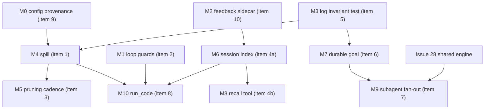

# DeepSeek Harness: what plank should take from it

Notes on [`deepseek-ai/deepseek-harness`](https://github.com/deepseek-ai/deepseek-harness)
(`dsh`, TypeScript, MIT, developer preview since 2026-08-13) read against plank as it
stands. Each of the ten sections below states what dsh does, what plank already has
(with file references, because several of these are *partly* built), the actual gap, a
concrete design in plank's terms, and the parity risk.

Survey date: 2026-08-22.

## 0. What dsh is, and what not to copy

`dsh` is a *harness*, not an agent. It is a [Cordis](https://github.com/cordiverse/cordis)
plugin container in which the model adapter, the tool registry, the session log and the
agent loop itself are all replaceable plugins contributing "services, typed events and
reversible effects to a shared context". Roughly fifty packages sit under `packages/`:

```
acp api attachment boot bundle client code-runtime compaction context core credentials
e2b examples experimental extensions feedback fs goal guard hooks host identity
interaction jobs llm lsp mcp plan preset runtime-diagnostics sandbox schedule sdk
session-query session settings shell skill spill storage subagent subprocess terminal
test-support todo typert util web workflow workspace
```

Composition happens through **profiles** (named local compositions) and **bundles**
(distributions of config plus code), layered base bundle → web/headless bundle → profile
patches → home-level patches → CLI overlays, with `dsh --profile web --dump-config`
printing the resolved tree.

Structurally this is the opposite of plank. plank is one Rust binary with a fixed module
graph, exactly one seam that matters (`Engine`, `src/engine.rs`), and a hard parity
constraint: tool output framing, DSML syntax and the system prompt must stay
byte-for-byte identical to `refs/ds4`, because that is what the model was trained on
(`tests/c_parity.rs`). Genericising plank into a plugin container would trade away the
one guarantee that makes it work.

**So the thing to import is capabilities, not composition.** Explicitly not worth taking:

- the Cordis container and the everything-is-a-seam architecture;
- `e2b`/`sandbox` remote execution, `acp`, `identity`, `credentials` — these serve a
  hosted multi-user product; plank is a local single-user macOS binary with its own
  `src/sandbox.rs` and `src/remote/`;
- the web UI on `:3080`. plank already keeps three front-ends in sync (Ratatui TUI,
  plain REPL, `--non-interactive`, plus `src/serve.rs`/`src/ds4web.rs`); a fourth
  is a maintenance tax, not a feature.

The ten items below are ordered by value-per-unit-of-work, not by size.

---

## 1. Output spill: bounded preview plus retrieval locator

### What dsh does

The `spill/` family is three packages: `spill/` defines the storage interface,
`spill-local/` implements file-backed storage under the session, and `spill-policy/`
runs *after tool execution* and decides what to spill. Oversized tool output is
persisted out-of-band and the inline result the model sees is replaced by a bounded
preview plus a locator it can use to retrieve more.

The important part is where it sits: it is a **post-dispatch policy**, not a
per-tool concern. Every tool gets the behaviour, including tools nobody thought
about when the policy was written — MCP tools especially.

### What plank has

Truncation exists, but per tool and with inconsistent shapes:

- `src/tools/files.rs:154` — `read` emits
  `[Read truncated at line N of M. continue_offset=K. ...]` and `src/tools/files.rs:240`
  implements the `more` tool that continues from `continue_offset`. This is *exactly*
  the spill pattern already, scoped to one tool: bounded output plus a retrieval
  locator plus a retrieval tool. The continuation state lives in `ToolContext`
  (`src/tools/mod.rs:55,85`).
- `src/tools/files.rs:80` — `read` refuses files over `FILE_MAX_BYTES` outright
  (`file too large: ...`), a hard error with no retrieval path.
- `src/tools/files.rs:481` — `glob` truncates at `GLOB_MAX_RESULTS` and says so, with
  no way to get the rest.
- `src/tools/bash.rs:285` — job output is byte- and line-limited for display.
- `src/tools/web.rs` — `[Content truncated by browser extractor.]`, with the noted
  exception that a PDF cannot be truncated on arrival.

So: four different truncation vocabularies, one retrieval path, and MCP tool results
(`src/tools/mcp.rs`) with no cap at all. A single 3 MB tool result from a third-party
MCP server goes straight into the transcript and straight into the KV cache.

### The gap

A dispatch-level spill policy that (a) applies uniformly, (b) always leaves a retrieval
locator rather than a dead end, and (c) writes the full payload somewhere durable so
`/export` and post-hoc inspection can still see what the tool actually returned.

### Proposed design

Add `src/spill.rs`:

```rust
pub struct SpillPolicy { pub max_bytes: usize, pub preview_bytes: usize }
pub struct Spilled { pub id: String, pub bytes: usize, pub path: PathBuf }

/// Applied to every tool result in `tools::dispatch` after the tool returns.
pub fn apply(policy: &SpillPolicy, tool: &str, result: String) -> (String, Option<Spilled>);
```

- Hook point: the tail of `dispatch` (`src/tools/mod.rs:266`), after
  `PostToolUse` hooks run, so a hook still sees the full output. Order matters and
  should be documented: hooks see truth, the model sees the preview.
- Storage: `~/.plank/spill/<session-id>/<n>.txt`, swept by the existing GC
  (`src/kvgc.rs`, `SessionStore::sweep` at `src/session.rs:609`) under the same TTL and
  byte-budget policy that already governs `kvcache`. Do not invent a second GC.
- Retrieval: reuse `more`. Generalise its continuation state from "the previous
  truncated read" to "the previous bounded result, whatever produced it", keyed by
  spill id. This avoids adding a tool the C reference does not have, which matters for
  section 1's parity risk below.
- Configuration: `tools.spillMaxBytes` / `tools.spillPreviewBytes` in
  `src/settings.rs`, defaulting generously enough that ordinary sessions never spill.

### Parity risk — read this before implementing

The preview text and the locator line are **model-facing**. `tests/c_parity.rs` pins
tool output framing against `refs/ds4`. Before inventing wording, check what the C agent
does with oversized output and match it; if the C agent has no such concept, the new
framing must be introduced deliberately and the fixtures regenerated
(`PLANK_REGEN_FIXTURES=1 cargo test`) with a note in `FINDINGS.md`. Reusing the existing
`[Read truncated at line N of M. continue_offset=K.]` shape is the low-risk choice
because it is already a fixture-blessed sentence.

Also beware the continued-string-literal trap documented in `CLAUDE.md`: never build the
preview banner from a `\`-continued Rust literal.

### Effort

Small-to-medium. One new module, one hook point, one generalised tool, settings keys,
GC integration. The `more` generalisation is the fiddly part.

---

## 2. Loop guards: repetition reminders and a per-call deadline policy

### What dsh does

`guard/` holds plugins that "watch the agent loop for unproductive patterns and enforce
per-call budgets". Two of them:

- **`repeat-tool-reminder`** — advisory: when the model calls the same tool repeatedly,
  it is told so. Advisory, not blocking; the model is nudged, not stopped.
- **`timeout-policy`** — a per-call execution deadline applied as *deployment policy*,
  not as an argument each tool parses for itself.

dsh notes these are not swappable seams; they are self-contained systems that attach to
existing extension points.

### What plank has

- Timeouts: only bash has one. `src/tools/mod.rs:571` `parse_timeout` clamps to
  `1..=86400` with a 3600 s default, mirroring `agent_parse_timeout`; the timeout is a
  *tool argument the model writes*. `src/tools/bash.rs:1070` tests that a job is killed.
  Nothing bounds `web`, `glob` over a huge tree, or an MCP call beyond the MCP server's
  own request timeout (`mcpTimeout` in settings).
- Repetition: nothing. The turn loop in `src/ui.rs` (`run_turn`/`tui_turn`) drives
  generate → dispatch → feed until a generation emits no tool calls, with no memory of
  what was called before.
- Interruption: `src/interrupt.rs` exists, but that is the human pressing a key, not the
  agent noticing it is stuck.

### The gap

The classic local-model failure is a loop: the model reads the same file, or runs the
same failing `cargo test`, four times. On a hosted model that costs money; on a local
Metal engine it costs the user's afternoon. plank has no detector.

### Proposed design

Add `src/guard.rs`, owned by the turn loop rather than by `tools/`:

```rust
pub struct LoopGuard { window: VecDeque<CallSig>, repeats: HashMap<CallSig, u32> }
pub enum Nudge { None, Advisory(String) }

impl LoopGuard {
    pub fn observe(&mut self, tool: &str, args_digest: u64) -> Nudge;
}
```

- `CallSig` is `(tool name, SHA-1 of normalised args)` — reuse `session::sha1_hex`.
- On the Nth identical call (N = 3 by default), append an advisory line to the tool
  result the model receives: *"you have called this tool with these arguments N times;
  the result has not changed"*. Advisory only. Never block — a legitimate poll of an
  async bash job (`src/tools/bash.rs:460` `job_tool_result`) looks identical to a stuck
  loop, and blocking it would be a regression.
- Exempt the async-job polling path explicitly.
- Deadline policy: promote the timeout from a bash argument to a dispatch-level wall
  clock. `tools.callTimeoutSec` in settings, applied in `dispatch`, defaulting to
  effectively off so parity is unaffected until a user opts in. Bash keeps its own
  model-supplied timeout, and the policy is the outer bound of the two.
- Surface both in the status bar's verb/stats segments so the human sees the guard fire.

### Parity risk

The advisory text is model-facing, so it is a fixture change. The deadline is not, as
long as it defaults to off. Consider gating the advisory behind a setting that defaults
to **on** but is documented in `docs/SYSTEM-PROMPT-OVERRIDES.md` as a deviation from the
C reference.

### Effort

Small. One module, one call site in each of the two loop paths (plain and TUI — remember
`CLAUDE.md`'s warning that a change to one usually needs the mirror change in the other).

---

## 3. Tool-result pruning as a pass separate from summarisation

### What dsh does

`compaction/` is deliberately four packages: the seam (`compaction/`), a summarising
backend (`compaction-basic/`), an **optional model-free tool-result pruner**
(`compaction-tool-result-pruner/`), and the human command (`command-compact/`). Token
measurement stays a separate LLM-family service. The point is that pruning old tool
results needs no model call and can run on a different cadence than summarisation.

### What plank has — mostly this already

`src/compact.rs` is closer to dsh's decomposition than I first assumed:

- `microcompact` (`src/compact.rs:44`) is exactly the model-free tool-result pruner. It
  keeps the last `MICROCOMPACT_KEEP_RESULTS = 3` tool results and replaces earlier ones
  over `MICROCOMPACT_MIN_BYTES = 256` with `MICROCOMPACT_STUB`.
- `should_compact` (`:110`) is the pressure test: `COMPACT_SOFT_PERCENT = 85` and
  `COMPACT_MIN_FREE_TOKENS = 8192`.
- `tail_budget` (`:123`) implements durable summary plus verbatim tail, with
  `COMPACT_TAIL_DIVISOR = 8` and `COMPACT_TAIL_CAP_TOKENS = 8192`.
- `build_reinjection` (`:72`) re-injects up to `REINJECT_MAX_FILES = 5` files within
  `REINJECT_CAP_TOKENS = 50_000` — dsh has no equivalent that I found.
- `/compact` and `/comp` exist as human commands.

So item 3 is **largely already done**, and plank's reinjection is ahead of dsh here.

### The remaining delta

Three narrower things:

1. **Cadence.** plank's `microcompact` is invoked in the compaction path. dsh runs the
   pruner as an independent policy, so stale tool results are dropped *before* pressure
   builds, which keeps the KV prefix stable for longer. Running `microcompact`
   opportunistically at end-of-turn, not only at the compaction threshold, is a real
   win given plank's KV discipline: the earlier a suffix stops growing, the more prefix
   survives.
2. **Keep-policy.** `KEEP_RESULTS = 3` is positional. A size- or age-aware policy
   ("keep the last 3, plus anything under 2 KB, plus anything from the current task")
   prunes less aggressively where it is cheap to keep. Interacts with section 1: once
   spill exists, a pruned result still has a locator, so pruning becomes cheaper still
   because the model can go get it back.
3. **Separate the token measurement.** dsh keeps counting in the LLM family;
   plank calls `Engine::count_tokens`. Already fine, worth stating as a rule.

### Parity risk

`MICROCOMPACT_STUB` is model-facing and already fixtured. Changing *when* pruning runs
does not change the stub. Changing *what* is kept changes the transcript the model sees
but not the wire format, so it is a behaviour change, not a parity break — but it does
change KV prefix behaviour, so measure before and after.

### Effort

Small. This is tuning an existing module, not building one.

---

## 4. Session query: searchable, compaction-proof history

### What dsh does

The `session-query/` family provides "authorised retrieval over live and durable session
logs" that is **not affected by compaction**, backed by SQLite full-text search, with a
web `/export` command and workspace-authorised queries exposed *to the model* as a tool.

Two distinct wins there, and they are separable:
- the human can search their own history;
- the model can retrieve facts that compaction removed from its context.

The second is the interesting one. Compaction is lossy by construction; a search index
over the durable log makes the loss recoverable on demand instead of permanent.

### What plank has

- `SessionStore` (`src/session.rs:421`) with `list` (`:1246`), `find` by prefix
  (`:1218`), `complete` (`:1305`), `load`, `delete`, `rename`, `retitle_all`. Lookup is
  by id prefix or title. **There is no content search.**
- `/export` already exists — `src/export.rs` renders markdown and HTML with
  `segments`/`render_markdown`/`render_html`. dsh's export adds nothing plank lacks.
- `/history` renders a window of the *current* transcript
  (`session::render_history:1754`), not a search.
- `src/insights.rs` already walks every saved session and maintains a per-session
  metadata cache at `~/.plank/usage-data/session-meta/<id>.json`, validated against the
  transcript file's size and mtime — because, as its header notes, plank rewrites a
  session file in place on every save, so caching by id alone is unsound.

That last point is the important one: **plank already has a whole-store scanner with a
correct invalidation strategy.** An index is an extension of it, not a new subsystem.

### The gap

Cross-session content search, and model-facing retrieval of pre-compaction facts.

### Proposed design

Two phases, and phase 1 is worth doing even if phase 2 never happens.

**Phase 1 — human search.** `src/sessionindex.rs` maintaining
`~/.plank/usage-data/index.sqlite` with an FTS5 table over
`(session_id, turn_ordinal, role, text)`. Reuse `insights`'s size+mtime validation
verbatim rather than reimplementing it; a session whose stamp changed is re-indexed
wholesale, which is correct precisely because plank rewrites files in place. Surface as
`/search <query>`, rendering hits with session title, age and a snippet, and offering
`/resume` on a hit. On the TUI path this wants a pane like `src/kvpane.rs` /
`src/resumepane.rs`; per `CLAUDE.md`, the plain-stdout path then needs a static text
equivalent.

Dependency cost: `rusqlite` with the bundled feature. plank currently has no SQLite
dependency (the only hits are a syntax-highlighting keyword list in `src/render.rs`).
If that is unacceptable, a hand-rolled inverted index over the metadata cache directory
is viable at plank's data scale — a few hundred sessions — and avoids the C build
interaction on the `build.rs` path entirely. **Recommend measuring before taking the
dependency.**

**Phase 2 — model-facing retrieval.** A `recall` tool the model can call to search its
own prior sessions and the pre-compaction portion of the current one. This is a genuine
new capability and a genuine parity deviation: the C agent has no such tool, so it must
be advertised in the tools prompt, which changes the system prompt, which changes the
`fp1` fingerprint and invalidates every `sysprompt-<fp1>.kv_raw` snapshot. That is
survivable (they rebuild) but it should be a deliberate, versioned change, and it
belongs behind a setting.

Authorisation matters: dsh scopes queries to the workspace. plank should scope `recall`
to sessions whose project key (`session::project_key:1374`) matches the current
project, so a work session cannot dredge up a personal one.

### Effort

Phase 1: medium. Phase 2: medium, plus a system-prompt change with KV consequences.

---

## 5. The invariant: model-visible content must be logged

### What dsh says

From `docs/architecture.md`: *anything that reaches a model request must be
reconstructible from the session log*, so that forks, resumption and replay stay honest.
Sessions themselves are append-only event logs of durable facts.

This is not a feature. It is a rule that makes several other features possible, and it
is the one thing in dsh that is free to adopt.

### Why plank should care specifically

plank already has the analogous rule one layer down, in KV caching
(`docs/KV-CACHING.md`): a blob's embedded signature is the sole trust input, the sidecar
is advisory, and a stale checkpoint is rebuilt rather than trusted. The session-log
invariant is the same discipline applied to text instead of tensors, and plank has more
reasons to want it than dsh does, because plank has more ways to re-enter a transcript:
`/fork`, `/clone`, `/rollback`, `/checkpoint` (`src/checkpoint.rs`), `/branch`
(`src/branch.rs`, `Session::tree:327`), `/resume`, `/repro` (`src/repro.rs`), and
warm KV reuse across turns.

Every one of those is a bet that the transcript is a faithful record of what the model
saw. If some content is injected at request-assembly time and never written to the
transcript, then a fork replays a *different* conversation than the one that happened,
and — worse for plank specifically — the KV prefix computed from the replayed
transcript will silently disagree with the blob on disk.

### The audit to run

Enumerate every source of text that reaches a request and check it is in the transcript:

- `src/sysprompt.rs` — the system prompt is separately fingerprinted, so it is
  accounted for, but check `system_prompt_note` (`src/session.rs:723`) covers overrides
  from `docs/SYSTEM-PROMPT-OVERRIDES.md`.
- `src/context.rs` — session-start context: git status, `AGENTS.md` discovery, the date.
  **This is the most likely offender.** Git status and today's date are time-varying, so
  a session resumed tomorrow that recomputes them does not reproduce yesterday's
  request.
- `src/tasks.rs:230` `inject_block` — the task list is injected into context. Is the
  injected block itself logged, or only the task state it was rendered from?
- `src/compact.rs:72` `build_reinjection` — re-injected file contents.
- `src/skills.rs`, `src/templates.rs`, `src/plugins.rs` — skill and template text.
- `src/memory.rs` and `/remember` — remembered facts.
- `src/agents.rs:458,492,509` — `task_message`, `final_round_reminder`,
  `report_message` for subagents.
- `src/tools/mcp_advert.rs` — MCP tool advertisements, which change when a server's
  tool list changes underneath a resumed session.

### The deliverable

Write the invariant into `docs/ARCHITECTURE.md` as a named rule, add a test that asserts
it for the injection sites above (assemble a request, assert every span of it is
attributable to a transcript entry), and record any deliberate exception in
`FINDINGS.md` with the reason. Where the audit finds a violation, the fix is usually to
log the *rendered* text as a system-role transcript entry at the moment it is injected,
rather than recomputing it at replay time.

### Effort

The audit is a day. The fixes depend on what it finds. The test is the durable part.

---

## 6. Durable goal state

### What dsh does

`goal/` keeps "durable objective state" *in the session log itself*, separate from the
tools and policies that consume it, with four pieces: goal state lifecycle, same-session
continuation, model-facing tools, and human-facing commands. Consumers use a shared
goal interface rather than each keeping their own notion of what the session is for.

### What plank has

`src/goal.rs` exists but is a different thing: it is a **goal loop** — `GoalLoop::new`
(`:113`) with `max_iters`, `next_iteration` (`:138`), `at_cap` (`:145`), a
`kickoff_message` (`:183`), and an adjudicator that parses a verdict out of the model's
text (`parse_verdict:238`, `Adjudication`, `Outcome`, `closing:267`), driven by `/goal`.
That is iterate-until-adjudicated-done. Useful, and orthogonal.

What is missing is the *state*: the goal lives in the `GoalLoop` value for the duration
of the command. It is not part of the session, so:

- `/resume` on an interrupted goal run does not know what the goal was;
- compaction can summarise away the kickoff message that stated it;
- `src/tasks.rs`'s task list and the goal are two unrelated notions of intent, and
  nothing reconciles them;
- subagents (`src/agents.rs`) get a `task_message` but no ambient objective.

### Proposed design

Promote the goal to session state:

- Add a `goal: Option<GoalState>` field to `Session` (`src/session.rs:252`), serialised
  with the rest of the session, carrying the objective text, the iteration counter, the
  originating command and a status.
- Per section 5, the goal text as the model sees it must also be a transcript entry —
  the field is the durable *fact*, the transcript entry is the *record of what was
  shown*. Do not let the field become a second, unlogged source of model-visible text.
- Pin the goal against compaction: `src/compact.rs` should treat the goal statement the
  way it treats the durable summary, never the way it treats a tool result.
- Human surface: `/goal` with no argument prints the current goal and progress;
  `/goal clear` ends it. Both loop paths.
- Reconcile with `/tasks`: the goal is the objective, the task list is the plan for it.
  At minimum, show the goal above the task list in `render_list` and include it in
  `inject_block`.
- Give `resolve_named` subagents the goal in their preamble, so a subagent knows what
  the session is ultimately for.

### Effort

Medium. Mostly plumbing plus a serialisation change to `Session`, which needs a
backward-compatible read of sessions saved without the field.

---

## 7. Model-authored workflows over subagents

### What dsh does

`workflow/` runs **model-authored** orchestration workflows over subagents:
`workflow/` handles execution, lifecycle events, run metadata and live monitoring;
`workflow-worker-thread/` executes workflow scripts in isolated worker threads —
explicitly *not* a security boundary; `tool-workflow/` exposes the general capability to
the model; `tool-ralph/` exposes one fixed-policy workflow ("fresh-agent Ralph").

The distinction that matters: the model writes the *orchestration*, deterministically
executed, rather than improvising a fan-out one tool call at a time.

### What plank has

More than dsh's README suggests, in pieces:

- `src/agents.rs` — `AgentDef` loaded from plugin and project roots (`load_from:228`,
  `load_default:246`), a roster (`set_roster:338`), name resolution
  (`resolve_named:324`), `ProviderSpec` for per-agent providers, `/agent`, and
  `worktree_notice:195` for agents that run in an isolated checkout.
- `src/worktree.rs` and `src/tools/worktree.rs` — isolation, which is the expensive part
  and is already built.
- `src/tasks.rs` — a task list with `tool_task:295`, so the model can already plan.
- `src/worker.rs`, `src/host.rs` — process/host plumbing.

What is absent is the join: no primitive that runs N subagents concurrently and collects
their results deterministically, and no way for the model to *author* the shape of that
run.

### Proposed design, and a caution

Start with the fan-out, not the scripting language:

1. A `task` tool variant that accepts a list of independent subtasks and runs them
   concurrently against `resolve_named` agents, each in its own worktree where the agent
   def asks for one, collecting `report_message` results into one tool result. Bounded
   concurrency — plank shares a single local engine, so the useful bound is small, and
   for the `ds4_engine` path it may be 1 unless `docs/SHARED-ENGINE-DESIGN.md`'s scheme
   is in place. **Check that document before promising parallelism**; on a single Metal
   context, "parallel subagents" may mean interleaved, not concurrent, and the honest
   version of this feature says so.
2. Only then consider model-authored scripts. dsh runs them in worker threads; the plank
   analogue is the WASM plugin host (`src/wasmhost.rs`, `docs/WASM-PLUGINS.md`,
   `docs/WASM-PLUGIN-AUTHORING.md`), which already exists and *is* a sandbox, unlike
   dsh's worker threads. That is a nicer substrate than dsh has. It is also a large
   piece of work.

Skip `tool-ralph`. A fixed-policy fresh-agent loop is `/goal` plus `/clear`.

### Effort

Fan-out: medium, gated on the shared-engine question. Model-authored workflows: large.
Recommend doing (1) and stopping to see whether (2) is wanted.

---

## 8. Code mode: `run_code`

### What dsh does

`code-runtime/` is "a runtime service for executing code written by models" against
host-provided bindings, capturing output and return values, with replaceable providers
and a worker-thread backend. The tool registry exposes it as `run_code`.

The economics: instead of N round-trips of individual tool calls, each costing a full
generate-dispatch-feed cycle and a KV suffix, the model writes one program that calls
host bindings and returns one value. For anything iterative — rename this symbol across
forty files, summarise every JSON in a directory — the saving is large.

### What plank has

Nothing. `grep -rn "run_code" src` is empty. The closest things are `bash` (which is
code execution, but shell, unsandboxed by default and mediated by `src/sandbox.rs` and
`src/consent.rs`) and the WASM plugin host (which runs *authored* plugins, not
model-written scratch code).

### Proposed design

plank's advantage here is that the substrate is already built and is a real sandbox.

- Back `run_code` with the existing WASM host (`src/wasmhost.rs`, `src/wasmcaps.rs` for
  capabilities, `src/wasmsig.rs`, `src/wasmreg.rs`) rather than a subprocess. The
  capability model in `wasmcaps.rs` is exactly what decides which host bindings the
  model's program may reach, and it already exists.
- The friction: the model must emit something the host can run. Asking a local model to
  emit WASM is a non-starter, so this needs an interpreted guest — a small embedded
  scripting language compiled to the WASM host, with bindings for the same operations
  the tools expose (read, glob, edit, bash-with-consent).
- Bindings must go through the same consent and sandbox checks as the tools
  (`src/consent.rs`, `src/sandbox.rs:77` `should_sandbox`,
  `src/tools/bash.rs:512` `plank_home_grant`). A program that can call `write` is a
  program that can bypass every guard those files implement if the bindings shortcut
  them. This is the whole risk of the feature.
- Output goes through the section 1 spill policy like any other tool result.

### Parity risk

A new model-facing tool, so a tools-prompt change, so an `fp1` change and sysprompt KV
snapshot rebuild. Same consideration as section 4 phase 2. Behind a setting, off by
default.

### Effort

Large, and the largest of the ten. Worth scoping only after 1, 2 and 4 land, because
without spill a `run_code` result is an unbounded blob and without guards a bad program
is an unbounded loop.

---

## 9. Resolved-configuration introspection

### What dsh does

`dsh --profile web --dump-config` prints the full resolved composition tree. Given five
layers of patches, this is not a nicety; it is the only way to answer "why is this
setting what it is".

### What plank has

plank has at least as many layers and no such command:

- `~/.plank/settings.json`, project settings, and plugin `settings.json` — with the
  documented rule that plugin settings sit *below* the user's, so a plugin can never
  override them (`src/plugins.rs`, `CLAUDE.md`);
- `~/.plank/.mcp.json` and `./.mcp.json`, hierarchical (`src/tools/mcp.rs`);
- CLI flags in `src/config.rs`, several of which shadow settings keys (`engine.model`
  vs `-m`, `engine.threads` vs `-t`, `engine.backend`, `engine.power`, `engine.ctx`
  vs `-c` — all documented at `src/settings.rs:61`);
- `--plugin-dir`, `~/.plank/plugins/dev/`, `./.plank/plugins/`;
- hooks from `hooks.json` at several roots (`src/hooks.rs:391`);
- agents, skills and templates, each addressable as `<plugin>:<name>` and keeping the
  bare name only when nothing else claims it — a *resolution* rule whose outcome is
  genuinely hard to predict by reading files.

`/config` sets and reads individual keys, and `src/configform.rs` gives a form UI, but
neither answers "which file won, and what did it beat".

### Proposed design

`/config --resolved` (and a `--dump-config` CLI flag for the non-interactive path)
printing every effective key with its value and the file it came from, plus the shadowed
candidates beneath it:

```
engine.ctx = 262144        <- CLI --ctx
                              (~/.plank/settings.json: 1048576)
tools.spillMaxBytes = 65536 <- default
skills.review               <- ./.plank/plugins/rev/skills/review.md
                              (shadowed: ~/.plank/plugins/dev/qa/skills/review.md
                               still reachable as qa:review)
```

The name-claiming rule is the part users will actually reach for. Emitting it requires
the loaders to *retain* provenance rather than discard it during the merge, which is a
small change spread across `settings.rs`, `plugins.rs`, `agents.rs`, `skills.rs`,
`templates.rs` and `hooks.rs`: each merge site records where a winning entry came from.

### Effort

Small per site, moderate in aggregate because there are several sites. High
payoff-to-difficulty; this is the item most likely to save the maintainer's own time.

---

## 10. Feedback capture

### What dsh does

`feedback/` is two mechanisms, both with the same discipline: **neither ever enters model
context**.

- *Command feedback*: trigger-independent events written to the canonical session
  record, log-only, independent of telemetry policy.
- *Message feedback*: per-message ratings and notes in a **sidecar**, deliberately
  outside the session, with its own storage and retrieval contract.

The split is principled. A rating is a fact about the session, not a fact in it; putting
it in the transcript would both pollute the model's context and, in plank's case, break
the KV prefix.

### What plank has

Nothing. No rating, no thumbs, no per-message annotation. `src/insights.rs` produces a
usage report, but every number in it is behavioural (counts, response-time percentiles,
activity by hour) — it never asks the user whether a session was any good, and its
header notes that plank deliberately skips the reference's per-session model-judged
"facets" because that is minutes of local compute for a paragraph of prose.

That is exactly the hole human feedback fills: it is the satisfaction signal without the
inference cost.

### Proposed design

- Sidecar only: `~/.plank/usage-data/feedback/<session-id>.jsonl`, append-only, one
  record per rating with `{turn_ordinal, rating, note, at}`. Never the session file,
  never the transcript, never the KV. State this in the module header so nobody
  helpfully "fixes" it later.
- TUI: a key on a scrollback message to rate it. Plain path: `/rate [+|-] [note]`
  applying to the last assistant turn.
- Consume it in `/insights`: satisfaction over time, and the ability to list the
  worst-rated turns. Because ratings are keyed by session id and turn ordinal, they
  survive the in-place session rewrite that forced `insights`'s size+mtime cache
  validation, as long as ordinals are stable across a rewrite — **check that they are**
  before keying on them; if not, key on a content hash of the turn.
- No telemetry. This is local data for a local user, and nothing about it should
  suggest otherwise.

### Effort

Small, and entirely additive: no parity surface, no model-facing text, no KV
interaction.

---

## Summary

| # | Item | plank today | Verdict | Effort |
|---|------|-------------|---------|--------|
| 1 | Output spill | per-tool truncation, one retrieval path (`more`) | build it | S–M |
| 2 | Loop guards | bash timeout only, no repeat detection | build it | S |
| 3 | Tool-result pruning | `microcompact` already does this | tune cadence + keep-policy | S |
| 4 | Session query | `/export` yes, content search no | phase 1 yes, phase 2 behind a flag | M |
| 5 | Log-everything invariant | implicit, unaudited | write it down, test it | S + fixes |
| 6 | Durable goal state | `/goal` loop, no persisted state | promote to `Session` | M |
| 7 | Subagent fan-out | agents + worktrees, no join | fan-out yes, scripting later | M / L |
| 8 | `run_code` | absent | after 1, 2, 4 | L |
| 9 | Resolved config dump | absent, many layers | build it | S×N |
| 10 | Feedback capture | absent | build it, sidecar only | S |

Three cross-cutting rules fall out of the above and are worth stating once:

1. **Anything model-facing is a parity surface.** Sections 1, 2, 4 (phase 2) and 8 all
   add or change text the model sees, which means fixtures, and in the case of
   tools-prompt changes, an `fp1` change that invalidates sysprompt KV snapshots.
2. **Do not add a second GC or a second cache.** Spill blobs, a search index and
   feedback sidecars all belong under the sweep policy and the metadata-cache
   conventions that `src/kvgc.rs` and `src/insights.rs` already establish.
3. **Everything here lands twice.** The plain-stdout REPL and the Ratatui TUI are
   parallel paths; a pane-based surface needs a static text equivalent.

Recommended order: 9, 2, 10 (cheap, no parity surface), then 5 (the audit informs
everything after it), then 1, then 3's tuning, then 4, 6, 7, 8.

---

# Implementation plan

## Findings that changed the plan

Three things were verified in the code after the survey above was written, and each
moved an item.

**The two open questions are answered.**

1. *Can subagents run concurrently?* No — not usefully, and not soon.
   `docs/SHARED-ENGINE-DESIGN.md` §2 records that `Ds4Engine` holds a single
   `ds4_session`, that `src/ds4engine.rs:50-53` documents the engine as single-threaded
   by contract, and that **one Metal command queue means concurrency is time-sliced, not
   parallel**: two sessions calling `ds4_session_eval`/`sample` on separate threads
   contend for the same queue and buy no throughput. That document has its own
   implementation plan (§9: `Ds4Session` as a first-class object, then a cooperative
   single-GPU-thread scheduler). Item 7's fan-out therefore **depends on #28** and, until
   it lands, delivers *structure* (a deterministic join over subtask results) and not
   speed. The plan below scopes item 7 to the structure and says so in the tool's own
   description, so the model is not told a lie about parallelism.

2. *Are turn ordinals stable across the in-place session rewrite?* **Append-stable, not
   branch-stable.** `SessionStore::save` (`src/session.rs:959`) rewrites the whole file
   from `session.transcript` in order, so appending preserves every earlier index. But
   `Agent::compact` (`src/ui.rs:2809-2833`) *replaces* `session.transcript` wholesale and
   calls `clear_branches()` precisely because "off-path branches index into the
   transcript being replaced here, so they cannot survive the rewrite" (issue #65). A
   rollback or a compaction renumbers everything. So item 10 must key feedback on
   `(session id, ordinal, SHA-1 of the turn text at rating time)` and treat a digest
   mismatch as "this rating no longer has a subject" rather than silently attributing it
   to whatever now sits at that index.

**Item 5 is in better shape than the survey assumed.** plank already honours most of the
invariant:

- `src/context.rs` already splits `stable_context()` from `volatile_context()` and
  carries a `stable_hash()`, so the time-varying part is already identified as such.
- `CONTEXT_MARKERS` (`src/context.rs:465`) plus `Message::is_session_context`
  (`src/session.rs`) mean injected context blocks *are* real transcript entries, tagged
  so replay does not show them back as if a human typed them.
- `Agent::compact` pushes both the reinjection block and the task list into the
  transcript with `session.push` (`src/ui.rs:2824,2831`), with a comment explaining that
  the rebuild already invalidated the KV prefix so re-surfacing is free and the
  transcript is append-only again afterwards.

So item 5 is not an audit-then-fix; it is **codify-and-test**, with two narrow suspects
left: `volatile_context()` recomputation on resume, and MCP advertisements
(`src/tools/mcp_advert.rs`) that change when a server's tool list changes under a resumed
session.

## Sequencing



The ordering rule: everything with **no parity surface** goes first (M0–M3), because it
is shippable without touching a fixture. Then the invariant test, because it constrains
the design of everything after it. Then spill, which every later item's output flows
through. The two items that change the tools prompt (M8, M10) go last and land together
if possible, so the `fp1` fingerprint churns once rather than twice.

---

## M0 — Configuration provenance and `--resolved` (item 9)

**Why first.** No parity surface, no model-facing text, and it pays for itself the first
time a later milestone adds a settings key that mysteriously does not take effect.

**Changes.**

- New `src/provenance.rs`: `Origin { Default, UserSettings, ProjectSettings, Plugin(String), Cli, Env }`
  and `Sourced<T> { value: T, origin: Origin, shadowed: Vec<(Origin, String)> }`.
- Retain provenance at each merge site instead of discarding it: `src/settings.rs`
  (the layered JSON merge), `src/config.rs` (CLI shadowing of `engine.*` — the pairs are
  already documented at `src/settings.rs:61`), `src/plugins.rs`, `src/agents.rs:228`
  (`load_from`), `src/skills.rs`, `src/templates.rs`, `src/hooks.rs:391` (`parse_event`),
  `src/tools/mcp.rs` (the two-level `.mcp.json`).
- The `<plugin>:<name>` claiming rule is the highest-value output: when a bare name is
  claimed, record the loser and the qualified name it is still reachable under.
- Surfaces: `/config --resolved` in both loop paths, and a `--dump-config` CLI flag that
  works under `--non-interactive`. Rendered as key, value, winning origin, then indented
  shadowed candidates.

**Tests.** A fixture tree with a user settings file, a project settings file and two
plugins claiming the same skill name; assert the rendered provenance names the winner,
the loser, and the qualified alias. Assert `engine.ctx` shows `Cli` beating
`UserSettings` when `-c` is passed.

**Done when** `plank --dump-config` prints every effective key with its origin, and the
plugin-below-user rule from `CLAUDE.md` is visible in the output rather than only in the
docs.

**Risk.** Touch-many-files churn. Keep `Sourced<T>` out of the hot paths: resolve to
plain values at the end of loading and keep the provenance in a side table keyed by
setting path, so no existing signature changes.

---

## M1 — Loop guards (item 2)

**Changes.**

- New `src/guard.rs`: `LoopGuard { window: VecDeque<CallSig>, repeats: HashMap<CallSig, u32> }`,
  `CallSig = (String, String)` of tool name and `session::sha1_hex` of the normalised
  args, and `observe(&mut self, tool, args_digest) -> Nudge`.
- Advisory at N = 3 identical calls: append one line to the tool result the model
  receives. **Never block.**
- Exempt the async-job polling path explicitly — `src/tools/bash.rs:460`
  `job_tool_result` polls with identical args by design, and `async_job_spawn_poll_and_stop`
  (`src/tools/bash.rs:903`) is the regression test that would catch a mistake here.
- Deadline policy: `tools.callTimeoutSec` in `src/settings.rs`, applied in
  `tools::dispatch` (`src/tools/mod.rs:266`) as an outer bound. Bash keeps the
  model-supplied timeout from `parse_timeout` (`src/tools/mod.rs:571`, default 3600,
  clamped `1..=86400`); the effective limit is the minimum of the two. Default the policy
  to off so parity is untouched until a user opts in.
- Surface a fired guard in the status bar's verb and stats segments (see the status-bar
  nomenclature so the segment names in the code match the documented ones).

**Tests.** Three identical `read` calls produce an advisory on the third and not the
second; three job polls produce none; a tool exceeding `callTimeoutSec` is cut off with a
result the model can act on rather than a panic.

**Parity.** The advisory line is model-facing → fixture regeneration
(`PLANK_REGEN_FIXTURES=1 cargo test`) and a `FINDINGS.md` entry. Gate it behind
`tools.repeatAdvisory`, default on, and record the deviation in
`docs/SYSTEM-PROMPT-OVERRIDES.md`.

**Done when** a session that reads the same file four times says so, and no async-job
poll ever triggers it.

---

## M2 — Feedback sidecar (item 10)

**Changes.**

- New `src/feedback.rs`. Storage: `~/.plank/usage-data/feedback/<session-id>.jsonl`,
  append-only, records of `{ordinal, digest, rating, note, at}` where `digest` is
  `sha1_hex` of the turn text at rating time (per the findings above).
- Module header states the rule in the imperative: this file never enters the transcript,
  never enters model context, never enters the KV. Nobody should be able to "fix" that by
  accident.
- Surfaces: a TUI key on a scrollback message; `/rate [+|-] [note]` on the plain path,
  applying to the last assistant turn.
- Consumption in `src/insights.rs`: satisfaction over time and a worst-rated-turns list,
  slotted into the existing deterministic-statistics half of the pipeline, never the
  narrative half. `insights` already caches per-session metadata under
  `~/.plank/usage-data/session-meta/<id>.json` validated by size and mtime; feedback
  files live beside it under the same directory and the same sweep.
- On a digest mismatch, render the rating as orphaned rather than reattributing it.

**Tests.** A rating survives a save/load round-trip; a rating is orphaned (not
misattributed) after a compaction renumbers the transcript; the transcript is
byte-identical before and after a rating is recorded.

**Parity.** None. Nothing model-facing.

---

## M3 — Codify and test the log-everything invariant (item 5)

**Changes.**

- Write the rule into `docs/ARCHITECTURE.md` as a named invariant, phrased as dsh phrases
  it and cross-referenced to the KV analogue in `docs/KV-CACHING.md`: model-visible
  content must be reconstructible from the session log, because `/fork`, `/clone`,
  `/rollback`, `/checkpoint`, `/branch`, `/resume` and `/repro` all replay it, and because
  a replayed transcript that differs from the recorded one produces a KV prefix that
  silently disagrees with the blob on disk.
- New test in `tests/` that assembles a request and asserts every span of it is
  attributable to a transcript entry or to the separately-fingerprinted system prompt.
  Enumerate the injection sites as the test's coverage list: `src/context.rs`
  (stable and volatile), `src/tasks.rs:230` `inject_block`, `src/compact.rs:72`
  `build_reinjection`, `src/skills.rs`, `src/templates.rs`, `src/memory.rs`,
  `src/agents.rs:458,492,509`, `src/tools/mcp_advert.rs`.
- Resolve the two known suspects. For `volatile_context()`: decide explicitly whether a
  resumed session replays yesterday's git status and date (faithful replay) or recomputes
  them (useful but unfaithful), and log the decision as a documented exception in
  `FINDINGS.md` if it is the latter — `stable_hash()` already exists to make the split
  representable. For `mcp_advert`: log the advertisement text that was actually shown, so
  a resumed session does not silently gain or lose tools relative to its own record.

**Done when** the test exists, passes, and fails if a new injection site is added without
logging.

**Risk.** The test can only check the sites it knows about. Mitigate by asserting on the
*assembled request* rather than on a list of call sites, so an unlogged span is caught
structurally.

---

## M4 — Output spill (item 1)

**Changes.**

- New `src/spill.rs`: `SpillPolicy { max_bytes, preview_bytes }`,
  `Spilled { id, bytes, path }`, and
  `apply(&SpillPolicy, tool: &str, result: String) -> (String, Option<Spilled>)`.
- Hook point: the tail of `tools::dispatch` (`src/tools/mod.rs:266`), **after**
  `PostToolUse`/`PostToolUseFailure` hooks run (`src/hooks.rs`), so a hook sees the full
  output and only the model sees the preview. Document that ordering next to the call.
- Storage under `~/.plank/spill/<session-id>/<n>.txt`, swept by the existing policy
  (`SessionStore::sweep`, `src/session.rs:609`, and `src/kvgc.rs`). No second GC.
- Retrieval: generalise `more` (`src/tools/files.rs:240`) from "the previous truncated
  read" to "the previous bounded result", keyed by spill id, and widen the continuation
  state in `ToolContext` (`src/tools/mod.rs:55,85`) accordingly. Reusing `more` keeps the
  tools prompt unchanged, which is the whole reason not to add a `fetch_spill` tool.
- Unify the framing on the shape that is already fixture-blessed —
  `[Read truncated at line N of M. continue_offset=K. ...]` (`src/tools/files.rs:154`) —
  and extend it to the currently dead-ended cases: `file too large`
  (`src/tools/files.rs:80`), `glob` at `GLOB_MAX_RESULTS` (`src/tools/files.rs:481`), and
  **MCP results (`src/tools/mcp.rs`), which today have no cap at all.**
- Settings: `tools.spillMaxBytes`, `tools.spillPreviewBytes`, defaulting high enough that
  ordinary sessions never spill.
- Build the preview banner with `format!`, never a `\`-continued literal — the
  leading-whitespace-stripping trap in `CLAUDE.md`.

**Tests.** A 5 MB MCP result yields a bounded preview plus a working `more`; a
`PostToolUse` hook receives the full text while the transcript receives the preview; a
spilled blob is swept by the existing GC under the byte budget; the existing `read`
truncation fixtures still pass byte-for-byte.

**Parity.** Reusing the existing sentence minimises the surface, but the new *sites* are
new model-facing text. Check `refs/ds4` for what the C agent does with oversized output
before finalising wording; regenerate fixtures; note it in `FINDINGS.md`.

**Done when** no tool in `dispatch` can return an unbounded result, and every bounded
result has a retrieval path.

---

## M5 — Pruning cadence and keep-policy (item 3)

Small, and it depends on M4 only because spill makes pruning cheaper: a pruned result
still has a locator, so the model can get it back.

**Changes.**

- Run `microcompact` (`src/compact.rs:44`) opportunistically at end-of-turn, not only
  from the compaction path. The payoff is KV-specific: the earlier a suffix stops
  growing, the more prefix survives. **Measure before and after** — pruning mid-session
  rewrites transcript text in place, which invalidates the prefix from that point, so an
  eager pass can cost more than it saves if it fires too often. Gate on a minimum
  reclaimed-bytes threshold.
- Replace the purely positional keep-rule (`MICROCOMPACT_KEEP_RESULTS = 3`,
  `MICROCOMPACT_MIN_BYTES = 256`) with keep-last-3 **plus** anything under a small byte
  cap **plus** anything belonging to the current task (`src/tasks.rs` already tracks
  which task is active).
- State as a rule in `docs/ARCHITECTURE.md` that token measurement stays behind
  `Engine::count_tokens` and never migrates into the compaction module.

**Parity.** `MICROCOMPACT_STUB` is fixtured and does not change. Cadence and keep-policy
change the transcript the model sees but not the wire format: a behaviour change, not a
parity break. Record the measured KV effect in `FINDINGS.md`.

---

## M6 — Session index and `/search` (item 4, phase 1)

**Changes.**

- New `src/sessionindex.rs`. Reuse `insights`'s size-plus-mtime validation *verbatim*
  rather than reimplementing it: plank rewrites session files in place, so a changed stamp
  means re-index the session wholesale. That is correct here for exactly the reason
  `src/insights.rs`'s header gives.
- **Decide the storage backend by measurement, not by taste.** plank has no SQLite
  dependency today (the only hits are a syntax-highlighting keyword list in
  `src/render.rs`), and adding `rusqlite` interacts with the `build.rs` native-build path.
  At plank's scale — a few hundred sessions — a hand-rolled inverted index over the
  existing metadata-cache directory is likely enough. Prototype both, keep the one that
  answers a query in a few milliseconds without a new C dependency.
- `/search <query>`: hits rendered with session title, age and a snippet, offering
  `/resume` on a hit. The TUI wants a pane in the style of `src/kvpane.rs` /
  `src/resumepane.rs`; per `CLAUDE.md`, the plain-stdout path then needs a static text
  equivalent (`/search <query>` printing a numbered list).
- Scope hits by project key (`session::project_key`, `src/session.rs:1374`) by default,
  with an explicit flag to search everything. This is the same authorisation posture dsh
  takes, and it is the groundwork M8 needs.

**Tests.** Indexing is idempotent; a session rewritten in place is re-indexed; a
compacted session's *pre-compaction* text is still findable, which is the entire point.

**Parity.** None. Human-facing only.

---

## M7 — Durable goal state (item 6)

**Changes.**

- Add `goal: Option<GoalState>` to `Session` (`src/session.rs:252`), carrying objective
  text, iteration counter, originating command and status. Serialise it in
  `SessionStore::save` (`src/session.rs:959`) as a new optional record, and read sessions
  written without it — the file format is line-oriented with `msg` and `node` records, so
  a `goal` record slots in and older files stay byte-identical when the field is absent
  (the same discipline `branch::canonicalize` already follows for linear sessions).
- Keep `src/goal.rs`'s `GoalLoop` as the *driver* and let it read and write the session
  field instead of owning the objective. `kickoff_message` (`src/goal.rs:183`) stays the
  model-facing text; the field is the durable fact and the transcript entry remains the
  record of what was shown. Per M3, do not let the field become a second unlogged source
  of model-visible text.
- Pin the goal against compaction: in `Agent::compact` (`src/ui.rs:2809`), treat the goal
  statement the way the durable summary is treated, not the way a tool result is.
- `/goal` with no argument prints the goal and progress; `/goal clear` ends it. Both loop
  paths.
- Reconcile with `/tasks`: show the goal above the list in `TaskList::render_list`
  (`src/tasks.rs:213`) and include it in `inject_block` (`src/tasks.rs:230`).
- Give subagents the goal in their preamble (`agents::task_message`, `src/agents.rs:458`).

**Tests.** A goal survives save, load and `/resume`; a goal survives compaction; a
session saved before the field loads with `goal: None` and re-saves byte-identically when
no goal is set.

**Parity.** `inject_block` and `task_message` are model-facing → fixtures.

---

## M8 — The `recall` tool (item 4, phase 2)

Deliberately after M6 and grouped with M10, because both change the tools prompt.

**Changes.**

- A `recall` tool over the M6 index, scoped by project key, searching prior sessions and
  the pre-compaction portion of the current one. Results bounded through M4's spill
  policy like any other tool result.
- Behind `tools.recall`, default off initially.

**Parity — the expensive part.** The C agent has no such tool, so it must be advertised
in the tools prompt. That changes the system prompt, which changes `fp1`, which
invalidates every `sysprompt-<fp1>.kv_raw` snapshot (`session::sysprompt_checkpoint_name`,
`src/session.rs:1421`). Snapshots rebuild rather than break, so this is survivable — but
it is a deliberate, versioned deviation: `FINDINGS.md`, `docs/SYSTEM-PROMPT-OVERRIDES.md`,
and one fingerprint churn shared with M10 rather than two.

---

## M9 — Subagent fan-out (item 7)

**Blocked on issue #28** for any throughput claim; buildable now for structure.

**Changes.**

- A `task` variant accepting a list of independent subtasks, resolving each against
  `agents::resolve_named` (`src/agents.rs:324`), running each in its own worktree where
  the `AgentDef` asks for one (`agents::worktree_notice`, `src/agents.rs:195`;
  `src/worktree.rs`), and collecting `report_message` results (`src/agents.rs:509`) into
  one deterministic joined result.
- **Say what it is.** On the `ds4_engine` path, subtasks are *interleaved on one Metal
  queue*, not parallel — `docs/SHARED-ENGINE-DESIGN.md` §2 is explicit that one command
  queue buys no parallel throughput. The tool description must promise a deterministic
  join, not speed, or the model will fan out expecting a win it cannot get.
- Concurrency bound of 1 until #28's `Ds4Session` split and cooperative GPU-thread
  scheduler (§9 of that document) land; raise it there, not here.
- Skip `tool-ralph`. A fixed-policy fresh-agent loop is `/goal` plus `/clear`.

**Deferred.** Model-authored workflow *scripts*. If they are ever wanted, the substrate
is the WASM plugin host (`src/wasmhost.rs`, `docs/WASM-PLUGINS.md`), which is a real
sandbox — better than dsh's worker threads, which its own docs say are not a security
boundary.

---

## M10 — `run_code` (item 8)

Last, and the largest. Do not start it before M1 and M4: without spill a `run_code`
result is an unbounded blob, and without guards a bad program is an unbounded loop.

**Changes.**

- Back it with the existing WASM host (`src/wasmhost.rs`, `src/wasmcaps.rs`,
  `src/wasmsig.rs`, `src/wasmreg.rs`). `wasmcaps.rs` is already the thing that decides
  which host bindings a guest may reach.
- The real work is the guest language. A local model will not emit WASM, so this needs a
  small interpreted language compiled to the host, with bindings mirroring the existing
  tools (read, glob, edit, bash-with-consent).
- **Bindings must go through the same checks as the tools**, not around them:
  `src/consent.rs`, `src/sandbox.rs:77` `should_sandbox`,
  `src/sandbox.rs:159` `mentions_plank_home`, `src/tools/bash.rs:512` `plank_home_grant`.
  A binding that shortcuts these is a hole straight through every guard those files
  implement, and it is the entire risk of the feature.
- Output through M4's spill policy.
- Behind `tools.runCode`, default off; tools-prompt change shared with M8.

**Done when** a program can rename a symbol across forty files in one tool call, and a
program that tries to write outside the sandbox is refused by the same code path that
refuses `bash` (`bash_sandbox_blocks_writes_outside_cwd`, `src/tools/bash.rs:852`).

---

## Cross-cutting checklists

Run these against every milestone above.

**Parity.** Does the change alter text the model sees? If yes: check `refs/ds4` for the C
behaviour first, regenerate fixtures with `PLANK_REGEN_FIXTURES=1 cargo test`, add a
`FINDINGS.md` entry, and note deliberate deviations in
`docs/SYSTEM-PROMPT-OVERRIDES.md`. Does it alter the *tools prompt*? Then it churns `fp1`
and invalidates sysprompt KV snapshots — batch those changes (M8 and M10 together).

**Both front-ends.** Every user-facing surface lands twice: the plain-stdout REPL and the
Ratatui TUI (`src/ui.rs` and `src/tui.rs`). A pane-based surface needs a static text
equivalent, the way `/kvcache` has `pin|unpin|rm|gc`.

**No second cache, no second GC.** Spill blobs (M4), the search index (M6) and feedback
sidecars (M2) all live under the conventions `src/kvgc.rs`,
`SessionStore::sweep` (`src/session.rs:609`) and `src/insights.rs`'s metadata cache
already establish.

**KV effect.** Anything that rewrites transcript text mid-session invalidates the prefix
from that point. M5 is the obvious case; M4's preview substitution and M7's goal pinning
also touch it. Measure, and record the numbers.

**Gates.** `cargo fmt`, then
`cargo clippy --workspace --all-targets -- -D warnings`, then `cargo test --lib`. Clippy
only re-lints crates it recompiles, so trust CI over an incremental local run.

**Text literals.** Never build model-facing text with a `\`-continued Rust string
literal; it strips the next line's leading whitespace.

## What this plan does not include

`e2b`/`sandbox` remote execution, `acp`, `identity` and `credentials` (hosted
multi-tenant concerns plank does not have), the `:3080` web UI (a fourth front-end),
`tool-ralph`, and the Cordis plugin container itself. The last one is the important
omission: plank's single seam is `Engine`, and the parity guarantees that
`tests/c_parity.rs` enforces are worth more than composability.
